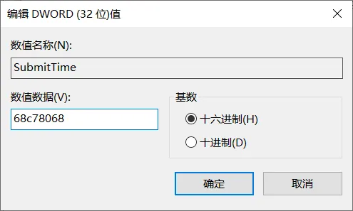

虽然 Xshell 和 Xftp 官方有免费版，但还要在线注册一下，否则每次打开都会先弹出注册窗口，
但离线环境无法连接外网怎么办？有没有什么办法能跳过这一步呢？

## 具体步骤

下面以 Xshell 为例说下具体步骤：

1、打开 Windows 注册表编辑器
Win+R 打开运行，在运行框里输入 regedit ，回车

2、找到下面位置，可以直接复制到上方地址栏，回车
计算机\HKEY_CURRENT_USER\SOFTWARE\NetSarang\Xshell\8\License

3、在空白处右键，新建 DWORD(32位)

4、名称为 SubmitTime，值为十六进制 68c78068，其实就是十进制的时间戳 十六进制格式。

结束！再次打开 Xshell 就不会出现注册窗口了。

 Xftp 同理，这里不再赘述。 