---

title: JVM | 基础篇
icon: article
date: 2022-11-01
category: JVM
tag:
  - JVM
---


## 1、字节码

## 2、类加载

### 2.1类的生命周期


#### 2.1.1 类的生命周期-加载阶段

加载(Loading)阶段第一步是类加载器根据类的全限定名通过不同的渠道以二进制流的方式获取字节码信息。程序员可以使用Java代码拓展的不同的渠道。


类加载器在加载完类之后，Java虚拟机会将字节码中的信息保存到内存的方法区中。

生成一个InstanceKlass对象，保存类的所有信息，里边还包含实现特定功能比如多态的信息

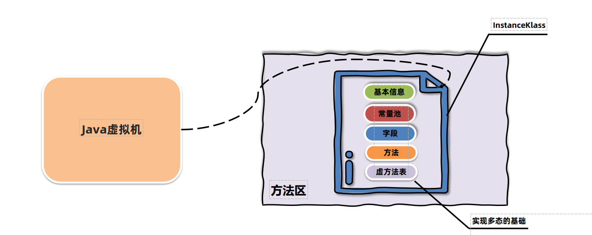

同时，Java虚拟机还会在堆中生成一份与方法区中数据类似的java.lang.Class对象。

**作用是在Java代码中去获取类的信息以及存储静态字段的数据（JDK8及之后）。**

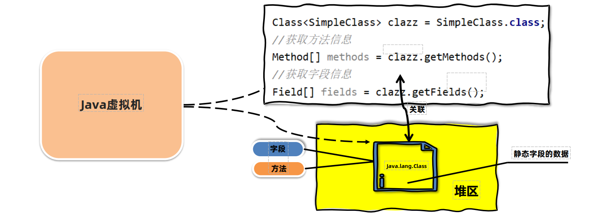

查看内存中的对象 

推荐使用 JDK自带的hsdb工具查看Java虚拟机内存信息。工具位于JDK安装目录下lib文件夹中的sa-jdi.jar中

启动命令：java -cp sa-jdi.jar sun.jvm.hotspot.HSDB

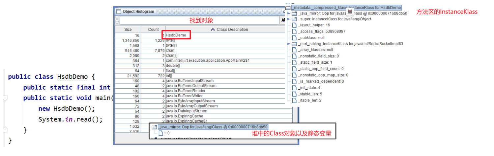

#### 2.1.2 类的生命周期-连接阶段之验证 

连接（Linking）阶段的第一个环节是验证，验证的主要目的是检测Java字节码文件是否遵守了《Java虚拟机规范》中的约束。这个阶段一般不需要程序员参与。

主要包含如下四部分，具体详见《Java虚拟机规范》：

1.文件格式验证，比如文件是否以0xCAFEBABE开头，主次版本号是否满足当前Java虚拟机版本要求

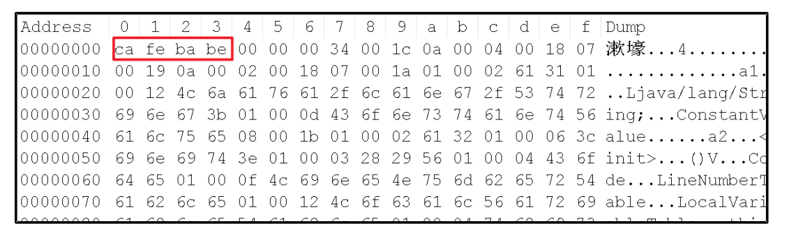

2.元信息验证，例如类必须有父类（super不能为空）。

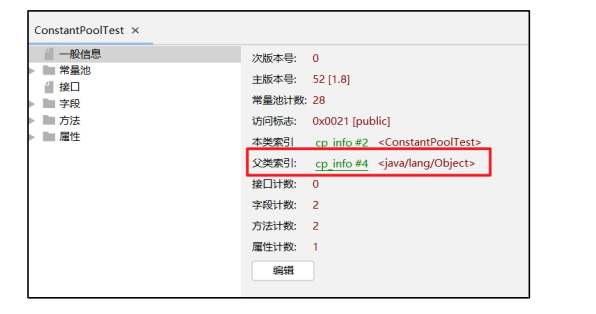

3.验证程序执行指令的语义，比如方法内的指令执行中跳转到不正确的位置。

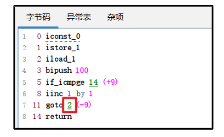

4.符号引用验证，例如是否访问了其他类中private的方法等。


类的生命周期验证案例-版本号的检测

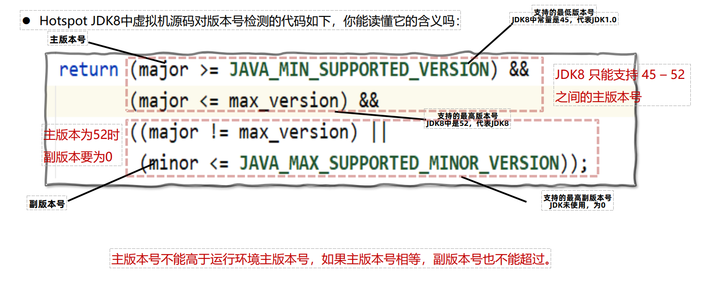

#### 2.1.3 类的生命周期-连接阶段之准备

准备阶段为静态变量（static）分配内存并设置初始值。

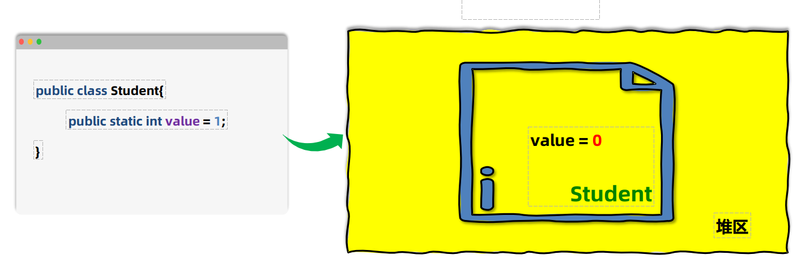

准备阶段只会给静态变量赋初始值，而每一种基本数据类型和引用数据类型都有其初始值

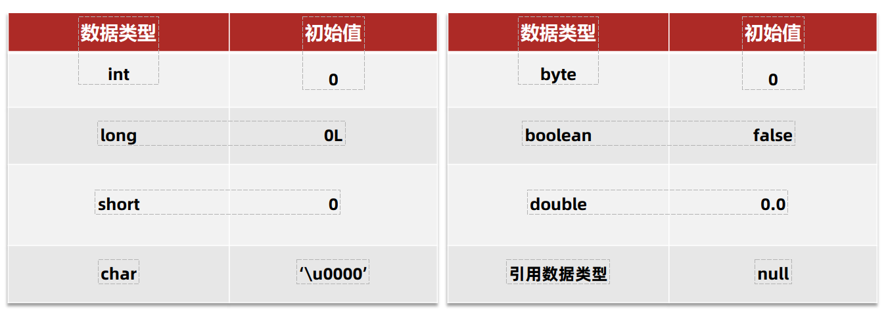

final修饰的基本数据类型的静态变量，准备阶段直接会将代码中的值进行赋值

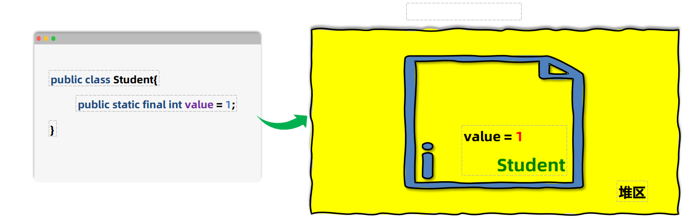

#### 2.1.4 类的生命周期-连接阶段之解析

解析阶段主要是将常量池中的符号引用替换为直接引用。

**符号引用就是在字节码文件中使用编号来访问常量池中的内容**

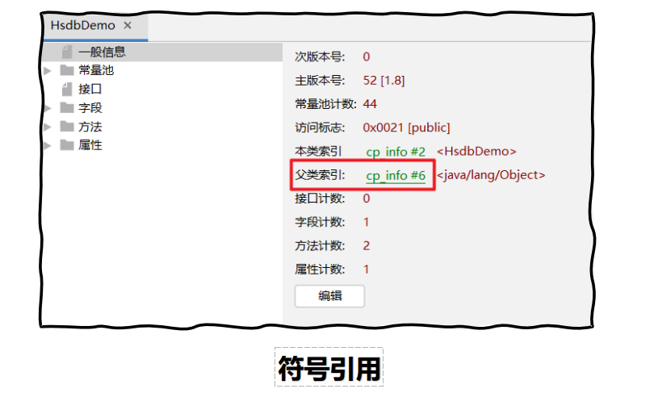

直接引用不在使用编号，而是使用内存中地址进行访问具体的数据。

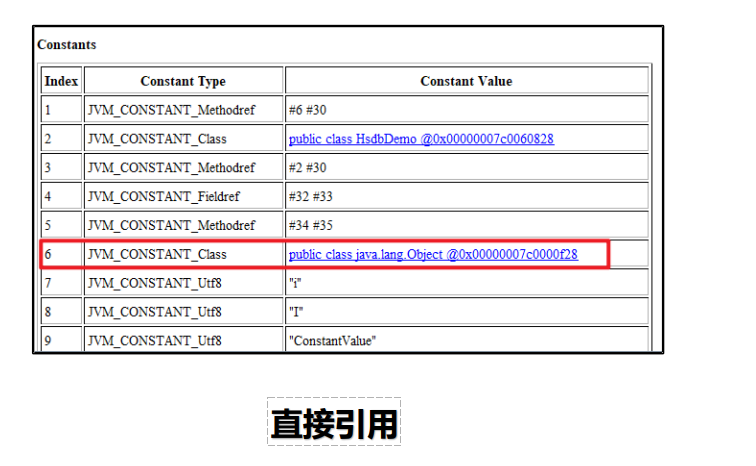

#### 2.1.5 类的生命周期-初始化阶段

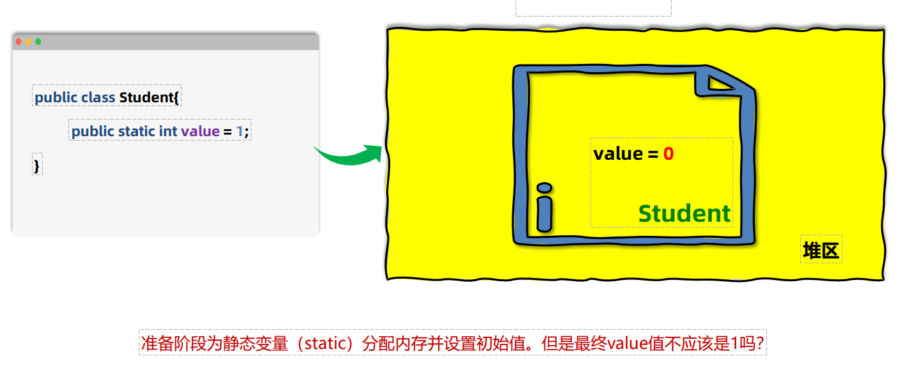

初始化阶段会执行**静态代码块中的代码**，并**为静态变量赋值**

初始化阶段会执行字节码文件中**clinit**部分的字节码指令

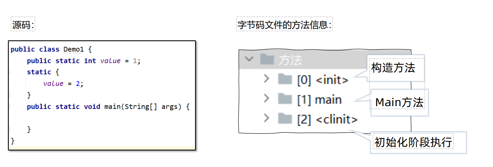


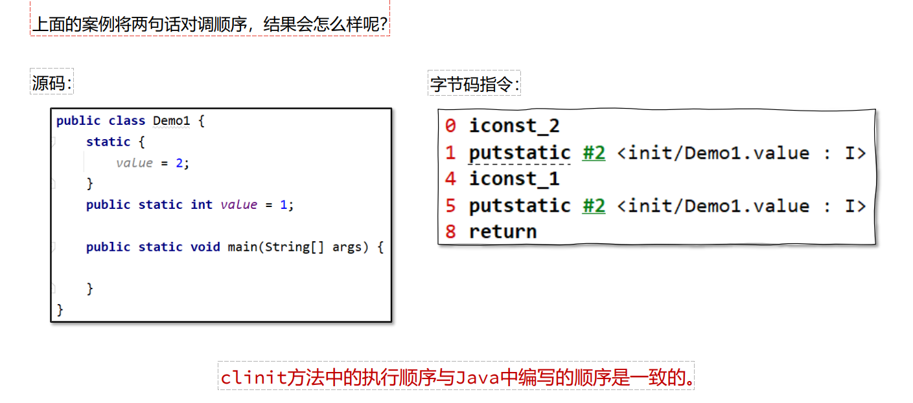

**以下几种方式会导致类的初始化**：

1.访问一个类的静态变量或者静态方法，注意变量是final修饰的并且等号右边是常量不会触发初始化。

2.调用Class.forName(String className)。

3.new一个该类的对象时。

4.执行Main方法的当前类。


**添加 -XX:+TraceClassLoading 参数可以打印出加载并初始化的类**


### 2.2 类加载器

类加载器（ClassLoader）是Java虚拟机提供给应用程序去实现获取类和接口字节码数据的技术。类加载器只参与加载过程中的字节码获取并加载到内存这一部分。


类加载器分为两类，一类是Java代码中实现的，一类是Java虚拟机底层源码实现的


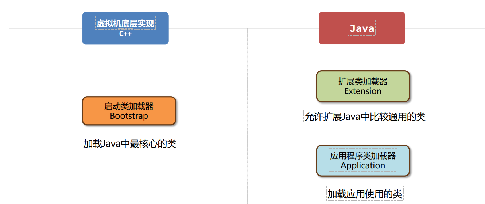

> Arthas中类加载器相关的功能
>
> 类加载器的详细信息可以通过classloader命令查看：
>
> classloader - 查看 classloader 的继承树，urls，类加载信息，使用 classloader 去 getResource

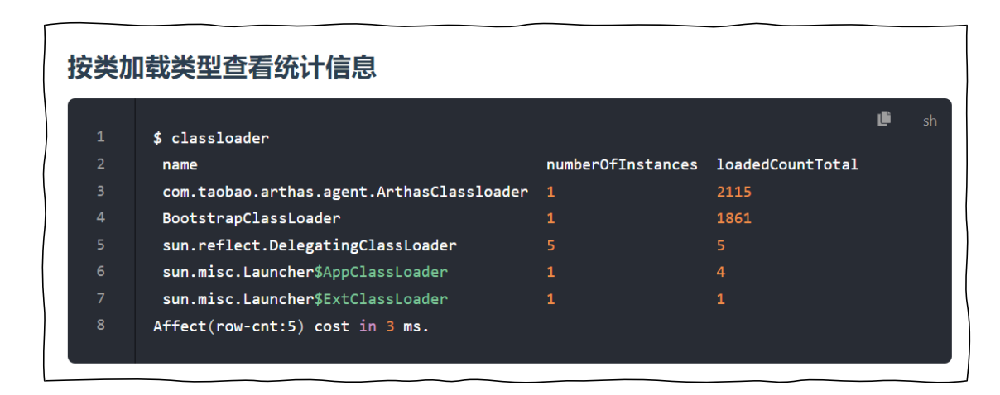

类加载器的分类-启动类加载器


启动类加载器（Bootstrap ClassLoader）是由Hotspot虚拟机提供的、使用C++编写的类加载器。

默认加载Java安装目录/jre/lib下的类文件，比如rt.jar，tools.jar，resources.jar等。


通过启动类加载器去加载用户jar包：

- 放入jre/lib下进行扩展

  不推荐，尽可能不要去更改JDK安装目录中的内容，会出现即时放进去由于文件名不匹配的问题也不会正常地被加载

- **使用参数进行扩展**

  推荐，使用-Xbootclasspath/a:jar包目录/jar包名进行扩展

  

类加载器的分类-Java中的默认类加载器

- 扩展类加载器和应用程序类加载器都是JDK中提供的、使用Java编写的类加载器。
- 它们的源码都位于sun.misc.Launcher中，是一个静态内部类。继承自URLClassLoader。具备通过目录或者指定jar包将字节码文件加载到内存中

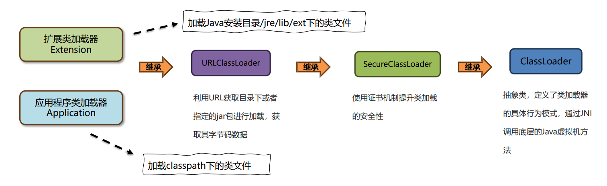

类加载器的分类-扩展类加载器

- 扩展类加载器（Extension Class Loader）是JDK中提供的、使用Java编写的类加载器。

- 默认加载Java安装目录/jre/lib/ext下的类文件。

  

通过扩展类加载器去加载用户jar包：

- 放入/jre/lib/ext下进行扩展

  不推荐，尽可能不要去更改JDK安装目录中的内容

- 使用参数进行扩展

  推荐，使用-Djava.ext.dirs=jar包目录进行扩展,这种方式会覆盖掉原始目录，可以用;(windows):(macos/linux)追加上原始目录

  

Arthas中类加载器相关的功能

> classloader -l    打印所有类加载器的hash
>
> 类加载器的加载路径可以通过classloader –c hash值 查看：

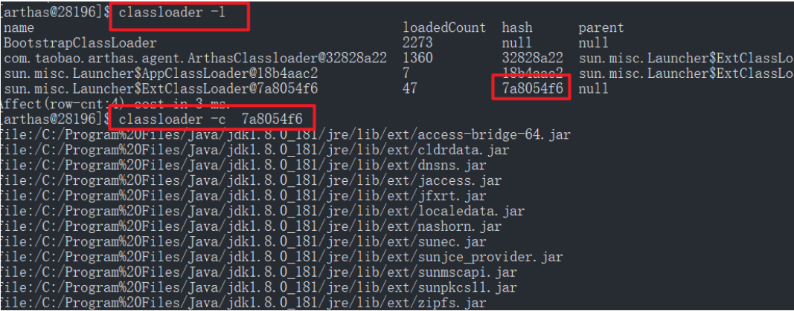


### 2.3 类加载器的双亲委派


在类加载的过程中，每个类加载器都会先检查是否已经加载了该类，如果已经加载则直接返回，否则会 将加载请求委派给父类加载器。

如果所有的父类加载器都无法加载该类，则由当前类加载器自己尝试加载。所以看上去是自顶向下尝试 加载。

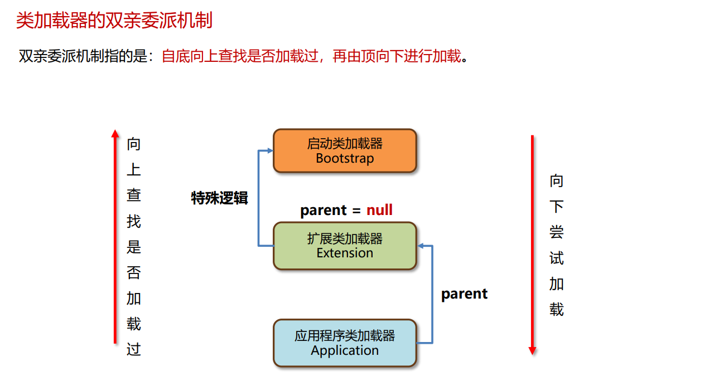


在Java中如何使用代码的方式去主动加载一个类呢？ 

方式1：使用Class.forName方法，使用当前类的类加载器去加载指定的类。 

方式2：获取到类加载器，通过类加载器的loadClass方法指定某个类加载器加载。 


在Idea中测试下面的案例：在idea中配置扩展类加载器的路径，放入包含com.itheima.my.A的jar包

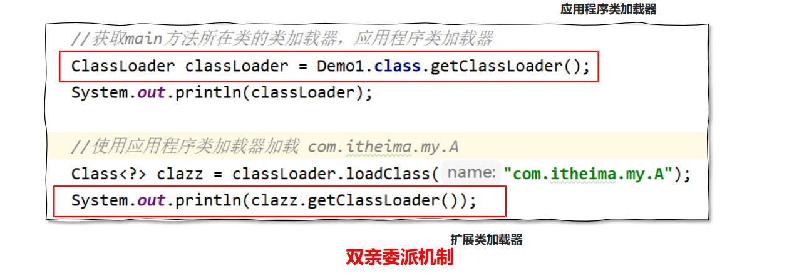

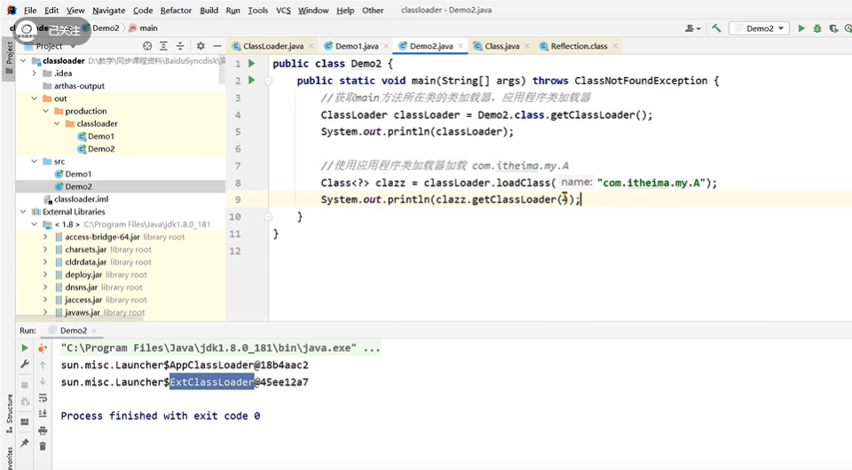

在代码中第二段实用类应用程序类加载器加载，但是运行结果却发现，实际使用了扩展类加载器


每个Java实现的类加载器中保存了一个成员变量叫“父”（Parent）类加载器，可以理解为它的上级， 并不是继承关系。

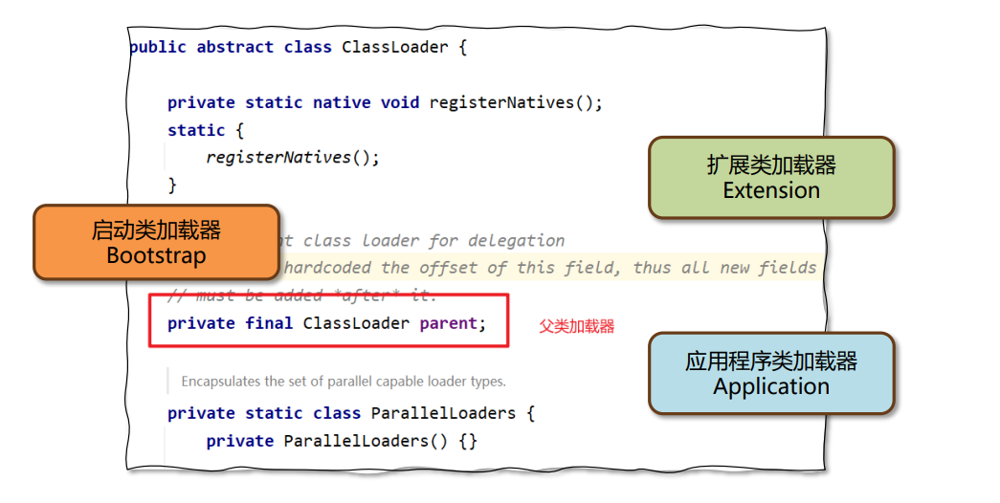

应用程序类加载器的parent父类加载器是扩展类加载器，而扩展类加载器的parent是空。

启动类加载器使用C++编写，没有上级类加载器。

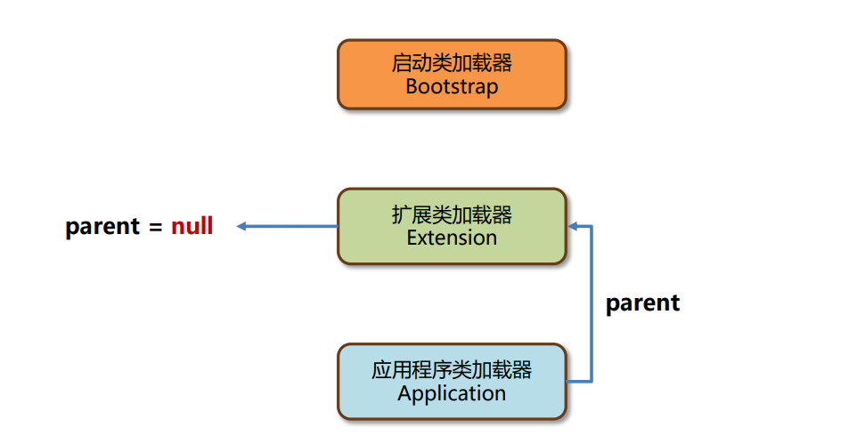


Arthas中类加载器相关的功能

类加载器的继承关系可以通过classloader –t 查看：

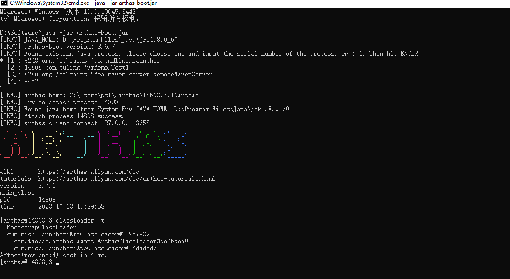


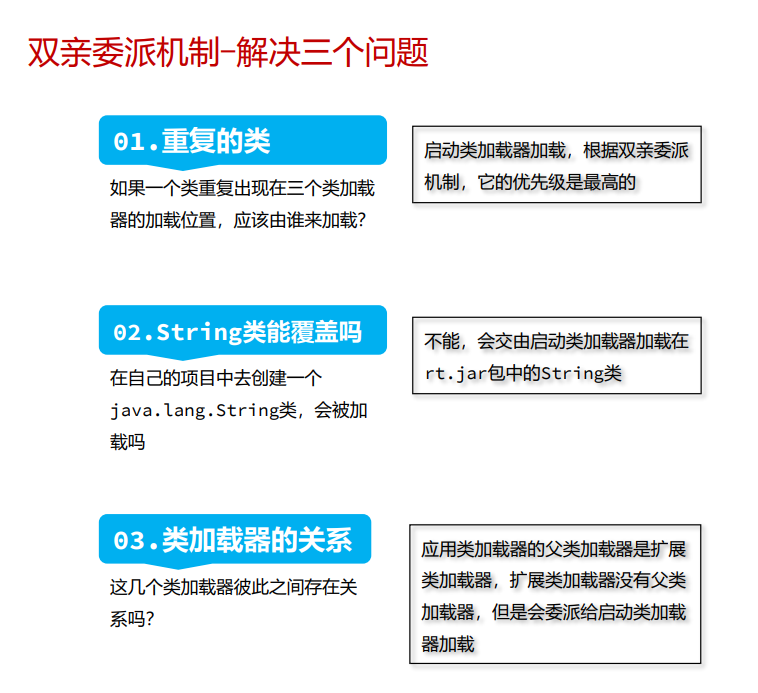

双亲委派机制有什么用？

1.保证类加载的安全性

通过双亲委派机制，让顶层的类加 载器去加载核心类，避免恶意代码 替换JDK中的核心类库，比如 java.lang.String，确保核心类 库的完整性和安全性。

2.避免重复加载

双亲委派机制可以避免同一个类被 多次加载，上层的类加载器如果加 载过类，就会直接返回该类，避免 重复加载。


### 2.4 打破双亲委派机制

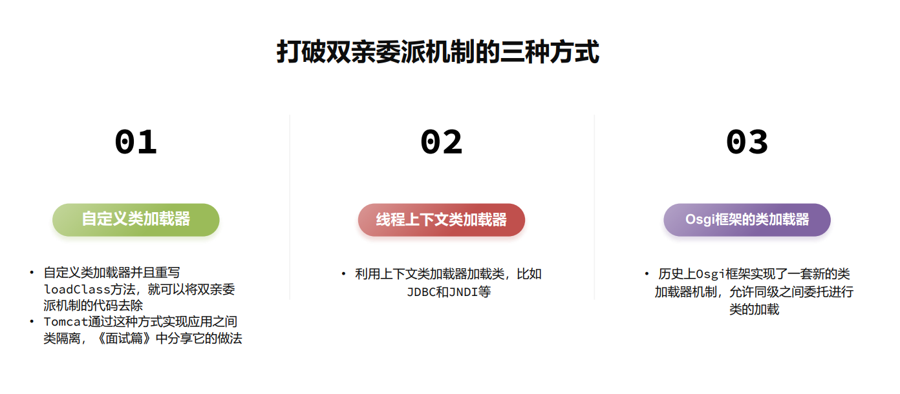

#### 2.4.1 打破双亲委派机制–自定义类加载器

- 一个Tomcat程序中是可以运行多个Web应用的，如果这两个应用中出现了相同限定名的类，比如Servlet类， Tomcat要保证这两个类都能加载并且它们应该是不同的类。

- 如果不打破双亲委派机制，当应用类加载器加载Web应用1中的MyServlet之后，Web应用2中相同限定名的 MyServlet类就无法被加载了。

  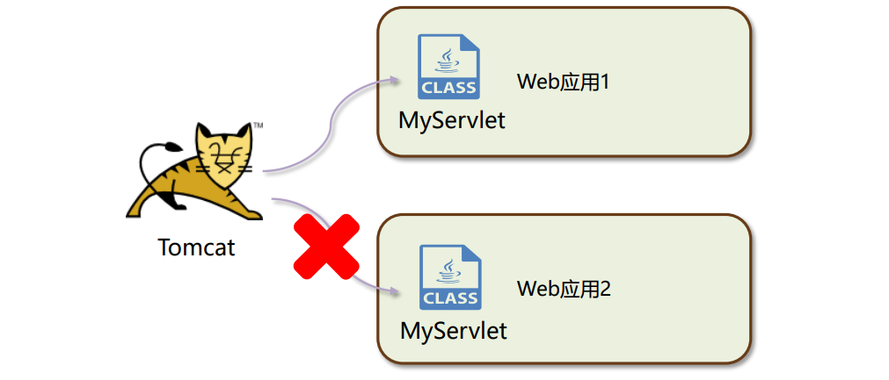


先来分析ClassLoader的原理，ClassLoader中包含了4个核心方法。

双亲委派机制的核心代码就位于loadClass方法中。

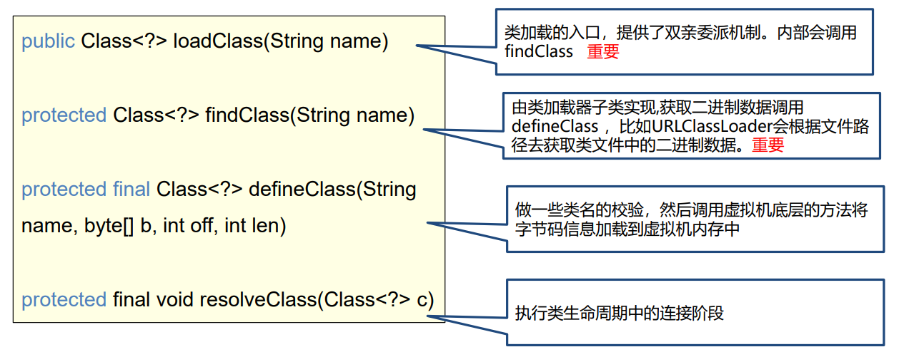

打破双亲委派机制的核心就是将下边这一段代码重新实现。

``` java
    protected Class<?> loadClass(String name, boolean resolve)
        throws ClassNotFoundException
    {
        synchronized (getClassLoadingLock(name)) {
            // First, check if the class has already been loaded
            Class<?> c = findLoadedClass(name);
            if (c == null) {
                long t0 = System.nanoTime();
                try {
                    //parent等于null说明父类加载器是启动类加载器，直接调用findBootstrapClassOrNull
					//否则调用父类加载器的加载方法

                    if (parent != null) {
                        c = parent.loadClass(name, false);
                    } else {
                        c = findBootstrapClassOrNull(name);
                    }
                } catch (ClassNotFoundException e) {
                    // ClassNotFoundException thrown if class not found
                    // from the non-null parent class loader
                }
                
                //父类加载器爱莫能助，我来加载！
                if (c == null) {
                    // If still not found, then invoke findClass in order
                    // to find the class.
                    long t1 = System.nanoTime();
                    c = findClass(name);

                    // this is the defining class loader; record the stats
                    sun.misc.PerfCounter.getParentDelegationTime().addTime(t1 - t0);
                    sun.misc.PerfCounter.getFindClassTime().addElapsedTimeFrom(t1);
                    sun.misc.PerfCounter.getFindClasses().increment();
                }
            }
            if (resolve) {
                resolveClass(c);
            }
            return c;
        }
    }
```

案例

``` java
/**
 * 打破双亲委派机制 - 自定义类加载器
 */

public class BreakClassLoader1 extends ClassLoader {

    private String basePath;
    private final static String FILE_EXT = ".class";

    public void setBasePath(String basePath) {
        this.basePath = basePath;
    }

    private byte[] loadClassData(String name)  {
        try {
            String tempName = name.replaceAll("\\.", Matcher.quoteReplacement(File.separator));
            FileInputStream fis = new FileInputStream(basePath + tempName + FILE_EXT);
            try {
                return IOUtils.toByteArray(fis);
            } finally {
                IOUtils.closeQuietly(fis);
            }

        } catch (Exception e) {
            System.out.println("自定义类加载器加载失败，错误原因：" + e.getMessage());
            return null;
        }
    }

    @Override
    public Class<?> loadClass(String name) throws ClassNotFoundException {
        if(name.startsWith("java.")){
            return super.loadClass(name);
        }
        byte[] data = loadClassData(name);
        return defineClass(name, data, 0, data.length);
    }

    public static void main(String[] args) throws ClassNotFoundException, InstantiationException, IllegalAccessException, IOException {
        BreakClassLoader1 classLoader1 = new BreakClassLoader1();
        classLoader1.setBasePath("D:\\lib\\");

        Class<?> clazz1 = classLoader1.loadClass("com.itheima.my.A");

        BreakClassLoader1 classLoader2 = new BreakClassLoader1();
        classLoader2.setBasePath("D:\\lib\\");

        Class<?> clazz2 = classLoader2.loadClass("com.itheima.my.A");

        System.out.println(clazz1 == clazz2);

        Thread.currentThread().setContextClassLoader(classLoader1);

        System.out.println(Thread.currentThread().getContextClassLoader());

        System.in.read();
     }
}
```

#### 2.4.2 打破双亲委派机制–线程上下文类加载器

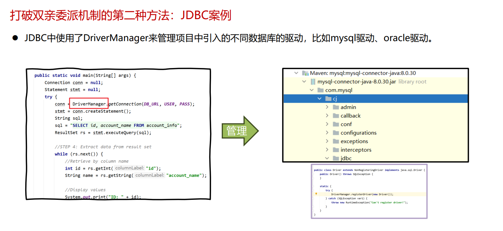

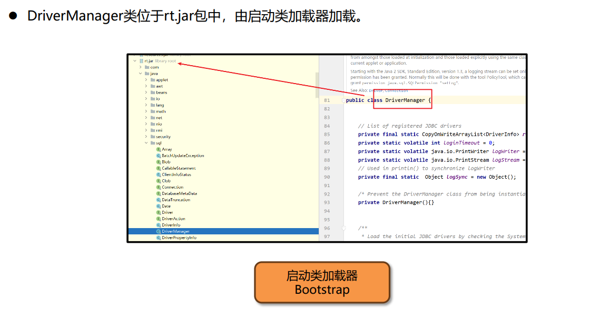

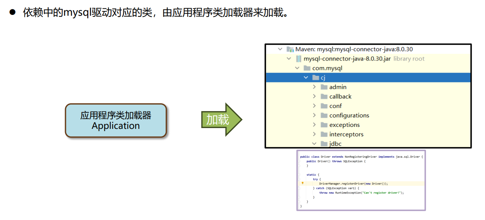

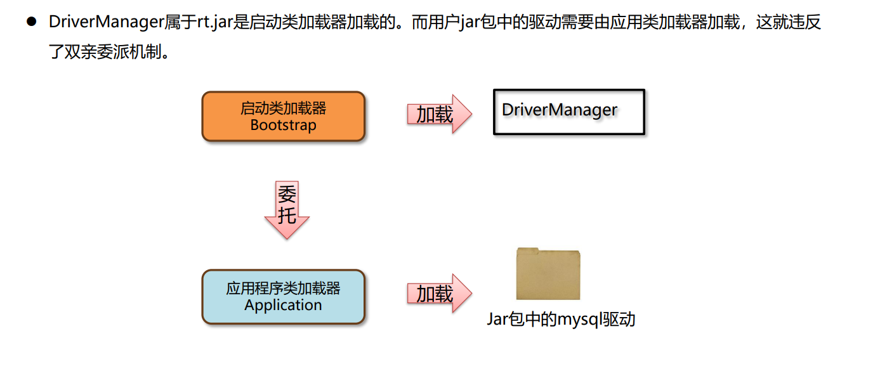

DriverManager怎么知道jar包中要加载的驱动在哪儿？

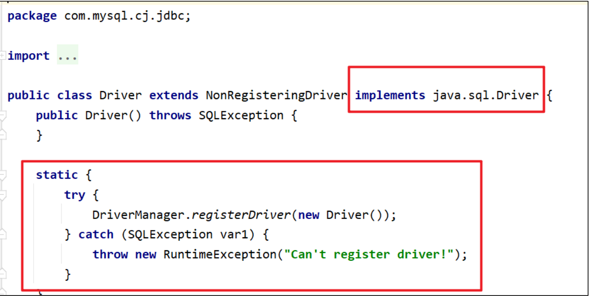

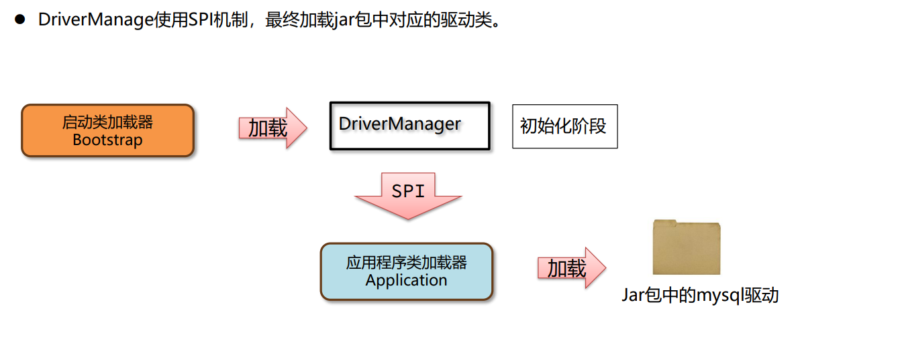

SPI中是如何获取到应用程序类加载器的？

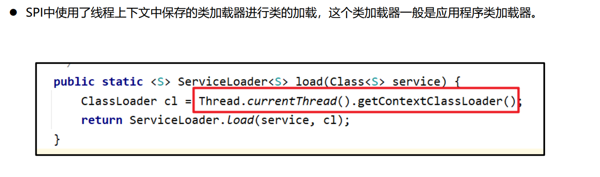

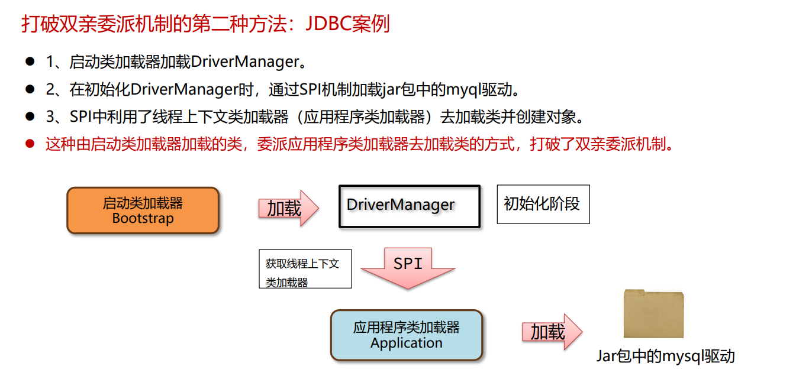

#### 2.4.3 打破双亲委派机制- OSGi模块化

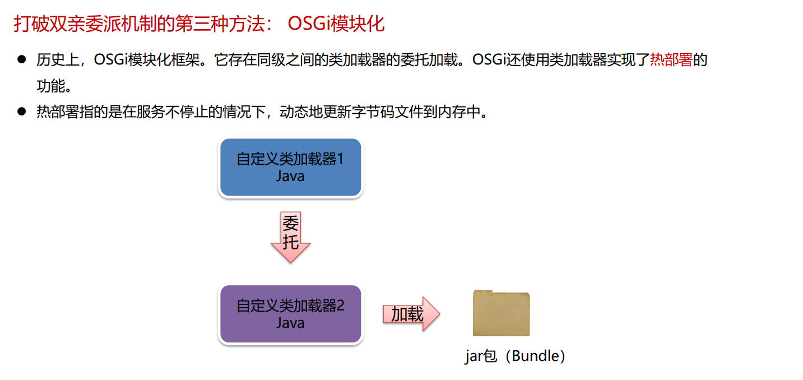

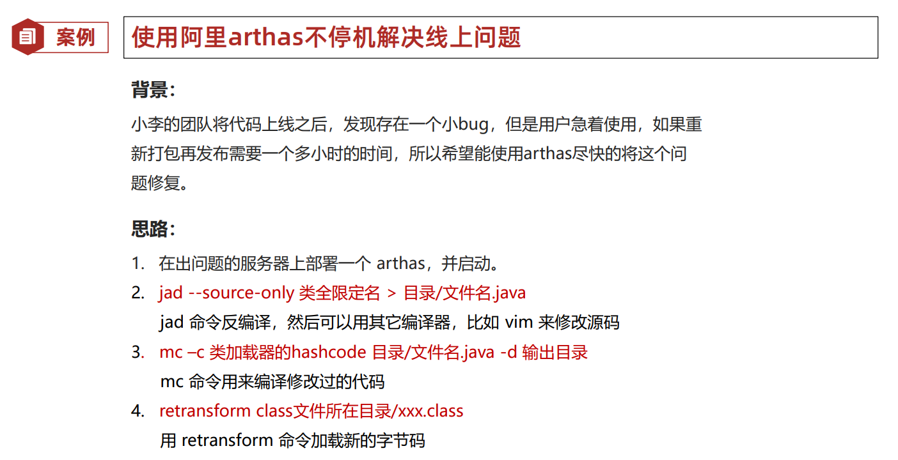

注意事项： 

1、程序重启之后，字节码文件会恢复，除非将class文件放入jar包中进行更新。

 2、使用retransform不能添加方法或者字段，也不能更新正在执行中的方法


### 2.5 JDK9之后的类加载器

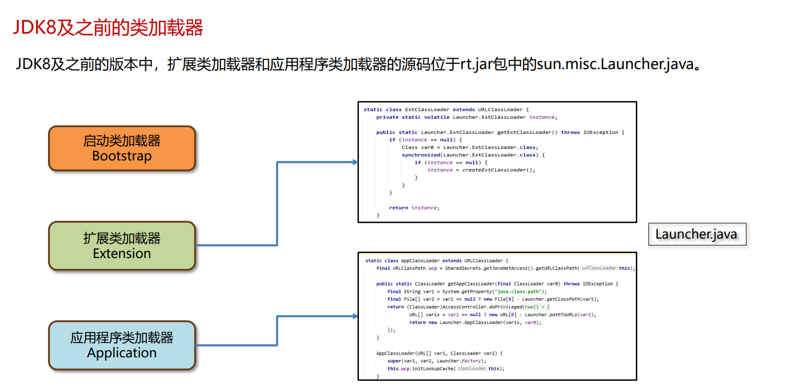

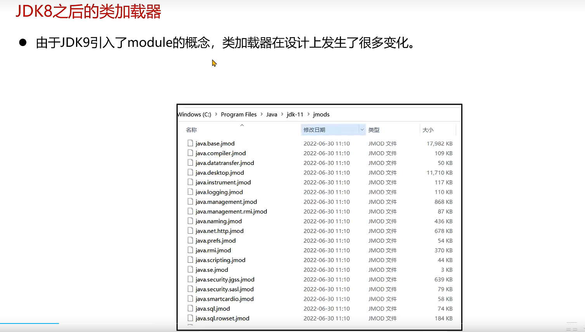

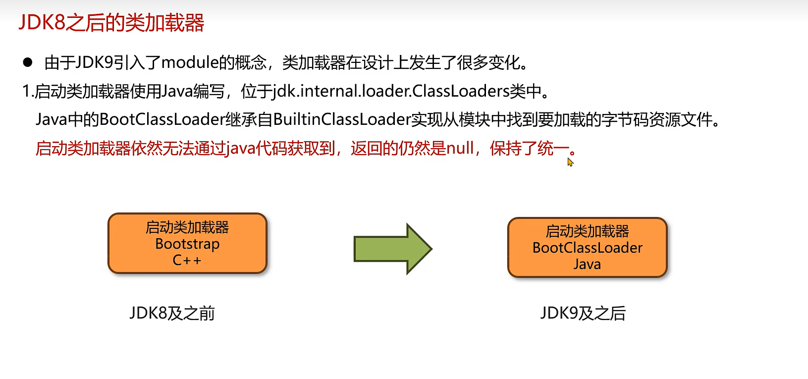

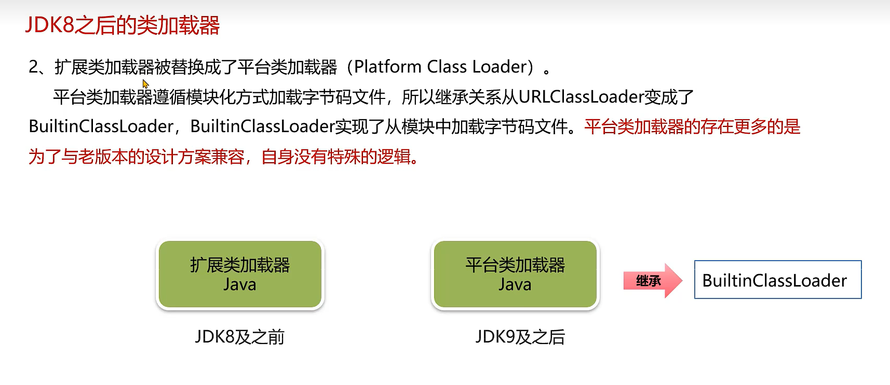

### 2.6 总结

1.类加载器的作用是什么？

类加载器（ClassLoader）负责在类加载过程中的字节码获取并加载到内存这 一部分。通过加载字节码数据放入内存转换成byte[]，接下来调用虚拟机底层 方法将byte[]转换成方法区和堆中的数据。


2.有几种类加载器？

1.启动类加载器（Bootstrap ClassLoader）加载核心类 

2.扩展类加载器（Extension ClassLoader）加载扩展类 

3.应用程序类加载器（Application ClassLoader）加载应用classpath中的类

4.自定义类加载器，重写findClass方法。 JDK9及之后扩展类加载器（Extension ClassLoader）变成了平台类加载器（Platform  ClassLoader）

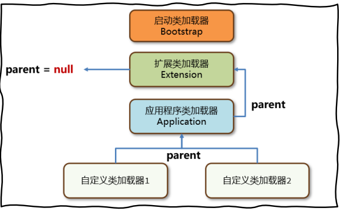


3、什么是双亲委派机制？

每个Java实现的类加载器中保存了一个成员变量叫“父”（Parent）类加载器。 自底向上查找是否加载过，再由顶向下进行加载。避免了核心类被应用程序重 写并覆盖的问题，提升了安全性。

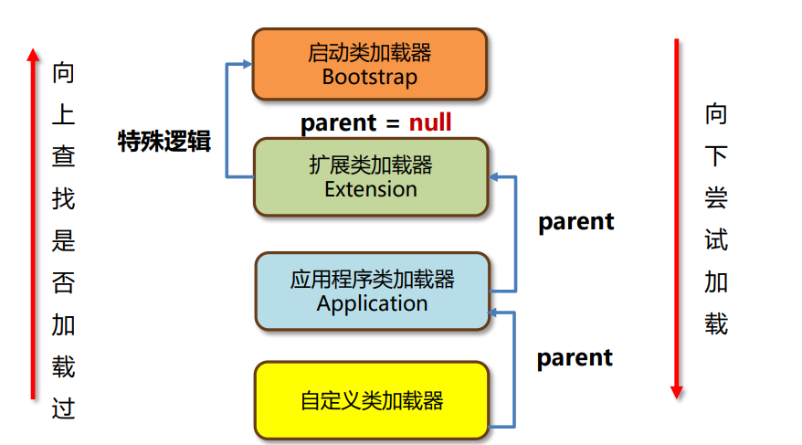

4、怎么打破双亲委派机制？

1、重写loadClass方法，不再实现双亲委派机制。 

2、JNDI、JDBC、JCE、JAXB和JBI等框架使用了SPI机制+线程上下文类加载器。

3、OSGi实现了一整套类加载机制，允许同级类加载器之间互相调用。


## 3、Java内存区域

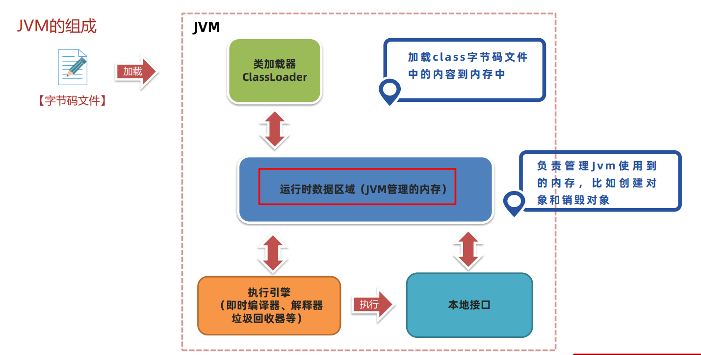

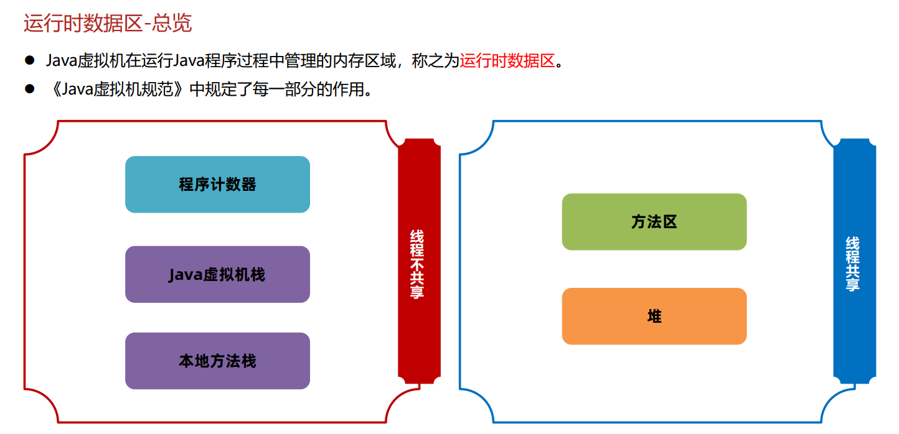

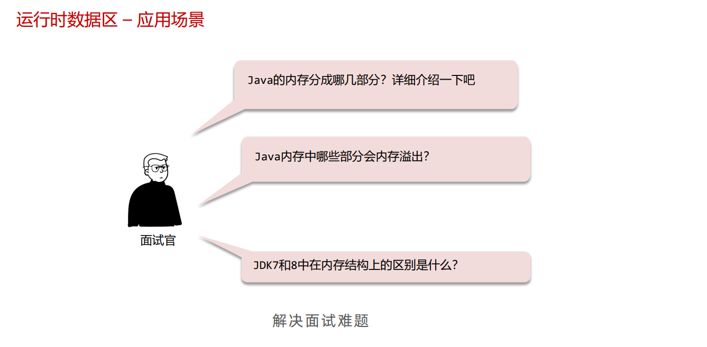

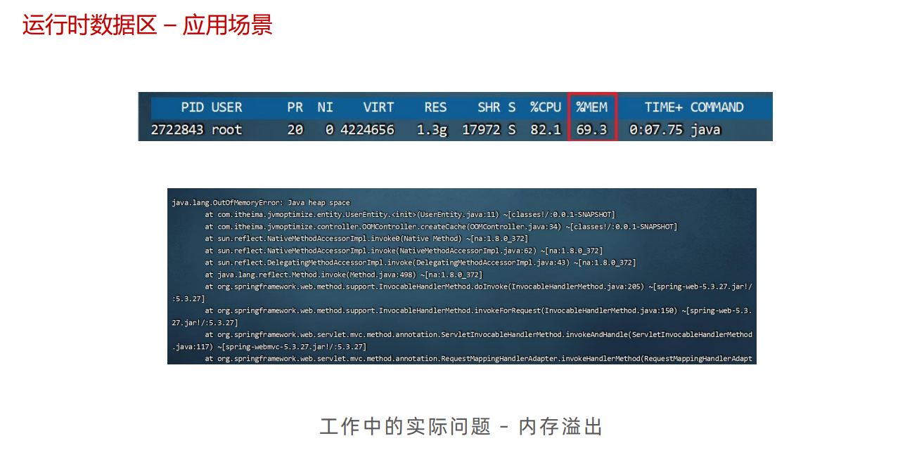

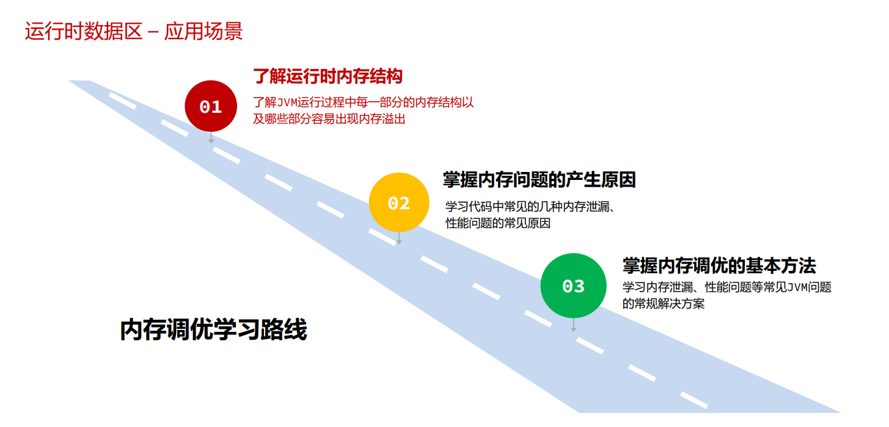

### 3.1 程序计数器

程序计数器（Program Counter Register）也叫PC寄存器，每个线程会通过程序计数器记录当前要执行的的字 节码指令的地址


在加载阶段，虚拟机将字节码文件中的指令读取到内存之后，会将原文件中的偏移量转换成内存地址。每一条字 节码指令都会拥有一个内存地址。


在代码执行过程中，程序计数器会记录下一行字节码指令的地址。执行完当前指令之后，虚拟机的执行引擎根据 程序计数器执行下一行指令。


程序计数器可以控制程序指令的进行，实现分支、跳转、异常等逻辑。


在多线程执行情况下，Java虚拟机需要通过程序计数器记录CPU切换前解释执行到那一句指令并继 续解释运行。


**问题：程序计数器在运行中会出现内存溢出吗？**

- 内存溢出指的是程序在使用某一块内存区域时，存放的数据需要占用的内存 大小超过了虚拟机能提供的内存上限。
- 因为每个线程只存储一个固定长度的内存地址，**程序计数器是不会发生内存 溢出的**。
- **程序员无需对程序计数器做任何处理**


### 3.2 栈

#### 3.2.1 **Java虚拟机栈**

Java虚拟机栈（Java Virtual Machine Stack）采用栈的数据结构来管理方法调用中的基本数据，先 进后出（First In Last Out）,每一个方法的调用使用一个栈帧（Stack Frame）来保存。


eat方法执行完，弹出栈


sleep执行完后出栈


study执行完后出栈


main方法执行完后出栈


通过Idea的debug工具查看栈帧的内容

``` java
public class FrameDemo {
    public static void main(String[] args) {
        A();
    }

    public static void A() {
        System.out.println("A执行了...");
        B();
    }

    public static void B() {
        System.out.println("B执行了...");
        C();
    }

    public static void C() {
        System.out.println("C执行了...");
        throw new RuntimeException("测试");
    }
}

```


Java虚拟机栈随着线程的创建而创建，而回收则会在线程的销毁时进行。由于方法可能会在不同线 程中执行，每个线程都会包含一个自己的虚拟机栈。


##### 3.2.1.1  局部变量表

局部变量表的作用是在方法执行过程中存放所有的局部变量。编译成字节码文件时就可以确定局部变量表的内容。


起始PC代表当前变量什么时候可以开始访问，例如变量 i ,初始化的字节码指令为 0,1，只有执行完这两句指令之后才可以访问，所以起始PC为2，可以访问的范围为2,3,4，所以长度为3


栈帧中的局部变量表是一个数组，数组中每一个位置称之为槽(slot) ，long和double类型占用两个槽，其 他类型占用一个槽。


为了节省空间，局部变量表中的槽是可以复用的，一旦某个局部变量不再生效，当前槽就可以再次被使用。


##### 3.2.1.2 操作数栈

操作数栈是栈帧中虚拟机在执行指令过程中用来存放中间数据的一块区域。他是一种栈式的数据结构，如 果一条指令将一个值压入操作数栈，则后面的指令可以弹出并使用该值。

在编译期就可以确定操作数栈的最大深度，从而在执行时正确的分配内存大小。


##### 3.2.1.3 帧数据


当前类的字节码指令引用了其他类的属性或者方法时，需要将符号引用（编号）转换成对应的运行时常量池 中的内存地址。动态链接就保存了编号到运行时常量池的内存地址的映射关系。


方法出口指的是方法在正确或者异常结束时，当前栈帧会被弹出，同时程序计数器应该指向上一个栈帧中的 下一条指令的地址。所以在当前栈帧中，需要存储此方法出口的地址。


异常表存放的是代码中异常的处理信息，包含了异常捕获的生效范围以及异常发生后跳转到的字节码指令位置。


##### 3.2.1.4 Java虚拟机栈-栈内存溢出

- Java虚拟机栈如果栈帧过多，占用内存超过栈内存可以分配的最大大小就会出现内存溢出。
- Java虚拟机栈内存溢出时会出现StackOverflowError的错误


##### 3.2.1.5 Java虚拟机栈 – 默认大小

如果我们不指定栈的大小，JVM 将创建一个 具有默认大小的栈。大小取决于操作系统和 计算机的体系结构。


##### 3.2.1.6 Java虚拟机栈 – 设置大小

- 要修改Java虚拟机栈的大小，可以使用虚拟机参数 -Xss 。

- 语法：-Xss栈大小

- 单位：字节（默认，必须是 1024 的倍数）、k或者K(KB)、m或者M(MB)、g或者G(GB)

  ``` 
  -Xss1048576 
  -Xss1024K
  -Xss1m
  -Xss1g
  
  ```

  

Java虚拟机栈 – 注意事项

1、与-Xss类似，也可以使用 -XX:ThreadStackSize 调整标志来配置堆栈大小。 格式为： -XX:ThreadStackSize=1024

2、HotSpot JVM对栈大小的最大值和最小值有要求：

比如测试如下两个参数:  -Xss1k    -Xss1025m

Windows（64位）下的JDK8测试最小值为180k，最大值为1024m。

3、局部变量过多、操作数栈深度过大也会影响栈内存的大小。


此方法申明了多个局部变量，此时每个栈祯包含的数据量变大了，所以总的栈祯数就变少了


**一般情况下，工作中即便使用了递归进行操作，栈的深度最多也只能到几百,不会出现栈的溢出。所以此参数 可以手动指定为-Xss256k节省内存。**


#### 3.2.2 本地方法栈

- Java虚拟机栈存储了Java方法调用时的栈帧，而本地方法栈存储的是native本地方法的栈帧。

- 在Hotspot虚拟机中，Java虚拟机栈和本地方法栈实现上使用了同一个栈空间。本地方法栈会在栈内 存上生成一个栈帧，临时保存方法的参数同时方便出现异常时也把本地方法的栈信息打印出来。

  


### 3.3 堆

#### 3.3.1 定义

- 一般Java程序中堆内存是空间最大的一块内存区域。创建出来的对象都存在于堆上

- 栈上的局部变量表中，可以存放堆上对象的引用。静态变量也可以存放堆对象的引用，通过静态变量就可以实 现对象在线程之间共享。

  


#### 3.3.2 实验-模拟堆区的溢出

需求：通过new关键字不停创建对象，放入集合中，模拟堆内存的溢出，观察堆溢出之后的异 常信息。

现象：堆内存大小是有上限的，当对象一直向堆中放入对象达到上限之后，就会抛出OutOfMemory 错误。


堆空间有三个需要关注的值，used total max。

used指的是当前已使用的堆内存，total是java虚拟机已经分配的可用堆内存，max是java虚拟机可以分配的最大堆内存。


#### 3.3.3 arthas中堆内存相关的功能

- 堆内存used total max三个值可以通过dashboard命令看到。

- 手动指定刷新频率（不指定默认5秒一次）：dashboard –i 刷新频率(毫秒)

  


- 随着堆中的对象增多，当total可以使用的内存即将不足时，java虚拟机会继续分配内存给堆

- 如果堆内存不足，java虚拟机就会不断的分配内存，total值会变大。total最多只能与max相等。

  


是不是当used = max = total的时候，堆内存就溢出了呢？

不是，堆内存溢出的判断条件比较复杂，在下一章《垃圾回收器》中会详细介绍。


#### 3.3.4  堆大小设置

如果不设置任何的虚拟机参数，max默认是系统内存的1/4，total默认是系统内存的1/64。在实际应用中一般都需要设置 total和max的值。

Oracle官方文档：https://docs.oracle.com/javase/8/docs/technotes/tools/unix/java.html

- 要修改堆的大小，可以使用虚拟机参数 –Xmx（max最大值）和-Xms (初始的total)。
- 语法：-Xmx值 -Xms值
- 单位：字节（默认，必须是 1024 的倍数）、k或者K(KB)、m或者M(MB)、g或者G(GB)
- 限制：Xmx必须大于 2 MB，Xms必须大于1MB
- Java服务端程序开发时，建议将-Xmx和-Xms设置为相同的值，这样在程序启动之后可使用的总内存就是最大内存，而无 需向java虚拟机再次申请，减少了申请并分配内存时间上的开销，同时也不会出现内存过剩之后堆收缩的情况。


### 3.4 方法区

#### 3.4.1 内容

方法区是存放基础信息的位置，线程共享，主要包含三部分内容：


方法区是用来存储每个类的基本信息（元信息），一般称之为InstanceKlass对象。在类的加载阶段完成。


方法区除了存储类的元信息之外，还存放了运行时常量池。常量池中存放的是字节码中的常量池内容。

字节码文件中通过编号查表的方式找到常量，这种常量池称为静态常量池。当常量池加载到内存中之后，可以通 过内存地址快速的定位到常量池中的内容，这种常量池称为运行时常量池。


方法区是《Java虚拟机规范》中设计的虚拟概念，每款Java虚拟机在实现上都各不相同。Hotspot设计如下：

- JDK7及之前的版本将方法区存放在堆区域中的永久代空间，堆的大小由虚拟机参数来控制。
- JDK8及之后的版本将方法区存放在元空间中，**元空间位于操作系统维护的直接内存中**，默认情况下只要不 超过操作系统承受的上限，可以一直分配。


#### 3.4.2 arthas中查看方法区

- 使用memory打印出内存情况，JDK7及之前的版本查看ps_perm_gen属性。
- JDK8及之后的版本查看metaspace属性。


#### 3.4.3 模拟方法区的溢出

需求：通过ByteBuddy框架，动态生成字节码数据，加载到内存中。通过死循环不停地加载到方法区，观察方法区是 否会出现内存溢出的情况。分别在JDK7和JDK8上运行上述代码。


ByteBuddy框架的基本使用方法

ByteBuddy是一个基于Java的开源库，用于生成和操作Java字节码。

1.引入依赖

``` yaml
<dependency>
	<groupId>net.bytebuddy</groupId>
 	<artifactId>byte-buddy</artifactId>
	<version>1.12.23</version>
 </dependency>

```

2.创建ClassWriter对象

``` java
ClassWriter classWriter = new ClassWriter(0);
```

3.调用visit方法，创建字节码数据。

```
classWriter.visit(Opcodes.V1_7,Opcodes.ACC_PUBLIC,name,null ,"java/lang/Object",null);
byte[] bytes = classWriter.toByteArray();
```

实验发现，JDK7上运行大概十几万次，就出现了错误。在JDK8上运行百万次，程序都没有出现任何错误，但是内 存会直线升高。这说明JDK7和JDK8在方法区的存放上，采用了不同的设计。

- JDK7将方法区存放在堆区域中的永久代空间，堆的大小由虚拟机参数-XX:MaxPermSize=值来控制。

- JDK8将方法区存放在元空间中，元空间位于操作系统维护的直接内存中，默认情况下只要不超过操作系统承受 的上限，可以一直分配。可以使用-XX:MaxMetaspaceSize=值将元空间最大大小进行限制。

  

#### 3.4.5 字符串常量池

- 方法区中除了类的元信息、运行时常量池之外，还有一块区域叫字符串常量池(StringTable)。

- 字符串常量池存储在代码中定义的常量字符串内容。比如“123” 这个123就会被放入字符串常量池。

  


字符串常量池和运行时常量池有什么关系？

早期设计时，字符串常量池是属于运行时常量池的一部分，他们存储的位置也是一致的。后续做出了调整， 将字符串常量池和运行时常量池做了拆分。


### 3.5 直接内存

直接内存（Direct Memory）并不在《Java虚拟机规范》中存在，所以并不属于Java运行时的内存区域。 

在 JDK 1.4 中引入了 NIO 机制，使用了直接内存，主要为了解决以下两个问题:

1、Java堆中的对象如果不再使用要回收，回收时会影响对象的创建和使用。

2、IO操作比如读文件，需要先把文件读入直接内存（缓冲区）再把数据复制到Java堆中。 

现在直接放入直接内存即可，同时Java堆上维护直接内存的引用，减少了数据复制的开销。写文件也是类似的思路。


- 要创建直接内存上的数据，可以使用ByteBuffer。
- 语法： ByteBuffer directBuffer = ByteBuffer.allocateDirect(size);
- 注意事项： arthas的memory命令可以查看直接内存大小，属性名direct。


如果需要手动调整直接内存的大小，可以使用-XX:MaxDirectMemorySize=大小

单位k或K表示千字节，m或M表示兆字节，g或G表示千兆字节。默认不设置该参数情况下，JVM 自动选择 最 大分配的大小。


### 3.6 总结

1、运行时数据区分成哪几部分，每一部分的作用是什么？


程序计数器：每个线程会通过程序计数器记录当前要执行的字节码指令的地址，程序计数器可以控制程序指令的进行，实现分支、跳转、异常等逻辑

Java虚拟机栈、本地方法栈：虚拟机采用栈的数据结构来管理方法调用中的基本数据（局部变量、操作数栈等），每一个方法的调用使用一个栈祯来保存

堆：堆中存放的是创建出来的对象，这也是最容易产生内存溢出的位置

方法区：方法区中主要存放的是类的元信息，同时还保存了常量池

2、不同JDK版本之间运行时数据区域的区别是什么？


## 4、垃圾回收


### 4.1 C/C++的内存管理

- 在C/C++这类没有自动垃圾回收机制的语言中，一个对象如果不再使用，需要手动释放，否则就会出现 内存泄漏。我们称这种释放对象的过程为垃圾回收，而需要程序员编写代码进行回收的方式为手动回收。

- 内存泄漏指的是不再使用的对象在系统中未被回收，内存泄漏的积累可能会导致内存溢出

  


### 4.2 Java的内存管理

Java中为了简化对象的释放，引入了自动的垃圾回收（Garbage Collection简称GC）机制。通过垃 圾回收器来对不再使用的对象完成自动的回收，垃圾回收器主要负责对堆上的内存进行回收。其他 很多现代语言比如C#、Python、Go都拥有自己的垃圾回收器。


### 4.3 垃圾回收的对比


自动垃圾回收：自动根据对象是否使用由虚拟机来回收对象

优点：降低程序员实现难度、降低对象回收bug的可能性

缺点：程序员无法控制内存回收的及时性


手动垃圾回收：由程序员编程实现对象的删除

优点：回收及时性高，由程序员把控回收的时机

缺点：编写不当容易出现悬空指针、重复释放、内存泄漏等问题


### 4.4 自动垃圾回收 – 应用场景


线程不共享的部分，都是伴随着线程的创建而创建，线程的销毁而销毁。而方法的栈帧在执行完方法之后就会 自动弹出栈并释放掉对应的内存。


### 4.5 方法区的回收


方法区中能回收的内容主要就是不再使用的类。

判定一个类可以被卸载。需要同时满足下面三个条件：

1、此类所有实例对象都已经被回收，在堆中不存在任何该类的实例对象以及子类对象。


2、加载该类的类加载器已经被回收。


3、该类对应的 java.lang.Class 对象没有在任何地方被引用。


方法区的回收 – 手动触发回收

如果需要手动触发垃圾回收，可以调用System.gc()方法。

注意事项：调用System.gc()方法并不一定会立即回收垃圾，仅仅是向Java虚拟机发送一个垃圾回收的请求，具体是否需要 执行垃圾回收Java虚拟机会自行判断。


开发中此类场景一般很少出现，主要在如 OSGi、JSP 的热部署等应用场景中。 每个jsp文件对应一个唯一的类加载器，当一个jsp文件修改了，就直接卸载这个jsp类 加载器。重新创建类加载器，重新加载jsp文件。


### 4.6 堆回收


如何判断堆上的对象可以回收？

Java中的对象是否能被回收，是根据对象是否被引用来决定的。如果对象被引用了，说明该对象还 在使用，不允许被回收。


如何判断堆上的对象没有被引用？

常见的有两种判断方法：引用计数法和可达性分析法。


#### 4.6.1 引用计数法

引用计数法会为每个对象维护一个引用计数器，当对象被引用时加1，取消引用时减1。


引用计数法的优点是实现简单，C++中的智能指针就采用了引用计数法，但是它也存在缺点，主要有两点：

1.每次引用和取消引用都需要维护计数器，对系统性能会有一定的影响

2.存在循环引用问题，所谓循环引用就是当A引用B，B同时引用A时会出现对象无法回收的问题。


AB实例对象在栈上已经没有变量引用了

由于计数器还是1无法回收，出现了内存泄漏


查看垃圾回收日志

如果想要查看垃圾回收的信息，可以使用-verbose:gc参数。

语法： -verbose:gc


#### 4.6.2可达性分析法

Java使用的是可达性分析算法来判断对象是否可以被回收。

可达性分析将对象分为两类：垃圾回收的根对象（GC  Root）和普通对象，对象与对象之间存在引用关系。


下图中A到B再到C和D，形成了一个引用链，可达性分析算法指的是如果从某个到GC Root对象是可达的，对象就 不可被回收。


哪些对象被称之为GC Root对象呢？

- 线程Thread对象。引用线程栈帧中的方法参数、局部变量等。

  

  

- 系统类加载器加载的java.lang.Class对象。引用类中的静态变量。

  

- 监视器对象，用来保存同步锁synchronized关键字持有的对象。

  

- 本地方法调用时使用的全局对象。


查看GC Root

通过arthas和eclipse Memory Analyzer (MAT) 工具可以查看GC Root，MAT工具是eclipse推出的Java堆内存 检测工具。具体操作步骤如下：

1、使用arthas的heapdump命令将堆内存快照保存到本地磁盘中。

2、使用MAT工具打开堆内存快照文件。

3、选择GC Roots功能查看所有的GC Root。


#### 4.6.3 几种常见的对象引用


##### 强引用

可达性算法中描述的对象引用，一般指的是**强引用**，即是GCRoot对象对普通对象有引用关系，只要这层关系存在， 普通对象就不会被回收。除了强引用之外，Java中还设计了几种其他引用方式：

- 软引用
- 弱引用
- 虚引用
- 终结器引用


##### 软引用

软引用相对于强引用是一种比较弱的引用关系，如果一个对象只有软引用关联到它，当程序内存不足时，就会将软 引用中的数据进行回收。

在JDK 1.2版之后提供了SoftReference类来实现软引用，软引用常用于缓存中。

软引用的执行过程如下：

1.将对象使用软引用包装起来，new SoftReference<对象类型>(对象)。

2.内存不足时，虚拟机尝试进行垃圾回收。

3.如果垃圾回收仍不能解决内存不足的问题，回收软引用中的对象。

4.如果依然内存不足，抛出OutOfMemory异常。


软引用中的对象如果在内存不足时回收，SoftReference对象本身也需要被回收。如何知道哪些SoftReference对 象需要回收呢？

SoftReference提供了一套队列机制：

1、软引用创建时，通过构造器传入引用队列

2、在软引用中包含的对象被回收时，该软引用对象会被放入引用队列

3、通过代码遍历引用队列，将SoftReference的强引用删除


软引用的使用场景-缓存

软引用也可以使用继承自SoftReference类的方式来实现，StudentRef类就是一个软引用对象。 通过构造器传入软引用包含的对象，以及引用队列。


``` java
package chapter04.soft;

import java.lang.ref.ReferenceQueue;
import java.lang.ref.SoftReference;
import java.util.HashMap;
import java.util.Map;
/**
 * 软引用案例4 - 学生信息的缓存
 */
public class StudentCache {

    private static StudentCache cache = new StudentCache();

    public static void main(String[] args) {
        for (int i = 0; ; i++) {
            StudentCache.getInstance().cacheStudent(new Student(i, String.valueOf(i)));
        }
    }

    private Map<Integer, StudentRef> StudentRefs;// 用于Cache内容的存储
    private ReferenceQueue<Student> q;// 垃圾Reference的队列

    // 继承SoftReference，使得每一个实例都具有可识别的标识。
    // 并且该标识与其在HashMap内的key相同。
    private class StudentRef extends SoftReference<Student> {
        private Integer _key = null;

        public StudentRef(Student em, ReferenceQueue<Student> q) {
            super(em, q);
            _key = em.getId();
        }
    }

    // 构建一个缓存器实例
    private StudentCache() {
        StudentRefs = new HashMap<Integer, StudentRef>();
        q = new ReferenceQueue<Student>();
    }

    // 取得缓存器实例
    public static StudentCache getInstance() {
        return cache;
    }

    // 以软引用的方式对一个Student对象的实例进行引用并保存该引用
    private void cacheStudent(Student em) {
        cleanCache();// 清除垃圾引用
        StudentRef ref = new StudentRef(em, q);
        StudentRefs.put(em.getId(), ref);
        System.out.println(StudentRefs.size());
    }

    // 依据所指定的ID号，重新获取相应Student对象的实例
    public Student getStudent(Integer id) {
        Student em = null;
// 缓存中是否有该Student实例的软引用，如果有，从软引用中取得。
        if (StudentRefs.containsKey(id)) {
            StudentRef ref = StudentRefs.get(id);
            em = ref.get();
        }
// 如果没有软引用，或者从软引用中得到的实例是null，重新构建一个实例，
// 并保存对这个新建实例的软引用
        if (em == null) {
            em = new Student(id, String.valueOf(id));
            System.out.println("Retrieve From StudentInfoCenter. ID=" + id);
            this.cacheStudent(em);
        }
        return em;
    }

    // 清除那些所软引用的Student对象已经被回收的StudentRef对象
    private void cleanCache() {
        StudentRef ref = null;
        while ((ref = (StudentRef) q.poll()) != null) {
            StudentRefs.remove(ref._key);
        }
    }

//    // 清除Cache内的全部内容
//    public void clearCache() {
//        cleanCache();
//        StudentRefs.clear();
//        //System.gc();
//        //System.runFinalization();
//    }
}

class Student {
    int id;
    String name;

    public Student(int id, String name) {
        this.id = id;
        this.name = name;
    }

    public int getId() {
        return id;
    }

    public void setId(int id) {
        this.id = id;
    }

    public String getName() {
        return name;
    }

    public void setName(String name) {
        this.name = name;
    }
}
```


##### 弱引用

弱引用的整体机制和软引用基本一致，区别在于弱引用包含的对象在垃圾回收时，不管内存够不够都会直接被回收。 

在JDK 1.2版之后提供了WeakReference类来实现弱引用，弱引用主要在ThreadLocal中使用。

弱引用对象本身也可以使用引用队列进行回收。

```
import java.io.IOException;
import java.lang.ref.WeakReference;

/**
 * 弱引用案例 - 基本使用
 */
public class WeakReferenceDemo2 {
    public static void main(String[] args) throws IOException {

        byte[] bytes = new byte[1024 * 1024 * 100];
        WeakReference<byte[]> weakReference = new WeakReference<byte[]>(bytes);
        bytes = null;
        System.out.println(weakReference.get());

        System.gc();

        System.out.println(weakReference.get());
    }
}
```

运行结果：


##### 虚引用

虚引用和终结器引用，这两种引用在常规开发中是不会使用的。

虚引用也叫幽灵引用/幻影引用，不能通过虚引用对象获取到包含的对象。虚引用唯一的用途是当对象被垃圾回 收器回收时可以接收到对应的通知。Java中使用PhantomReference实现了虚引用，直接内存中为了及时知道 直接内存对象不再使用，从而回收内存，使用了虚引用来实现。


##### 终结器引用

终结器引用指的是在对象需要被回收时，终结器引用会关联对象并放置在Finalizer类中的引用队列中，在稍后 由一条由FinalizerThread线程从队列中获取对象，然后执行对象的finalize方法，在对象第二次被回收时，该 对象才真正的被回收。在这个过程中可以在finalize方法中再将自身对象使用强引用关联上，但是不建议这样做。


### 4.7 垃圾回收算法

#### 垃圾回收算法-核心思想

Java是如何实现垃圾回收的呢？简单来说，垃圾回收要做的有两件事：

1、找到内存中存活的对象

2、释放不再存活对象的内存，使得程序能再次利用这部分空间


#### **垃圾回收算法的评价标准**


Java垃圾回收过程会通过单独的GC线程来完成，但是不管使用哪一种GC算法，都会有部分阶段需要停止所 有的用户线程。这个过程被称之为Stop The World简称STW，如果STW时间过长则会影响用户的使用。


所以判断GC算法是否优秀，可以从三个方面来考虑：

1.吞吐量

吞吐量指的是 CPU 用于执行用户代码的时间与 CPU 总执行时间的比值，即吞吐量 = 执行用户代码时间 / （执行用户代码时间 + GC时间）。吞吐量数值越高，垃圾回收的效率就越高。

比如：虚拟机总共运行了 100 分钟，其中GC花掉 1 分钟，那么吞吐量就是 99%

2.最大暂停时间

最大暂停时间指的是所有在垃圾回收过程中的STW时间最大值。

最大暂停时间越短，用户使用系统时 受到的影响就越短。

3.堆使用效率

不同垃圾回收算法，对堆内存的使用方式是不同的。比如标记清除算法，可以使用完整的堆内存。而复制算 法会将堆内存一分为二，每次只能使用一半内存。从堆使用效率上来说，标记清除算法要优于复制算法。


上述三种评价标准：堆使用效率、吞吐量，以及最大暂停时间不可兼得。

一般来说，堆内存越大，最大暂停时间就越长。想要减少最大暂停时间，就会降低吞吐量。 不同的垃圾回收算法，适用于不同的场景。


#### 标记清除算法

标记清除算法的核心思想分为两个阶段：

1.标记阶段，将所有存活的对象进行标记。Java中使用可达性分析算法，从GC Root开始通过引用链遍历出 所有存活对象。

2.清除阶段，从内存中删除没有被标记也就是非存活对象。


优点：实现简单，只需要在第一阶段给每个对象维护标志位，第二阶段删除对象即可。

缺点：1.碎片化问题

由于内存是连续的，所以在对象被删除之后，内存中会出现很多细小的可用内存单元。如果我们需要的是一 个比较大的空间，很有可能这些内存单元的大小过小无法进行分配。

2.分配速度慢。由于内存碎片的存在，需要维护一个空闲链表，极有可能发生每次需要遍历到链表的最后才 能获得合适的内存空间。


#### 复制算法

复制算法的核心思想是： 

1.准备两块空间From空间和To空间，每次在对象分配阶段，只能使用其中一块空间（From空间）。

 2.在垃圾回收GC阶段，将From中存活对象复制到To空间。 

3.将两块空间的From和To名字互换。


优点：

1.吞吐量高

复制算法只需要遍历一次存活对象 复制到To空间即可，比标记-整理 算法少了一次遍历的过程，因而性 能较好，但是不如标记-清除算法， 因为标记清除算法不需要进行对象 的移动

2.不会发生碎片化

复制算法在复制之后就会将对象按顺序放 入To空间中，所以对象以外的区域都是可 用空间，不存在碎片化内存空间。

缺点：

内存使用效率低：每次只能让一半的内存空间来为创 建对象使用


#### 标记-整理算法


标记整理算法也叫标记压缩算法，是对标记清理算法中容易产生内存碎片问题的一种解决方案。

1.标记阶段，将所有存活的对象进行标记。Java中使用可达性分析算法，从GC Root开始通过引用链遍历出 所有存活对象。

2.整理阶段，将存活对象移动到堆的一端。清理掉存活对象的内存空间。

优点:

1.内存使用效率高：整个堆内存都可以使用，不会像复 制算法只能使用半个堆内存

2.不会发生碎片化：在整理阶段可以将对象往内存的一侧进行 移动，剩下的空间都是可以分配对象的有 效空间

缺点：

整理阶段的效率不高：整理算法有很多种，比如Lisp2整 理算法需要对整个堆中的对象搜索3 次，整体性能不佳。可以通过TwoFinger、表格算法、ImmixGC等高 效的整理算法优化此阶段的性能


#### 分代GC

现代优秀的垃圾回收算法，会将上述描述的垃圾回收算法组合进行使用，其中应用最广的就是分代垃圾回收 算法(Generational GC)。

当前虚拟机的垃圾收集都采用分代收集算法，这种算法没有什么新的思想，只是根据对象存活周期的不同将内存分为几 块。一般将java堆分为新生代和老年代，这样我们就可以根据各个年代的特点选择合适的垃圾收集算法。 

比如在新生代中，每次收集都会有大量对象(近99%)死去，所以可以选择复制算法，只需要付出少量对象的复制成本就可 以完成每次垃圾收集。而老年代的对象存活几率是比较高的，而且没有额外的空间对它进行分配担保，所以我们必须选 择“标记-清除”或“标记-整理”算法进行垃圾收集。注意，“标记-清除”或“标记-整理”算法会比复制算法慢10倍以 上。


**arthas查看分代之后的内存情况**

在JDK8中，添加-XX:+UseSerialGC参数使用分代回收的垃圾回收器，运行程序。

在arthas中使用memory命令查看内存，显示出三个区域的内存情况。


调整内存区域的大小

根据以下虚拟机参数，调整堆的大小并观察结果。注意加上-XX:+UseSerialGC


``` java
//使用JDK8
//-XX:+UseSerialGC  -Xms60m -Xmn20m -Xmx60m -XX:SurvivorRatio=3  -XX:+PrintGCDetails
public class GcDemo0 {
    public static void main(String[] args) throws IOException {
        List<Object> list = new ArrayList<>();
        int count = 0;
        while (true){
            System.in.read();
            System.out.println(++count);
            //每次添加1m的数据
            list.add(new byte[1024 * 1024 * 1]);
        }
    }
}

```

程序运行后，启动arthas，查看内存情况


分代回收时，创建出来的对象，首先会被放入Eden伊甸园区。 

随着对象在Eden区越来越多，如果Eden区满，新创建的对象已经无法放入，就会触发年轻代的GC，称为 Minor GC或者Young GC。

Minor GC会把需要eden中和From需要回收的对象回收，把没有回收的对象放入To区。

接下来，S0会变成To区，S1变成From区。当eden区满时再往里放入对象，依然会发生Minor GC。 

此时会回收eden区和S1(from)中的对象，并把eden和from区中剩余的对象放入S0。 

注意：每次Minor GC中都会为对象记录他的年龄，初始值为0，每次GC完加1。

如果Minor GC后对象的年龄达到阈值（最大15，默认值和垃圾回收器有关），对象就会被晋升至老年代。

当老年代中空间不足，无法放入新的对象时，先尝试minor gc如果还是不足，就会触发Full GC，Full GC会对整个堆进行垃圾回收。

如果Full GC依然无法回收掉老年代的对象，那么当对象继续放入老年代时，就会抛出Out Of Memory异常。


**为什么分代GC算法要把堆分成年轻代和老年代？**


- 系统中的大部分对象，都是创建出来之后很快就不再使用可以被回收，比如用户获取订单数据，订单数据返回 给用户之后就可以释放了。
- 老年代中会存放长期存活的对象，比如Spring的大部分bean对象，在程序启动之后就不会被回收了。
- 在虚拟机的默认设置中，新生代大小要远小于老年代的大小。

分代GC算法将堆分成年轻代和老年代主要原因有：

1、可以通过调整年轻代和老年代的比例来适应不同类型的应用程序，提高内存的利用率和性能。

2、新生代和老年代使用不同的垃圾回收算法，新生代一般选择复制算法，老年代可以选择标记-清除和标记-整理 算法，由程序员来选择灵活度较高。

3、分代的设计中允许只回收新生代（minor gc），如果能满足对象分配的要求就不需要对整个堆进行回收(full  gc),STW时间就会减少。


### 4.8 垃圾回收器

垃圾回收器是垃圾回收算法的具体实现。 由于垃圾回收器分为年轻代和老年代，除了G1之外其他垃圾回收器必须成对组合进行使用。


#### 年轻代-Serial垃圾回收器

Serial是是一种单线程串行回收年轻 代的垃圾回收器。


#### 老年代-SerialOld垃圾回收器

SerialOld是Serial垃圾回收器的老年代版 本，采用单线程串行回收

-XX:+UseSerialGC 新生代、老年代都 使用串行回收器。


代码演示，使用参数 //-XX:+UseSerialGC  -Xms60m -Xmn20m -Xmx60m -XX:SurvivorRatio=3  -XX:+PrintGCDetails

启动arthas，dashboard命令可以看到GC相关信息，使用 dashborad -n 1 表示只显示一次


#### 年轻代-ParNew垃圾回收器

ParNew垃圾回收器本质上是对Serial在多 CPU下的优化，使用多线程进行垃圾回收

-XX:+UseParNewGC 新生代使用ParNew 回收器， 老年代使用串行回收器


#### 老年代- CMS(Concurrent Mark Sweep)垃圾回收器

CMS垃圾回收器关注的是系统的暂停时间， 允许用户线程和垃圾回收线程在某些步骤中 同时执行，减少了用户线程的等待时间。

参数：XX:+UseConcMarkSweepGC


CMS执行步骤：

1.初始标记，用极短的时间标记出GC Roots能直接关联到的对象。

 2.并发标记, 标记所有的对象，用户线程不需要暂停。 

 3.重新标记，由于并发标记阶段有些对象会发生了变化，存在错标、漏标等情况，需要重新标记。 

 4.并发清理，清理死亡的对象，用户线程不需要暂停。


缺点：

1、CMS使用了标记-清除算法，在垃圾收集结束之后会出现大量的内存碎片，CMS会在Full GC时进行碎片的整理。 这样会导致用户线程暂停，可以使用-XX:CMSFullGCsBeforeCompaction=N 参数（默认0）调整N次Full GC之 后再整理。

2、无法处理在并发清理过程中产生的“浮动垃圾”，不能做到完全的垃圾回收。

3、如果老年代内存不足无法分配对象，CMS就会退化成Serial Old单线程回收老年代。


#### 年轻代-Parallel Scavenge垃圾回收器（PS）

Parallel Scavenge是JDK8默认的年轻代垃圾回收器， 多线程并行回收，关注的是系统的吞吐量。具备自动 调整堆内存大小的特点。


Parallel Scavenge允许手动设置最大暂停时间和吞吐量。

Oracle官方建议在使用这个组合时，不要设置堆内存 的最大值，垃圾回收器会根据最大暂停时间和吞吐量 自动调整内存大小。


#### 老年代-Parallel Old垃圾回收器（PO）

Parallel Old是为Parallel Scavenge收集器 设计的老年代版本，利用多线程并发收集。

参数： -XX:+UseParallelGC 或 -XX:+UseParallelOldGC 可以使用 

Parallel Scavenge + Parallel Old这种组合。


#### G1垃圾回收器

JDK9之后默认的垃圾回收器是G1（Garbage First）垃圾回收器。

Parallel Scavenge关注吞吐量，允许用户设置最大暂停时间 ，但是会减少年轻代可用空间的大小。

CMS关注暂停时间，但是吞吐量方面会下降。

而G1设计目标就是将上述两种垃圾回收器的优点融合：

1.支持巨大的堆空间回收，并有较高的吞吐量。 

2.支持多CPU并行垃圾回收。 

3.允许用户设置最大暂停时间。


JDK9之后强烈建议使用G1垃圾回收器。


**G1垃圾回收器 – 内存结构**

G1的整个堆会被划分成多个大小相等的区域，称之为区Region，区域不要求是连续的。分为Eden、Survivor、 Old区。Region的大小通过堆空间大小/2048计算得到，也可以通过参数-XX:G1HeapRegionSize=32m指定(其 中32m指定region大小为32M)，Region size必须是2的指数幂，取值范围从1M到32M。


G1垃圾回收有两种方式：

1、年轻代回收（Young GC）

2、混合回收（Mixed GC）


年轻代回收（Young GC），回收Eden区和Survivor区中不用的对象。会导致STW，G1中可以通过参数 -XX:MaxGCPauseMillis=n（默认200） 设置每次垃圾回收时的最大暂停时间毫秒数，G1垃圾回收器会尽可能地 保证暂停时间。

G1垃圾回收器 – 执行流程

1、新创建的对象会存放在Eden区。当G1判断年轻代区不足（max默认60%），无法分配对象时需要回收时会执行 Young GC。

2、标记出Eden和Survivor区域中的存活对象

3、根据配置的最大暂停时间选择某些区域将存活对象复制到一个新的Survivor区中（年龄+1），清空这些区域。


G1在进行Young GC的过程中会去记录每次垃圾回收时每个Eden区和Survivor区的平均耗时，以作为下次回收时的 参考依据。这样就可以根据配置的最大暂停时间计算出本次回收时最多能回收多少个Region区域了。 

比如 -XX:MaxGCPauseMillis=n（默认200），每个Region回收耗时40ms，那么这次回收最多只能回收4个Region。


4、后续Young GC时与之前相同，只不过Survivor区中存活对象会被搬运到另一个Survivor区。

5、当某个存活对象的年龄到达阈值（默认15），将被放入老年代。

6、部分对象如果大小超过Region的一半，会直接放入老年代，这类老年代被称为Humongous区。比如堆内存是 4G，每个Region是2M，只要一个大对象超过了1M就被放入Humongous区，如果对象过大会横跨多个Region。


7、多次回收之后，会出现很多Old老年代区，此时总堆占有率达到阈值时 （-XX:InitiatingHeapOccupancyPercent默认45%）会触发混合回收MixedGC。回收所有年轻代和 部分老年代的对象以及大对象区。采用复制算法来完成。


**G1垃圾回收器 – 混合回收**

- 混合回收分为：初始标记（initial mark）、并发标记（concurrent mark）、最终标记（remark或者Finalize  Marking）、并发清理（cleanup）
- G1对老年代的清理会选择存活度最低的区域来进行回收，这样可以保证回收效率最高，这也是G1（Garbage  first）名称的由来。


最后清理阶段使用复制算法，不会产生内存碎片。


**G1垃圾回收器 – FULL GC**

注意：如果清理过程中发现没有足够的空Region存放转移的对象，会出现Full GC。单线程执行标记-整理算法， 此时会导致用户线程的暂停。所以尽量保证应该用的堆内存有一定多余的空间。


参数1： -XX:+UseG1GC 打开G1的开关， JDK9之后默认不需要打开 

参数2：-XX:MaxGCPauseMillis=毫秒值  最大暂停的时间


#### 总结

垃圾回收器的组合关系虽然很多，但是针对几个特定的版本，比较好的组合选 择如下：

JDK8及之前： ParNew + CMS（关注暂停时间）、Parallel Scavenge + Parallel Old (关注 吞吐量)、 G1（JDK8之前不建议，较大堆并且关注暂停时间）


JDK9之后: G1（默认）

从JDK9之后，由于G1日趋成熟，JDK默认的垃圾回收器已经修改为G1，所以 强烈建议在生产环境上使用G1。


1、Java中有哪几块内存需要进行垃圾回收？


2、有哪几种常见的引用类型？

- 强引用，最常见的引用方式，由可达性分析算法来判断

- 软引用，对象在没有强引用情况下，内存不足时会回收

- 弱引用，对象在没有强引用情况下，会直接回收

- 虚引用，通过虚引用知道对象被回收了

- 终结器引用，对象回收时可以自救，不建议使用

  

3、常见的垃圾回收器有哪些


