---

title: JVM | 实战篇2 | GC调优
icon: article
date: 2022-11-15
category: JVM
tag:
  - JVM

---

GC调优指的是对垃圾回收（Garbage Collection）进行调优。GC调优的主要目标是避免由垃圾回收引起程序性能下降。

GC调优的核心分成三部分：

1、通用Jvm参数的设置。

2、特定垃圾回收器的Jvm参数的设置。

3、解决由频繁的FULLGC引起的程序性能问题。

GC调优没有没有唯一的标准答案，如何调优与硬件、程序本身、使用情况均有关系，重点学习调优的工具和方法。

## 一、GC调优的核心指标

判断GC是否需要调优，需要从三方面来考虑，与GC算法的评判标准类似：

### 1.吞吐量(Throughput) 

吞吐量分为业务吞吐量和垃圾回收吞吐量

业务吞吐量指的在一段时间内，程序需要完成的业务数量。比如企业中对于吞吐量的要求可能会是这样的：

- 支持用户每天生成10000笔订单
- 在晚上8点到10点，支持用户查询50000条商品信息

保证高吞吐量的常规手段有两条：

1、优化业务执行性能，减少单次业务的执行时间

2、优化垃圾回收吞吐量

垃圾回收吞吐量

垃圾回收吞吐量指的是 CPU 用于执行用户代码的时间与 CPU 总执行时间的比值，即吞吐量 = 执行用户代 码时间 /（执行用户代码时间 + GC时间）。吞吐量数值越高，垃圾回收的效率就越高，允许更多的CPU时 间去处理用户的业务，相应的业务吞吐量也就越高。

### 2.延迟（Latency）

延迟指的是从用户发起一个请求到收到响应这其中经历的时间。比如企业中对于延迟的要求可能会是这样的：

所有的请求必须在5秒内返回给用户结果

延迟 = GC延迟 + 业务执行时间，所以如果GC时间过长，会影响到用户的使用。

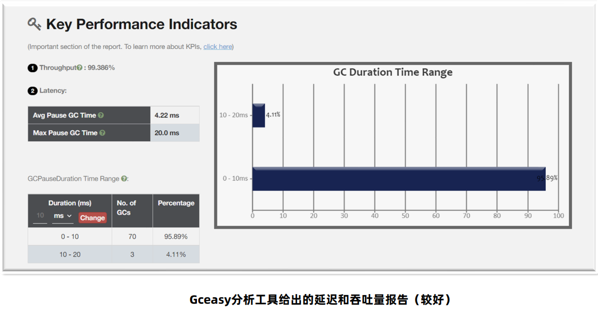

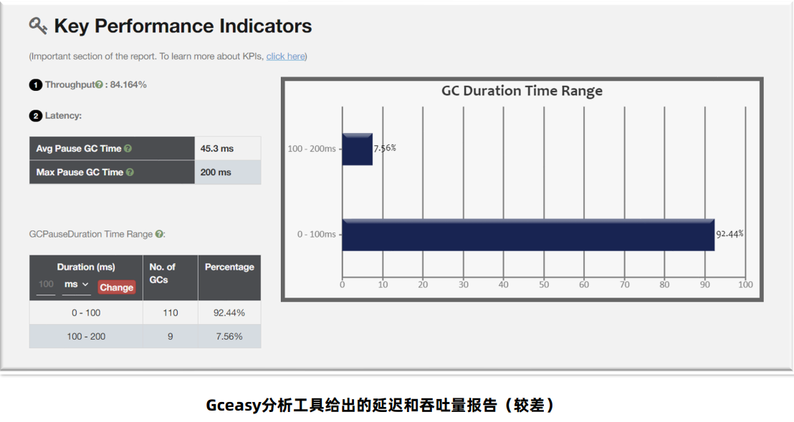

### 3.内存使用量

内存使用量指的是Java应用占用系统内存的最大值，一般通过Jvm参数调整，在满足上述两个指标的前提下， 这个值越小越好。

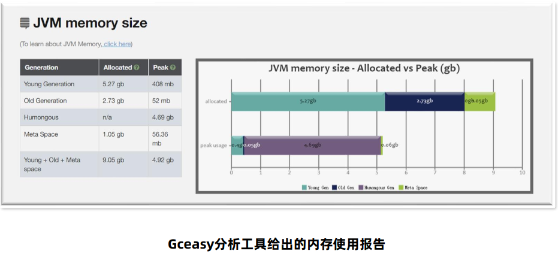

## 二、GC调优方法

### 发现问题 – jstat工具

- Jstat工具是JDK自带的一款监控工具，可以提供各种垃圾回收、类加载、编译信息 等不同的数据。
- 使用方法为：jstat -gc 进程ID 每次统计的间隔（毫秒） 统计次数

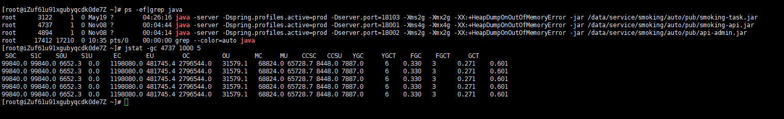

- C代表Capacity容量，U代表Used使用量
- S – 幸存者区，E – 伊甸园区，O – 老年代，M – 元空间
- YGC、YGT：年轻代GC次数和GC耗时（单位：秒）
- FGC、FGCT：Full GC次数和Full GC耗时
- GCT：GC总耗时

优点：操作简单，无额外的软件安装

缺点：无法精确到GC产生的时间，只能用于判断GC是否存在问题

### 发现问题 – visualvm插件

VisualVm中提供了一款Visual Tool插件（Visual GC），实时监控Java进程的堆内存结构、 堆内存变化趋势以及垃圾回收时间的变化趋势。同时还可以监控对象晋升的直方图。

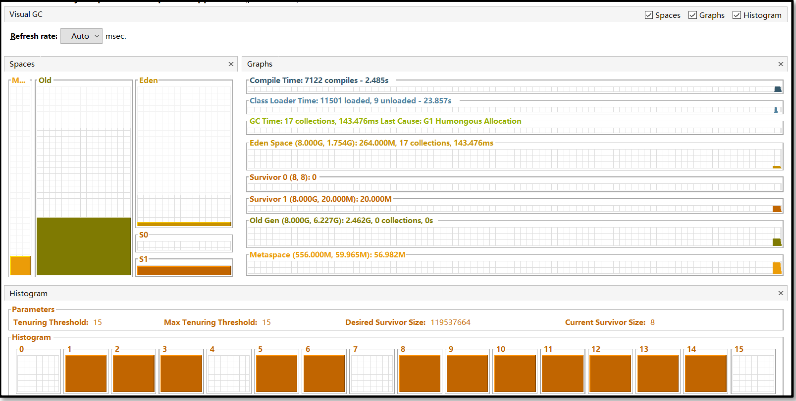

优点：适合开发使用，能直观的 看到堆内存和GC的变化趋 势

缺点：对程序运行性能有一定影响，生产环境程序员一般没有权限进 行操作

### 发现问题 – Prometheus + Grafana

- Prometheus+Grafana是企业中运维常用的监控方案，其中Prometheus用来采集 系统或者应用的相关数据，同时具备告警功能。Grafana可以将Prometheus采集 到的数据以可视化的方式进行展示。

- Java程序员要学会如何读懂Grafana展示的Java虚拟机相关的参数。

  

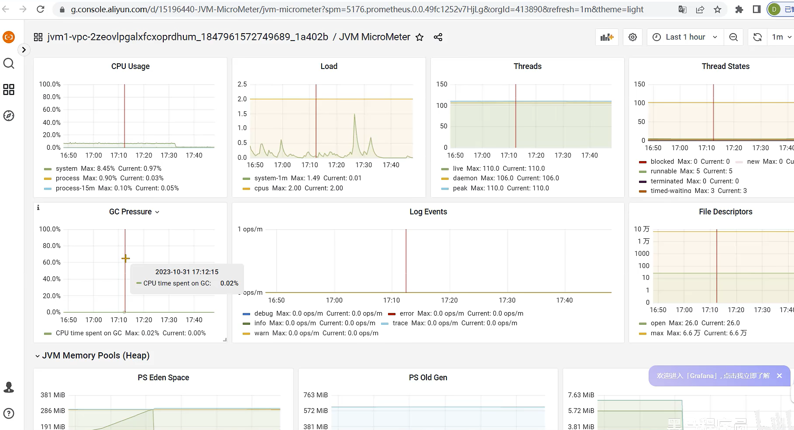

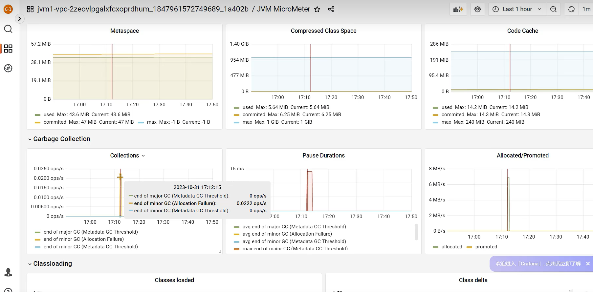

优点：

1.支持系统级别和应用级别的监 控，比如linux操作系统、 Redis、MySQL、Java进程。

2.支持告警并允许自定义告警指 标，通过邮件、短信等方式尽 早通知相关人员进行处理

缺点：环境搭建较为复杂，一般由运维 人员完成

### 发现问题 – GC日志

- 通过GC日志，可以更好的看到垃圾回收细节上的数据，同时也可以根据每款垃圾回收器的不同特点更好地发 现存在的问题。
- 使用方法（JDK 8及以下）：-XX:+PrintGCDetails -Xloggc:文件名
- 使用方法（JDK 9+）：-Xlog:gc*:file=文件名

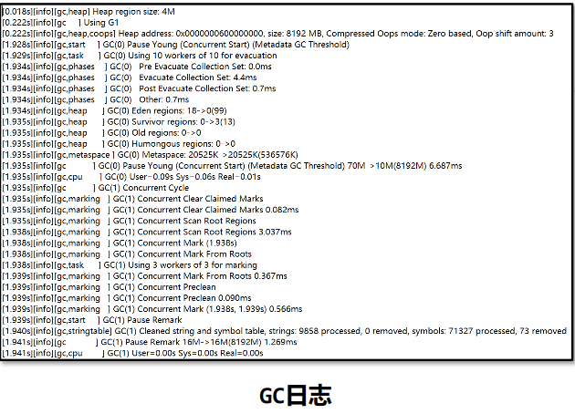

### 发现问题 – GC Viewer

GCViewer是一个将GC日志转换成可视化图表的小工具，github地址：  https://github.com/chewiebug/GCViewer

使用方法：java -jar gcviewer_1.3.4.jar 日志文件.log

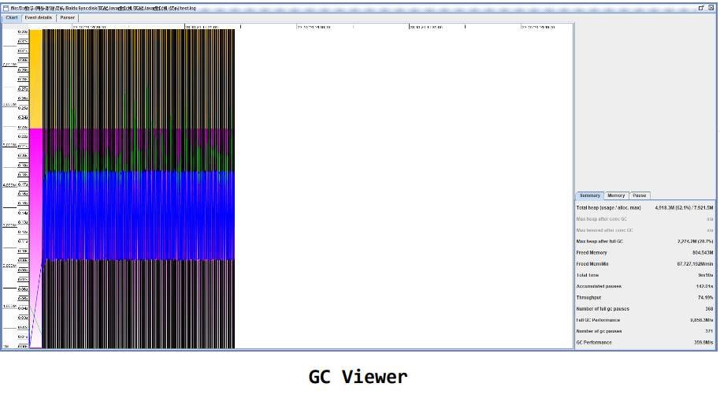

### 发现问题 – GCeasy

GCeasy是业界首款使用AI机器学习技术在线进行GC分析和诊断的工具。定位内存泄漏、GC延迟高的问题，提供JVM 参数优化建议，支持在线的可视化工具图表展示。

官方网站：https://gceasy.io/

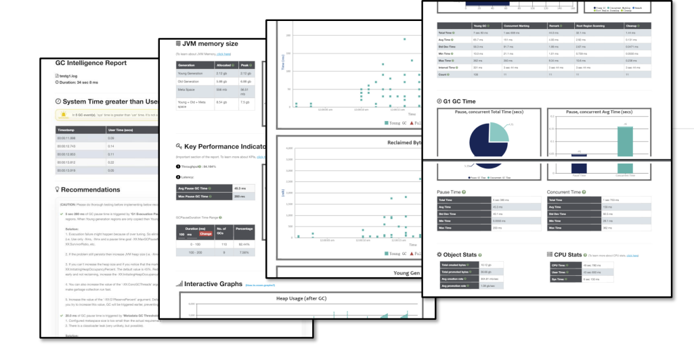

国外的网站，需要使用vpn,每个账号每个月有5次免费诊断分析的机会，可以多注册几个邮箱，那就可以多诊断几次

注册登录完账号后，选择gc日志文件进行解析，得到如下报告

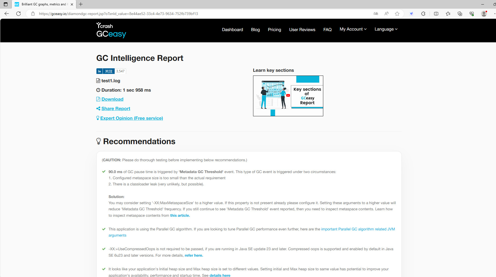

Recommendations：建议

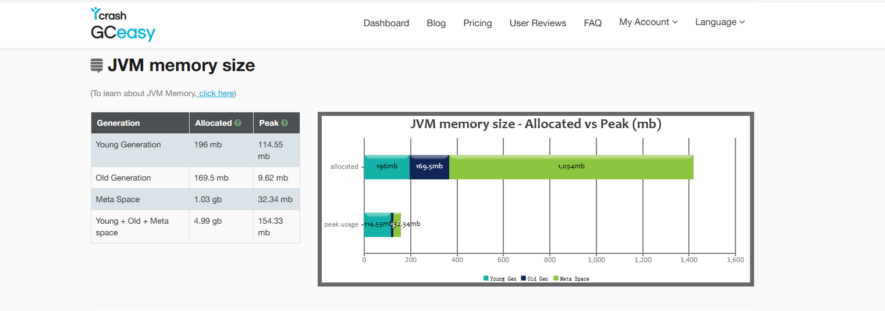

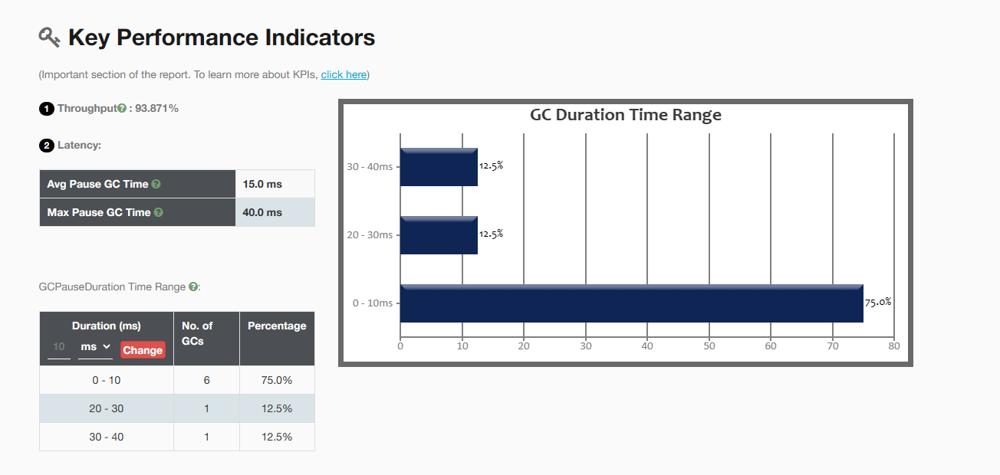

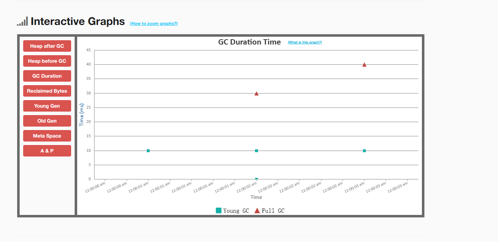

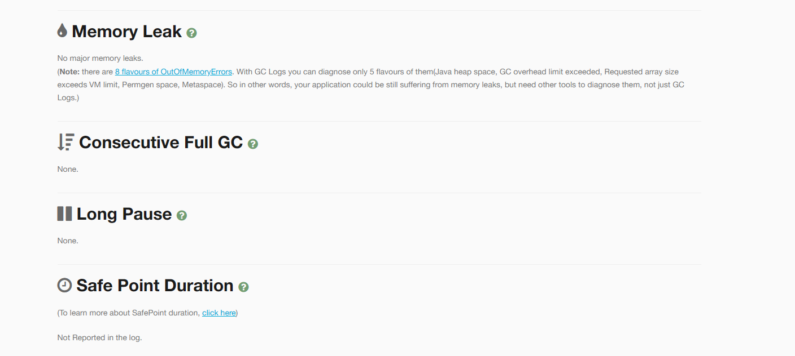

Memory Leak展示内存泄漏情况

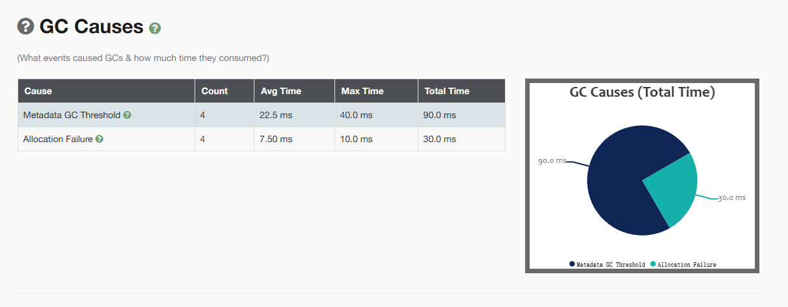

GC Causes：展示了GC次数和暂停时间

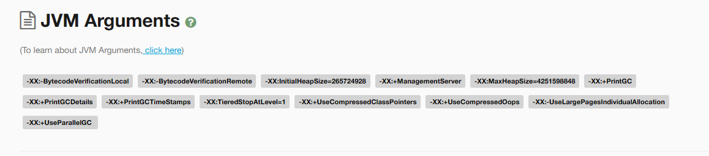

### 发现问题 – 常见的GC模式

#### 1、正常情况

特点：呈现锯齿状，对象创建之后内存上升，一旦发生垃圾回收之后下降到底部，并且每次下降之后的内存大小 接近，存留的对象较少。

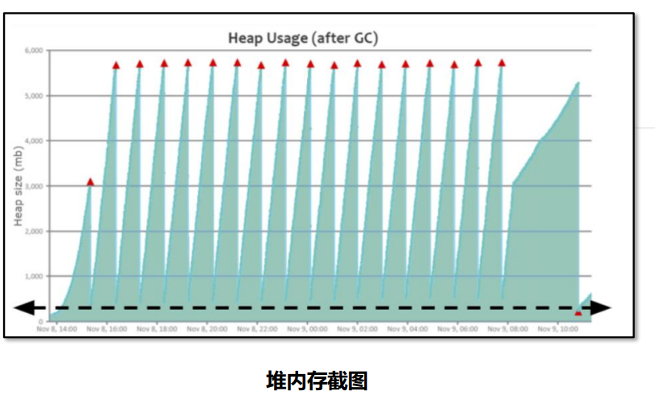

#### 2、缓存对象过多

特点：呈现锯齿状，对象创建之后内存上升，一旦发生垃圾回收之后下降到底部，并且每次下降之后的内存大小 接近，处于比较高的位置。 

问题产生原因： 程序中保存了大量的缓存对象，导致GC之后无法释放，可以使用MAT或者HeapHero等工具进行 分析内存占用的原因。

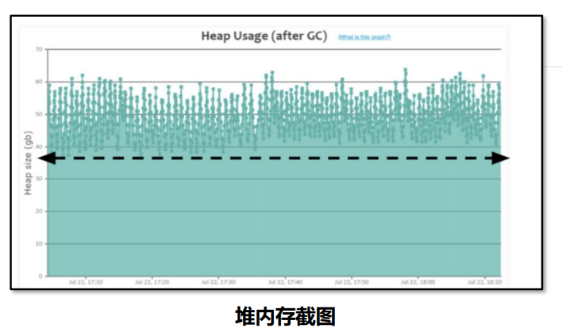

#### 3、内存泄漏

特点：呈现锯齿状，每次垃圾回收之后下降到的内存位置越来越高，最后由于垃圾回收无法释放空间导致对象无 法分配产生OutOfMemory的错误。 

问题产生原因： 程序中保存了大量的内存泄漏对象，导致GC之后无法释放，可以使用MAT或者HeapHero等工具 进行分析是哪些对象产生了内存泄漏。

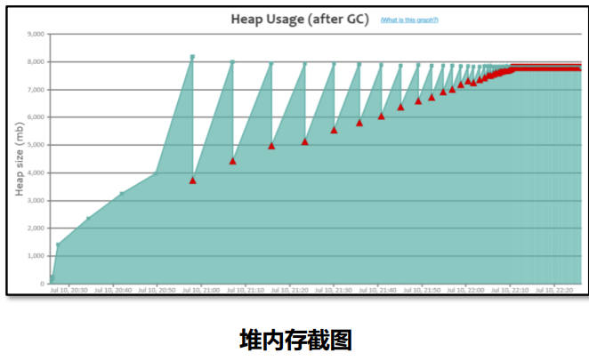

#### 4、持续的FullGC

特点：在某个时间点产生多次Full GC，CPU使用率同时飙高，用户请求基本无法处理。一段时间之后恢复正常。 

问题产生原因： 在该时间范围请求量激增，程序开始生成更多对象，同时垃圾收集无法跟上对象创建速率，导致 持续地在进行FULL GC。

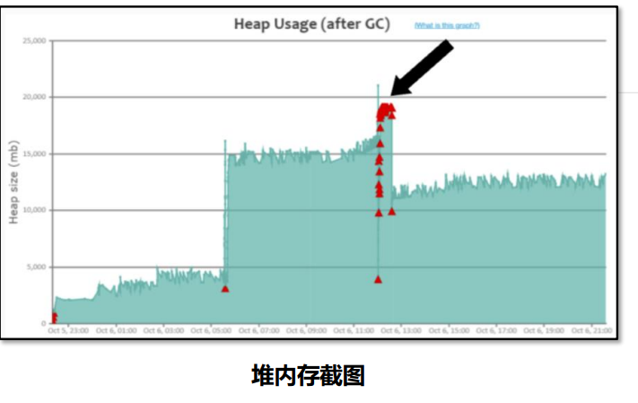

#### 5、元空间不足导致的FULLGC 

特点：堆内存的大小并不是特别大，但是持续发生FULLGC。 

问题产生原因： 元空间大小不足，导致持续FULLGC回收元空间的数据

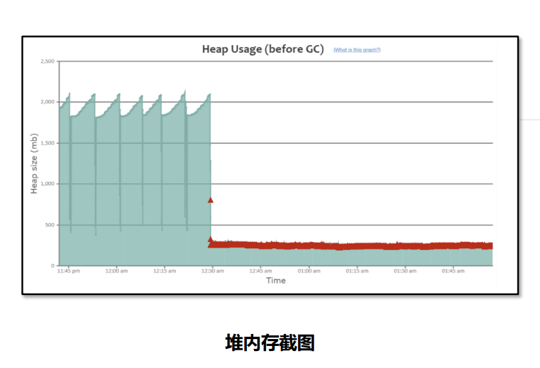

### 解决GC问题的手段

解决GC问题的手段中，前三种是比较推荐的手段，第四种仅在前三种无法解决时选用：

1.优化基础JVM参数

基础JVM参数的设置 不当，会导致频繁 FULLGC的产生

2.减少对象产生

大多数场景下的FULLGC是由 于对象产生速度过快导致的， 减少对象产生可以有效的缓 解FULLGC的发生

3.更换垃圾回收器

选择适合当前业务场景的 垃圾回收器，减少延迟、 提高吞吐量

4.优化垃圾回收器参数

优化垃圾回收器的参数， 能在一定程度上提升GC 效率

#### 1.解决问题 - 优化基础JVM参数

##### 参数1 ： -Xmx 和 –Xms

-Xmx参数设置的是最大堆内存，但是由于程序是运行在服务器或者容器上，计算可用内存时，要将元空间、操作系统、 其它软件占用的内存排除掉。 案例： 服务器内存4G，操作系统+元空间最大值+其它软件占用1.5G，-Xmx可以设置为2g。 

最合理的设置方式应该是根据最大并发量估算服务器的配置，然后再根据服务器配置计算最大堆内存的值。

-Xms用来设置初始堆大小，建议将-Xms设置的和-Xmx一样大，有以下几点好处：

- 运行时性能更好，堆的扩容是需要向操作系统申请内存的，这样会导致程序性能短期下降。
- 可用性问题，如果在扩容时其他程序正在使用大量内存，很容易因为操作系统内存不足分配失败。
- 启动速度更快，Oracle官方文档的原话：如果初始堆太小，Java 应用程序启动会变得很慢，因为 JVM 被迫频 繁执行垃圾收集，直到堆增长到更合理的大小。为了获得最佳启动性能，请将初始堆大小设置为与最大堆大小相同。

##### 参数2 ： -XX:MaxMetaspaceSize 和 –XX:MetaspaceSize

-XX:MaxMetaspaceSize=值 参数指的是最大元空间大小，默认值比较大，如果出现元空间内存泄漏会让操作系 统可用内存不可控，建议根据测试情况设置最大值，一般设置为256m。

-XX:MetaspaceSize=值 参数指的是到达这个值之后会触发FULLGC（网上很多文章的初始元空间大小是错误的）， 后续什么时候再触发JVM会自行计算。如果设置为和MaxMetaspaceSize一样大，就不会FULLGC，但是对象也无法 回收。

##### 参数3 ： -Xss虚拟机栈大小

如果我们不指定栈的大小，JVM 将创建一个具有默认大小的栈。大小取决于操作系统和计算机的体系结构。 比如Linux x86 64位 ： 1MB，如果不需要用到这么大的栈内存，完全可以将此值调小节省内存空间，合理值为 256k – 1m之间。 

使用：-Xss256k

##### 参数4 ： 不建议手动设置的参数

由于JVM底层设计极为复杂，一个参数的调整也许让某个接口得益，但同样有可能影响其他更多接口。

-Xmn 年轻代的大小，默认值为整个堆的1/3，可以根据峰值流量计算最大的年轻代大小，尽量让对象只存放在年 轻代，不进入老年代。但是实际的场景中，接口的响应时间、创建对象的大小、程序内部还会有一些定时任务等不 确定因素都会导致这个值的大小并不能仅凭计算得出，如果设置该值要进行大量的测试。G1垃圾回收器尽量不要设 置该值，G1会动态调整年轻代的大小。

‐XX:SurvivorRatio 伊甸园区和幸存者区的大小比例，默认值为8。

‐XX:MaxTenuringThreshold 最大晋升阈值，年龄大于此值之后，会进入老年代。另外JVM有动态年龄判断机 制：将年龄从小到大的对象占据的空间加起来，如果大于survivor区域的50%，然后把等于或大于该年龄的对象， 放入到老年代。

##### 其他参数:

- -XX:+DisableExplicitGC

  禁止在代码中使用System.gc()， System.gc()可能会引起FULLGC，在代码中尽量不要使用。使用 DisableExplicitGC参数可以禁止使用System.gc()方法调用。

- -XX:+HeapDumpOnOutOfMemoryError：

  发生OutOfMemoryError错误时，自动生成hprof内存快照文件。 -XX:HeapDumpPath=：指定hprof文件的输出路径。

- 打印GC日志

  JDK8及之前 ： -XX:+PrintGCDetails -XX:+PrintGCDateStamps -Xloggc:文件路径 

  JDK9及之后 ： -Xlog:gc*:file=文件路径

##### JVM参数模板：

> -Xms1g 
>
> -Xmx1g 
>
> -Xss256k 
>
> -XX:MaxMetaspaceSize=512m 
>
>  -XX:+DisableExplicitGC 
>
> -XX:+HeapDumpOnOutOfMemoryError 
>
> -XX:HeapDumpPath=/opt/logs/my-service.hprof 
>
> -XX:+PrintGCDetails 
>
> -XX:+PrintGCDateStamps 
>
> -Xloggc:文件路径

注意： JDK9及之后gc日志(最后三行)输出修改为 -Xlog:gc*:file=文件名 堆内存大小和栈内存大小根据实际情况灵活调整。

#### 2.解决问题 - 减少对象产生

大多数场景下的FULLGC是由 于对象产生速度过快导致的， 减少对象产生可以有效的缓 解FULLGC的发生

#### 3.解决问题 - 更换垃圾回收器

> 背景： 
>
> 小李负责的程序在高峰期遇到了性能瓶颈，团队从业务代码入手优化了多次也取得了不错的效 果，这次他希望能采用更合理的垃圾回收器优化性能。
>
> 思路：
>
> 1. 编写Jmeter脚本对程序进行压测，同时添加RT响应时间、每秒钟的事务数 等指标进行监控。 
>
> 2. 选择不同的垃圾回收器进行测试，并发量分别设置50、100、200，观察 数据的变化情况。
>
> 3. JDK8 下 ParNew + CMS 组合 ： -XX:+UseParNewGC -XX:+UseConcMarkSweepGC 
>
>    默认组合 ： PS（Parallel Scavenge） + PO（Parallel Old）
>
>    JDK8使用g1 : -XX:+UseG1GC 
>
>    JDK11 默认 g1
>
>    

#### 4.解决问题 – 优化垃圾回收器的参数

一个优化的案例：

CMS的并发模式失败（concurrent mode failure）现象。由于CMS的垃圾清理线程和用户线程是并行进行的，如 果在并发清理的过程中老年代的空间不足以容纳放入老年代的对象，会产生并发模式失败。

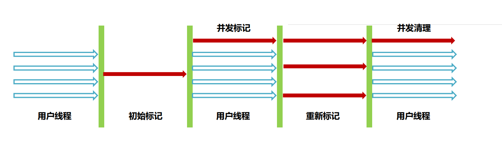

并发模式失败会导致Java虚拟机使用Serial Old单线程进行FULLGC回收老年代，出现长时间的停顿。

解决方案：

1.减少对象的产生以及对象的晋升。

2.增加堆内存大小

3.优化垃圾回收器的参数，比如-XX:CMSInitiatingOccupancyFraction=值，当老年代大小到达该阈值时，会 自动进行CMS垃圾回收，通过控制这个参数提前进行老年代的垃圾回收，减少其大小。 JDK8中默认这个参数值为 -1，根据其他几个参数计算出阈值： ((100 - MinHeapFreeRatio) + (double)(CMSTriggerRatio * MinHeapFreeRatio) / 100.0)

该参数设置完是不会生效的，必须开启-XX:+UseCMSInitiatingOccupancyOnly参数。

## 三、实战案例

### 实战案例 – 内存调优 + GC调优

> 背景： 小李负责的程序在高峰期经常会出现接口调用时间特别长的现象，他希望能优化程序的性能。
>
> 思路： 
>
> 1. 生成GC报告，通过Gceasy工具进行分析，判断是否存在GC问题或者内存问题。 
> 2. 存在内存问题，通过jmap或者arthas将堆内存快照保存下来。 
> 3. 通过MAT或者在线的heaphero工具分析内存问题的原因。 
> 4. 修复问题，并发布上线进行测试。

问题1： 发生了连续的FULL GC,堆内存1g如果没有请求的情况下，内存大小在200-300mb之间。

分析： 没有请求的情况下，内存大小并没有处于很低的情况，满足缓存对象过多的情况，怀疑内存种 缓存了很多数据。需要将堆内存快照保存下来进行分析。

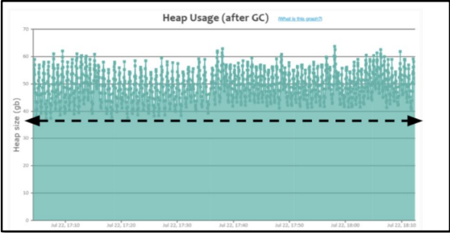

问题2： 堆内存快照保存到本地之后，使用MAT打开，发现只有几十兆的内存。

分析： 有大量的对象不在GC Root引用链上，可以被回收，使用MAT查看这些对象。

问题3： 由于这些对象已经不在引用链上，无法通过支配树等手段分析创建的位置。 

分析： 在不可达对象列表中，除了发现大量的byte[]还发现了大量的线程，可以考虑跟踪线程的栈信息 来判断对象在哪里创建。

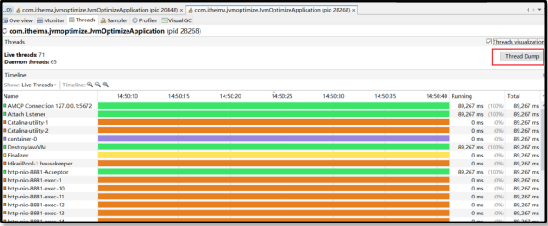

问题产生原因： 在定时任务中通过线程创建了大量的对象，导致堆内存一直处于比较高的位置。

解决方案： 暂时先将这段代码注释掉，测试效果，由于这个服务本身的内存压力比较大，将这段定时任务 移动到别的服务中。

问题4： 修复之后内存基本上处于100m左右，但是当请求发生时，依然有频繁FULL GC的发生。

分析： 请求产生的内存大小比当前最大堆内存大，尝试选择配置更高的服务器，将-Xmx和-Xms参数 调大一些。

案例总结： 

1、压力比较大的服务中，尽量不要存放大量的缓存或者定时任务，会影响到服务的内存使用。 

2、内存分析发现有大量线程创建时，可以使用导出线程栈来查看线程的运行情况。 

3、如果请求确实创建了大量的内存超过了内存上限，只能考虑减少请求时创建的对象，或者使用更大的内存。 

4、推荐使用g1垃圾回收器，并且使用较新的JDK可以获得更好的性能。

### GC调优的核心流程：

1、监控是否出现连续的FULL GC或者单次GC时间过长。

2、诊断并解决，一般通过四种途径解决：

- 优化基础JVM参数
- 减少对象的产生
- 更换垃圾回收器
- 优化垃圾回收参数

3、在测试环境验证问题是否已经解决，最后发布上线。

