---

title: JVM | 实战篇3 | 性能调优
icon: article
date: 2022-11-16
category: JVM
tag:
  - JVM

---

## 一、性能调优解决的问题

应用程序在运行过程中经常会出现性能问题，比较常见的性能问题现象是：

1、通过top命令查看CPU占用率高，接近100甚至多核CPU下超过100都是有可能的。

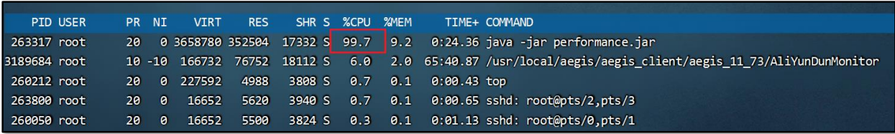

2、请求单个服务处理时间特别长，多服务使用skywalking等监控系统来判断是哪一个环节性能低下。

3、程序启动之后运行正常，但是在运行一段时间之后无法处理任何的请求（内存和GC正常）。

## 二、性能调优的方法

### 性能调优 – 线程转储的查看方式

线程转储（Thread Dump）提供了对所有运行中的线程当前状态的快照。线程转储可以通过jstack、visualvm等工 具获取。其中包含了线程名、优先级、线程ID、线程状态、线程栈信息等等内容，可以用来解决CPU占用率高、死 锁等问题。

jstack方式

> jps 命令查看进程信息
>
> jstack 进程ID > test.tdump
>
> 

jvisualm方式

> Thread->Thread Dump
>
> 然后在visualvm界面就可以看到dump文件，鼠标选中后右键 “Save As”保存到本地目录

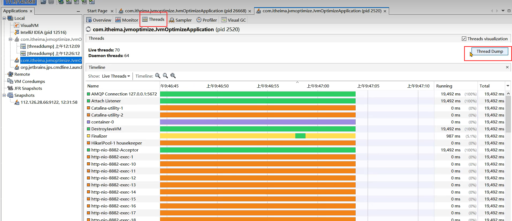

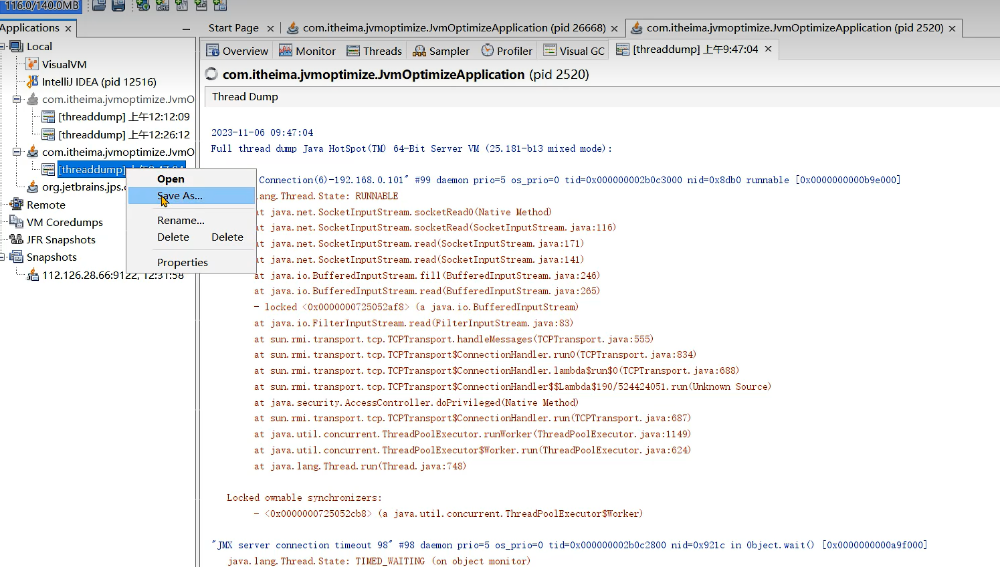

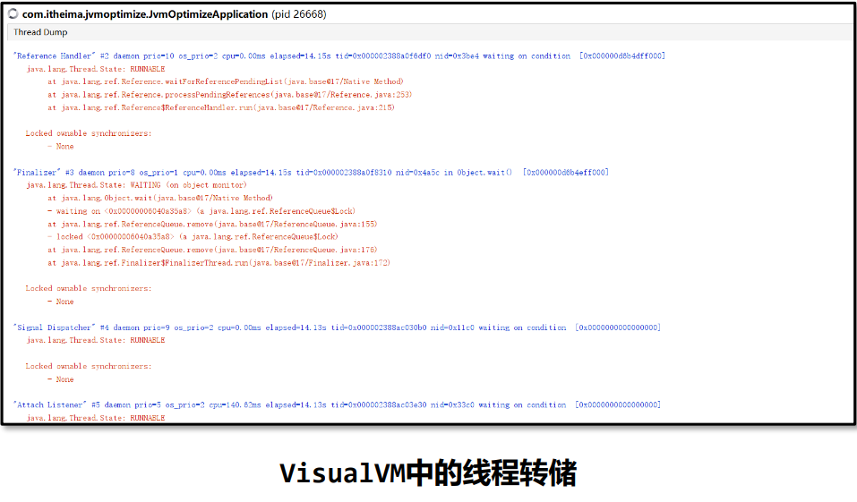

线程转储（Thread Dump）中的几个核心内容：

- 名称： 线程名称，通过给线程设置合适的名称更容易“见名知意”
- 优先级（prio）：线程的优先级
- Java ID（tid）：JVM中线程的唯一ID
- 本地 ID (nid)：操作系统分配给线程的唯一ID
- 状态：线程的状态，分为：
  - NEW – 新创建的线程，尚未开始执行
  - RUNNABLE –正在运行或准备执行 
  - BLOCKED – 等待获取监视器锁以进入或重新进入同步块/方法 
  - WAITING – 等待其他线程执行特定操作，没有时间限制 
  - TIMED_WAITING – 等待其他线程在指定时间内执行特定操作 
  - TERMINATED – 已完成执行						
- 栈追踪： 显示整个方法的栈帧信息

线程转储的可视化在线分析平台：

 1、 https://jstack.review/ 

 2、 https://fastthread.io/

### 案例1：CPU占用率高问题的解决方案

> 问题： 
>
> 监控人员通过prometheus的告警发现CPU占用率一直处于很高的情况，
>
> 通过top命令看到是由 于Java程序引起的，希望能快速定位到是哪一部分代码导致了性能问题。

解决思路：

1、通过 “top –c ” 命令找到CPU占用率高的进程，获取它的进程ID。

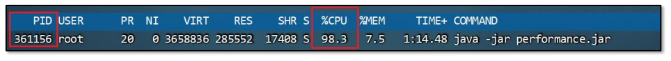

2、使用 "top -p 进程ID "   单独监控某个进程，

然后再按H可以查看到所有的线程以及线程对应 的CPU使用率，找到CPU使用率特别高的线程。

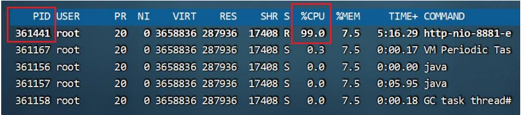

3、使用 “ jstack 进程ID ” 命令可以查看到所有线程正在执行的栈信息。

使用 “ jstack 进 程ID > 文件名 ”保存到文件中方便查看。

4、找到nid线程ID相同的栈信息，需要将之前记录下的十进制线程号转换成16进制 。

通过 “ printf ‘%x\n’ 线程ID ”命令直接获得16进制下的线程ID。

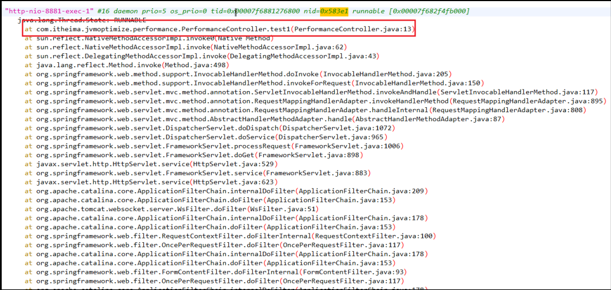

5、找到栈信息对应的源代码，并分析问题产生原因。

**遗留问题：** 

如果方法中嵌套方法比较多，如何确定栈信息中哪一个方法性能较差？

案例补充： 在定位CPU占用率高的问题时，比较需要关注的是状态为RUNNABLE的线程。但实际上，有一些线程执行本地方法时并不会消耗CPU，而只是在等待。但 JVM 仍然会 将它们标识成“RUNNABLE”状态。

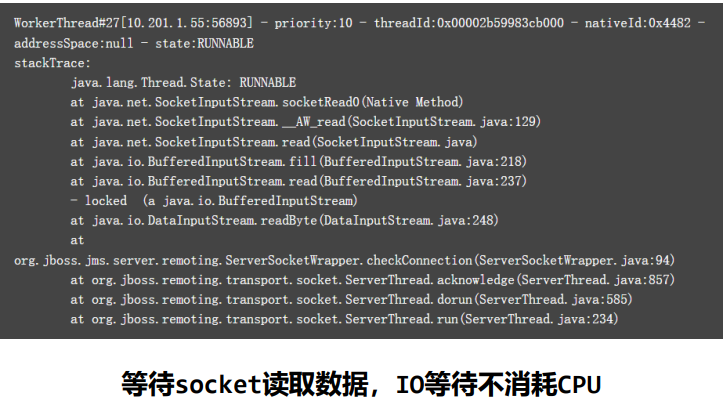

### 案例2：接口响应时间很长的问题

> 问题： 
>
> 在程序运行过程中，发现有几个接口的响应时间特别长，需要快速定位到是哪一个方法的代码 执行过程中出现了性能问题。

解决思路： 已经确定是某个接口性能出现了问题，但是由于方法嵌套比较深，需要借助于arthas定位到具 体的方法。

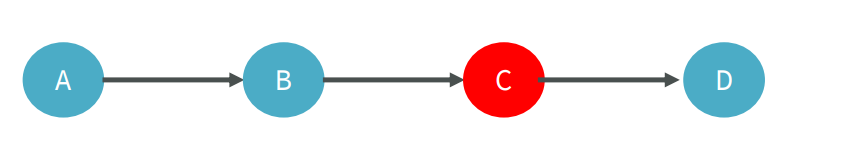

Arthas的trace命令

使用Arthas的trace命令，可以展示出整个方法的调用路径以及每一个方法的执行耗时。

命令： trace 类名 方法名

- 添加 --skipJDKMethod false 参数可以输出JDK核心包中的方法及耗时。

- 添加 ‘#cost > 毫秒值’ 参数，只会显示耗时超过该毫秒值的调用。

- 添加 –n 数值 参数，最多显示该数值条数的数据。

- 所有监控都结束之后，输入stop结束监控，重置arthas增强的对象。 优

  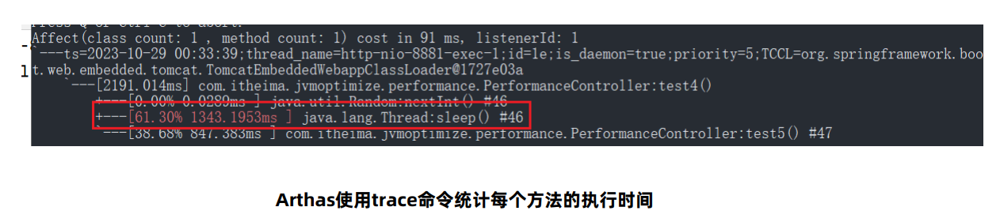

### 案例3：定位偏底层的性能问题

> 问题： 
>
> 有一个接口中使用了for循环向ArrayList中添加数据，但是最终发现执行时间比较长，需要定位 是由于什么原因导致的性能低下。

解决思路： Arthas提供了性能火焰图的功能，可以非常直观地显示所有方法中哪些方法执行时间比较长。

Arthas的profile命令 

使用arthas的profile命令，生成性能监控的火焰图。 

命令1： profiler start 开始监控方法执行性能 

命令2： profiler stop --format html 以HTML的方式生成火焰图 

火焰图中一般找绿色部分Java中栈顶上比较平的部分，很可能就是性能的瓶颈。

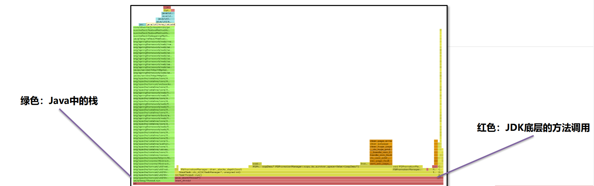

## 

