---

title: JVM-面试篇
icon: article
date: 2021-01-16
category: JVM
tag:
  - 面试

---

## 1.什么是JVM

### 1.1定义

JVM 指的是Java虚拟机（ Java Virtual Machine ）。JVM 本质上是一个运行在计算机上的程序，他的职责是运行Java字节码文件，Java虚拟机上可以运行Java、Kotlin、Scala、Groovy等语言。

### 1.2作用

为了支持Java中Write Once，Run Anywhere；编写一次，到处运行的跨平台特性。

### 1.3JVM的功能

#### 解释和运行

对字节码文件中的指令， 实时的解释成机器码， 让计算机执行

#### 内存管理

- 自动为对象、方法等分 配内存
- 自动的垃圾回收机制， 回收不再使用的对象

#### 即时编译

对热点代码进行优化， 提升执行效率

### 1.4JVM的组成

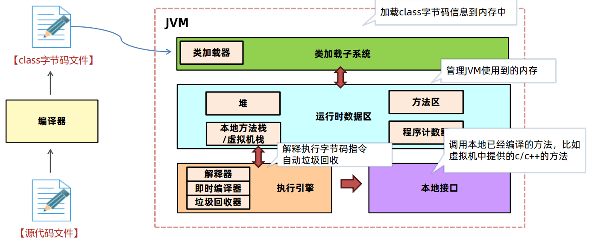

### 1.5常见的JVM

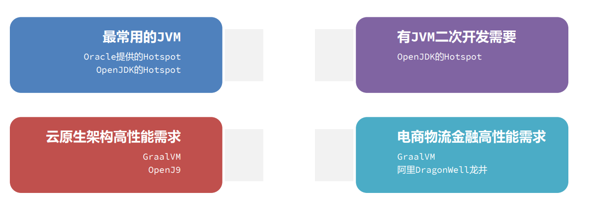

### 1.6总结

什么是JVM？ 

1、JVM 指的是Java虚拟机，本质上是一个运行在计算机上的程序，他的职 责是运行Java字节码文件，作用是为了支持跨平台特性。 

2、JVM的功能有三项：第一是解释执行字节码指令；第二是管理内存中对象的 分配，完成自动的垃圾回收；第三是优化热点代码提升执行效率。 

3、JVM组成分为类加载子系统、运行时数据区、执行引擎、本地接口这四部分 。 

4、常用的JVM是Oracle提供的Hotspot虚拟机，也可以选择GraalVM、龙井、 OpenJ9等虚拟机。

## 2.字节码文件的组成

字节码文件本质上是一个二进制的文件，无 法直接用记事本等工具打开阅读其内容。需 要通过专业的工具打开。

① 开发环境使用jclasslib插件

② 服务器环境使用javap –v  xxx.class 命令

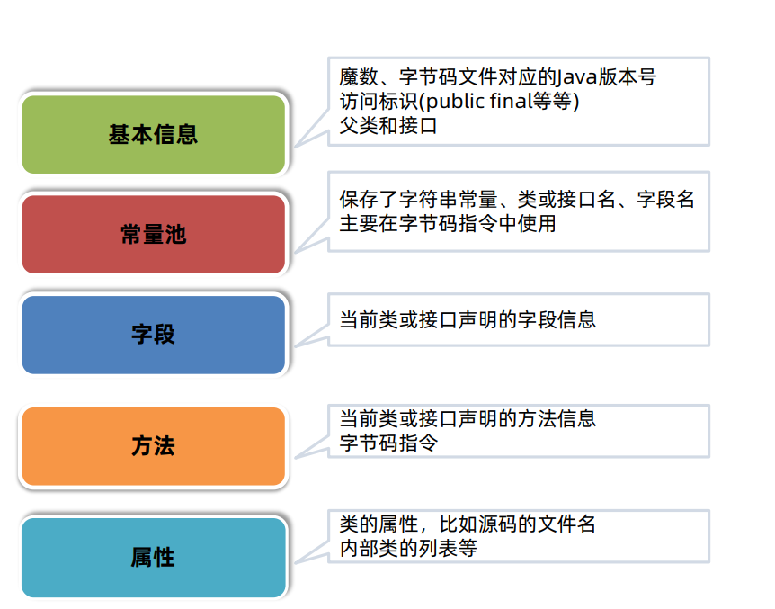

## 3.说一下运行时数据区

运行时数据区指的是JVM所管理的内存区域，其中分成两大类： 

线程共享 – 方法区、堆 

线程不共享 – 本地方法栈、虚拟机栈、程序计数器 

直接内存主要是NIO使用，由操作系统直接管理，不属于JVM内存。

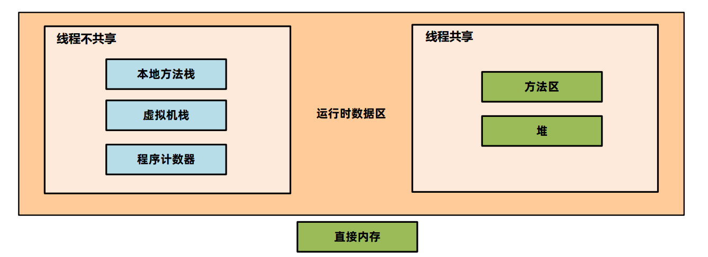

### 3.1程序计数器

程序计数器（Program Counter Register）也叫PC寄存器，每个线程会通过程序计数器记录当前要执行的的字节码 指令的地址。主要有两个作用：

1、程序计数器可以控制程序指令的进行，实现分支、跳转、异常等逻辑。

2、在多线程执行情况下，Java虚拟机需要通过程序计数器记录CPU切换前解释执行到那一句指令并继续解释运行。

### 3.2栈 - Java虚拟机栈

Java虚拟机栈采用栈的数据结构来管理方法调用中的基本数据，先进后出 ,每一个方法的调用使用一个栈帧来保存。 每个线程都会包含一个自己的虚拟机栈，它的生命周期和线程相同。

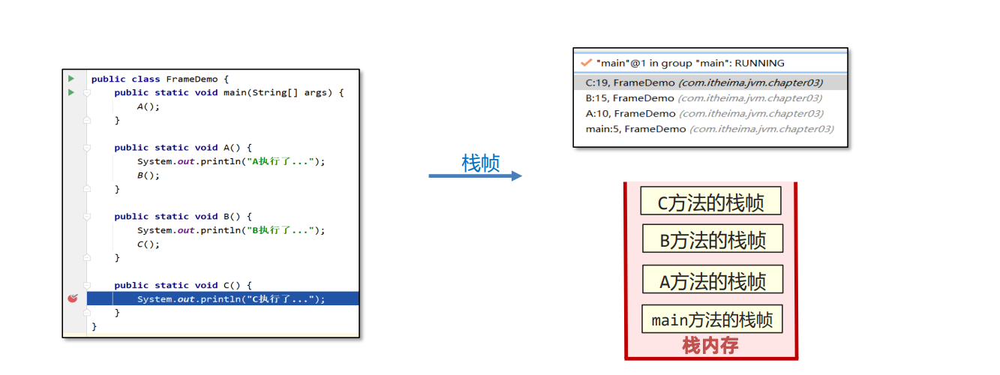

Java虚拟机栈 – 栈帧

栈帧主要包含三部分内容：

1、局部变量表，在方法执行过程中存放所有的局部变量。

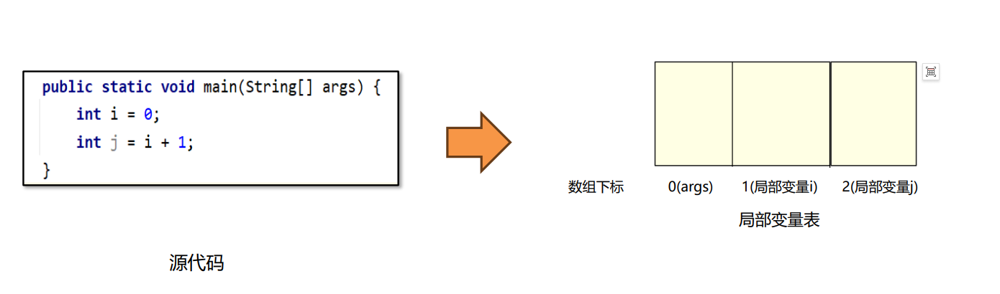

2、操作数栈，虚拟机在执行指令过程中用来存放临时数据的一块区域。

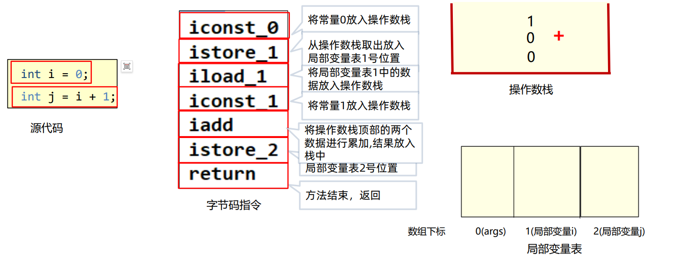

3、帧数据，主要包含动态链接、方法出口、异常表等内容。

动态链接：方法中要用到其他类的属性和方法，这些内容在字节码文件中是以编号保存的，运行过程中需要替换成 内存中的地址，这个编号到内存地址的映射关系就保存在动态链接中。 

方法出口：方法调用完需要弹出栈帧，回到上一个方法，程序计数器要切换到上一个方法的地址继续执行，方法出 口保存的就是这个地址。 

异常表：存放的是代码中异常的处理信息，包含了异常捕获的生效范围以及异常发生后跳转到的字节码指令位置。

### 3.3本地方法栈

- Java虚拟机栈存储了Java方法调用时的栈帧，而本地方法栈存储的是native本地方法的栈帧。
- 在Hotspot虚拟机中，Java虚拟机栈和本地方法栈实现上使用了同一个栈空间。本地方法栈会在栈内 存上生成一个栈帧，临时保存方法的参数同时方便出现异常时也把本地方法的栈信息打印出来。

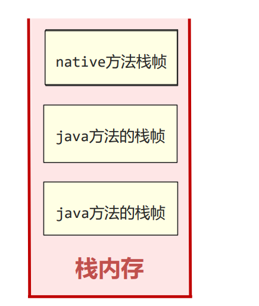

### 3.4堆

- 一般Java程序中堆内存是空间最大的一块内存区域。创建出来的对象都存在于堆上。
- 栈上的局部变量表中，可以存放堆上对象的引用。静态变量也可以存放堆对象的引用，通过静态变量就可以实现对象在线程之间共享。
- 堆是垃圾回收最主要的部分，堆结构更详细的划分与垃圾回收器有关。

### 3.5方法区

方法区是Java虚拟机规范中提出来的一个虚拟机概念，在HotSpot不同版本中会用永久代或者元空间来实现。方法 区主要存放的是基础信息，包含：

1、每一个加载的类的元信息（基础信息）。

2、运行时常量池，保存了字节码文件中的常量池内容，避免常量内容重复创建减少内存开销。

3、字符串常量池，存储字符串的常量。

### 3.6总结

**什么是运行时数据区？** 

运行时数据区指的是JVM所管理的内存区域，其中分成两大类： 

**线程共享 – 方法区、堆** 

方法区：存放每一个加载的类的元信息、运行时常量池、字符串常量池。

堆：存放创建出来的对象。

 

**线程不共享 – 本地方法栈、虚拟机栈、程序计数器** 

本地方法栈和虚拟机栈都存放了线程中执行方法时需要使用的基础数据。 

程序计数器存放了当前线程执行的字节码指令在内存中的地址。 

直接内存主要是NIO使用，由操作系统直接管理，不属于JVM内存。

## 4.哪些区域会出现内存溢出，会有什么现象？

内存溢出指的是内存中某一块区域的使用量超过了允许使用的最大值，从而使用内存时因空间不足而失败，虚拟机一般 会抛出指定的错误。 

在Java虚拟机中，只有程序计数器不会出现内存溢出的情况，因为每个线程的程序计数器只保存一个固定长度的地址。

### 4.1堆内存溢出：

堆内存溢出指的是在堆上分配的对象空间超过了堆的最大大小，从而导致的内存溢出。堆的最大大小使用-Xmx参数进 行设置，如-Xmx10m代表最大堆内存大小为10m。

溢出之后会抛出OutOfMemoryError，并提示是Java heap Space导致的：

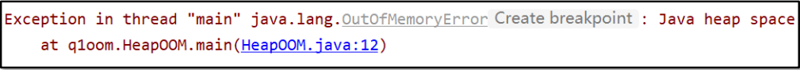

### 4.2栈内存溢出：

栈内存溢出指的是所有栈帧空间的占用内存超过了最大值，最大值使用-Xss进行设置，比如-Xss256k代表所有栈帧占用 内存大小加起来不能超过256k。 

溢出之后会抛出StackOverflowError：

### 4.3方法区内存溢出：

方法区内存溢出指的是方法区中存放的内容比如类的元信息超过了方法区内存的最大值，JDK7及之前版本方法区使用永久代（-XX:MaxPermSize=值）来实现，JDK8及之后使用元空间（-XX:MaxMetaspaceSize=值）来实现。

元空间溢出：

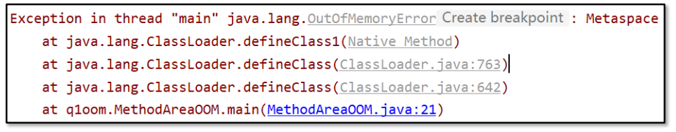

永久代溢出：

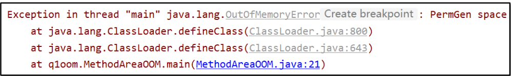

### 4.4直接内存溢出：

直接内存溢出指的是申请的直接内存空间大小超过了最大值，使用 -XX:MaxDirectMemorySize=值 设置最大值。 溢出之后会抛出OutOfMemoryError：

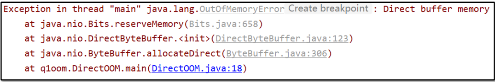

### 4.5总结

**哪些区域会出现内存溢出，会有什么现象？** 

内存溢出指的是内存中某一块区域的使用量超过了允许使用的最大值，从而使用内存 时因空间不足而失败，虚拟机一般会抛出指定的错误。 

堆：溢出之后会抛出OutOfMemoryError，并提示是Java heap Space导致的。 

栈：溢出之后会抛出StackOverflowError。 

方法区：溢出之后会抛出OutOfMemoryError，JDK7及之前提示永久代，JDK8及之 后提示元空间。 

直接内存：溢出之后会抛出OutOfMemoryError。

## 5.JDK6-8之间在内存区域上有什么不同

### 5.1方法区的实现

方法区是《Java虚拟机规范》中设计的虚拟概念，每款Java虚拟机在实现上都各不相同。Hotspot设计如下：

- JDK7及之前的版本将方法区存放在堆区域中的永久代空间，堆的大小由虚拟机参数来控制。
- JDK8及之后的版本将方法区存放在元空间中，元空间位于操作系统维护的直接内存中，默认情况下只要不 超过操作系统承受的上限，可以一直分配。也可以手动设置最大大小。

使用元空间替换永久代的原因：

1、提高内存上限：元空间使用的是操作系统内存，而不是JVM内存。如果不设置上限，只要不超过操作系统内存 上限，就可以持续分配。而永久代在堆中，可使用的内存上限是有限的。所以使用元空间可以有效减少OOM情况 的出现。 

2、优化垃圾回收的策略：永久代在堆上，垃圾回收机制一般使用老年代的垃圾回收方式，不够灵活。使用元空间 之后单独设计了一套适合方法区的垃圾回收机制。

### 5.2字符串常量池的位置

早期设计时，字符串常量池是属于运行时常量池的一部分，他们存储的位置也是一致的。后续做出了调整， 将字符串常量池和运行时常量池做了拆分。

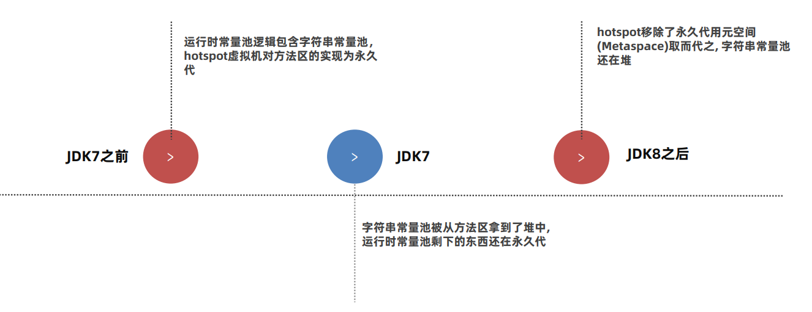

字符串常量池从方法区移动到堆的原因： 

1、垃圾回收优化：字符串常量池的回收逻辑和对象的回收逻辑类似，内存不足的情况下，如果字符串常量池中的 常量不被使用就可以被回收；方法区中的类的元信息回收逻辑更复杂一些。移动到堆之后，就可以利用对象的垃圾 回收器，对字符串常量池进行回收。 

2、让方法区大小更可控：一般在项目中，类的元信息不会占用特别大的空间，所以会给方法区设置一个比较小的 上限。如果字符串常量池在方法区中，会让方法区的空间大小变得不可控。 

3、intern方法的优化：JDK6版本中intern () 方法会把第一次遇到的字符串实例复制到永久代的字符串常量 池中。JDK7及之后版本中由于字符串常量池在堆上，就可以进行优化：字符串保存在堆上，把字符串的引用放入 字符串常量池，减少了复制的操作。

## 6.类的生命周期

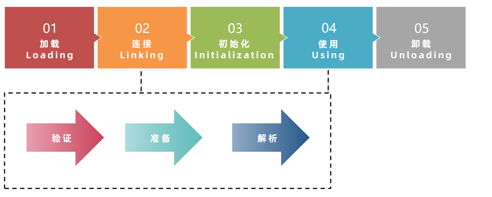

### 6.1加载阶段

1、加载(Loading)阶段第一步是类加载器根据类的全限定名通过不同的渠道以二进制流的方式获取字节码信息。程序员可以使用Java代码拓展的不同的渠道。

2、类加载器在加载完类之后，Java虚拟机会将字节码中的信息保存到内存的方法区中。在方法区生成一个InstanceKlass对象，保存类的所有信息。

3、在堆中生成一份与方法区中数据类似的java.lang.Class对象，作用是在Java代码中去获取类的信息。

### 6.2连接阶段

#### 6.2.1连接阶段之验证

连接（Linking）阶段的第一个环节是验证，验证的主要目的是检测Java字节码文件是否遵守了《Java虚拟机规范》中的约束。这个阶段一般不需要程序员参与。

主要包含如下四部分，具体详见《Java虚拟机规范》：

1.文件格式验证，比如文件是否以0xCAFEBABE开头，主次版本号是否满足当前Java虚拟机版本要求。

2.元信息验证，例如类必须有父类（super不能为空）。

3.验证程序执行指令的语义，比如方法内的指令执行到一半强行跳转到其他方法中去。

4.符号引用验证，例如是否访问了其他类中private的方法等。

#### 6.2.2连接阶段之准备

准备阶段为静态变量（static）分配内存并设置初值。final修饰的基本数据类型的静态变量，准备阶段直接会将代码中的值进行赋值。

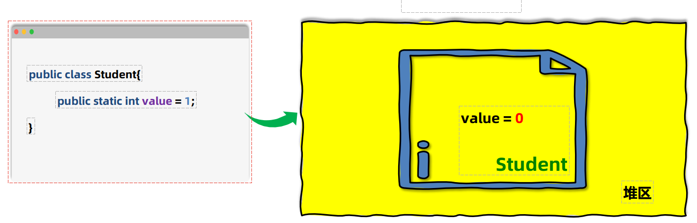

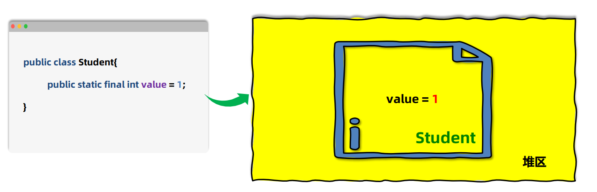

#### 6.2.3连接阶段之解析

解析阶段主要是将常量池中的符号引用替换为直接引用。符号引用就是在字节码文件中使用编号来访问常量池中 的内容。直接引用不在使用编号，而是使用内存中地址进行访问具体的数据。

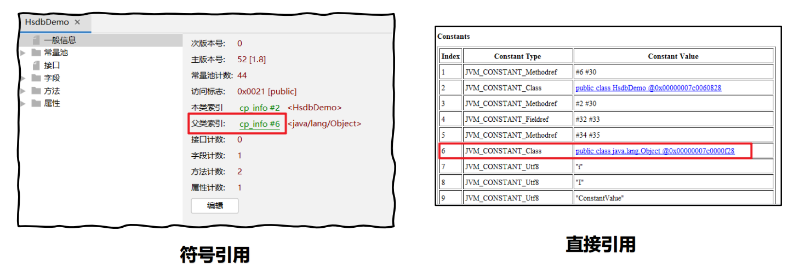

### 6.3初始化阶段

初始化阶段会执行静态代码块中的代码，并为静态变量赋值。

初始化阶段会执行字节码文件中clinit部分的字节码指令。

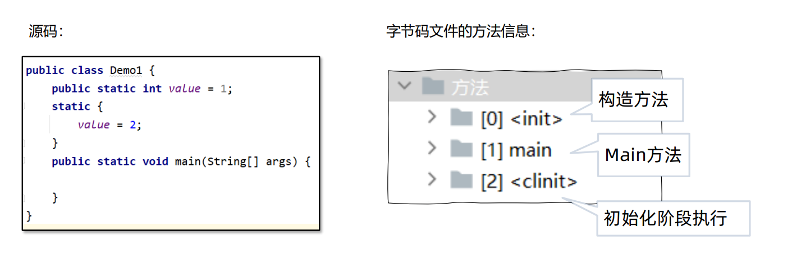

### 6.4类的卸载

判定一个类可以被卸载。需要同时满足下面三个条件： 

1、此类所有实例对象都已经被回收，在堆中不存在任何该类的实例对象以及子类对象。 

2、加载该类的类加载器已经被回收。 

3、该类对应的 java.lang.Class 对象没有在任何地方被引用。

### 6.5总结

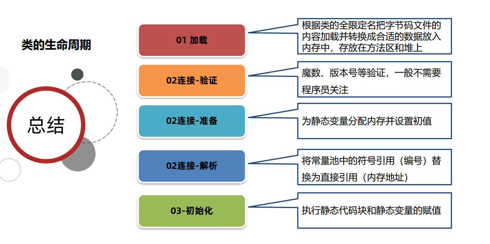

## 7.什么是类加载器，有哪些常见的类加载器

类加载器负责在类的加载过程中将字节码信息以流的方式获取并加载到内存中。JDK8及之前如下：

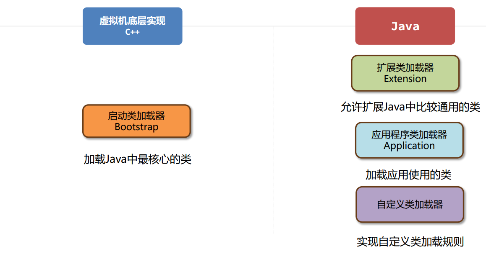

类加载器负责在类的加载过程中将字节码信息以流的方式获取并加载到内存中。JDK9之后均由Java实现：

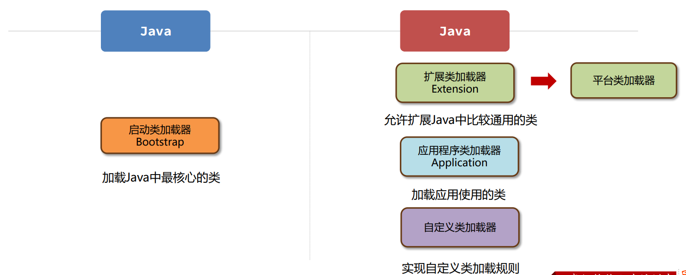

### 7.1启动类加载器

启动类加载器（Bootstrap ClassLoader）是由Hotspot虚拟机提供的类加载器，JDK9之前使用C++编写的、JDK9之 后使用Java编写。

默认加载Java安装目录/jre/lib下的类文件，比如rt.jar，tools.jar，resources.jar等。

### 7.2扩展类加载器

扩展类加载器（Extension Class Loader）是JDK中提供的、使用Java编写的类加载器。JDK9之后由于采用了模块化， 改名为Platform平台类加载器。

默认加载Java安装目录/jre/lib/ext下的类文件。

### 7.3应用程序类加载器

应用程序类加载器（Application Class Loader）是JDK中提供的、使用Java编写的类加载器。默认加载为应用程序 classpath下的类。

### 7.4自定义类加载器

自定义类加载器允许用户自行实现类加载的逻辑，可以从网络、数据库等来源加载类信息。自定义类加载器需要继承自 ClassLoader抽象类，重写findClass方法。

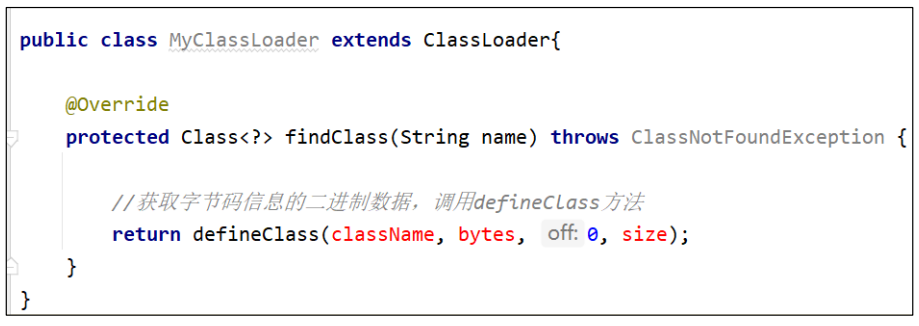

### 7.5总结

**有几种类加载器？** 

1.启动类加载器（Bootstrap ClassLoader）加载核心类 

2.扩展类加载器（Extension ClassLoader）加载扩展类 

3.应用程序类加载器（Application ClassLoader）加载应用classpath中的类 

4.自定义类加载器，重写findClass方法。 

JDK9及之后扩展类加载器（Extension ClassLoader）变成了平台类加载器（Platform  ClassLoader）

## 8.什么是双亲委派机制

类加载有层级关系，上一级称之为下一级的父类加载器。

双亲委派机制指的是：当一个类加载器接收到加载类的任务时，会向上查找是否加载过，再由顶向下进行加载。

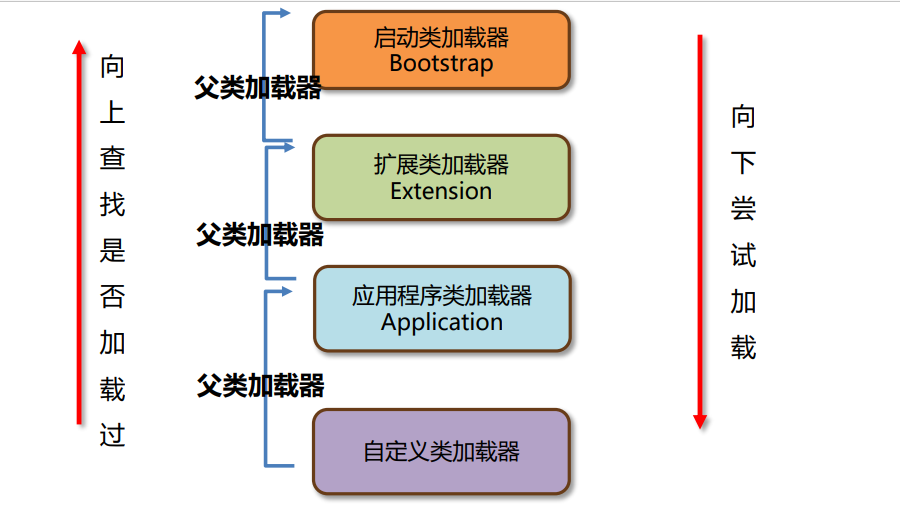

每个类加载器都有一个父类加载器，在类加载的过程中，每个类加载器都会先检查是否已经加载了该类，如 果已经加载则直接返回，否则会将加载请求委派给父类加载器。

**双亲委派机制有什么用？**

1.保证类加载的安全性

通过双亲委派机制避免恶意代码替 换JDK中的核心类库，比如 java.lang.String，确保核心类 库的完整性和安全性。

2.避免重复加载

双亲委派机制可以避免同一个类被多次加载。

**总结：**

双亲委派机制指的是：当一个类加载器接收到加载类的任务时，会向上交给父类加载器查找是否加载过，再由顶向下进行加载。

双亲委派机制的作用：保证类加载的安全性，避免重复加载。

## 9.如何打破双亲委派机制？

ClassLoader中包含了4个核心方法：

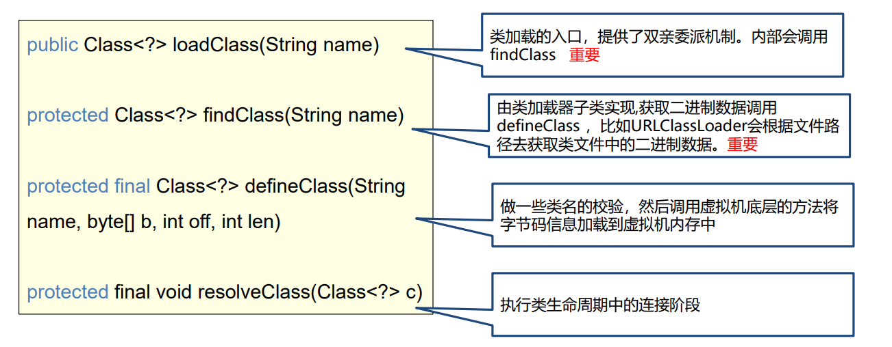

他们的调用关系如下：

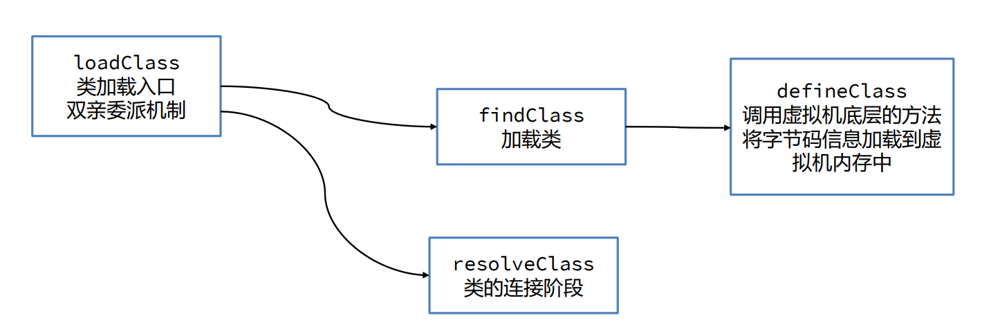

ClassLoader中包含了4个核心方法，对Java程序员来说，打破双亲委派机制的唯一方法就是实现自定义类加载器 重写loadClass方法，将其中的双亲委派机制代码去掉。

## 10.Tomcat的自定义类加载器

## 11.如何判断堆上的对象没有被引用？

常见的有两种判断方法：引用计数法和可达性分析法。

**引用计数法**会为每个对象维护一个引用计数器，当对象被引用时加1，取消引用时减1。

引用计数法的优点是实现简单，缺点有两点：

1.每次引用和取消引用都需要维护计数器，对系统性能会有一定的影响 

2.存在循环引用问题，所谓循环引用就是当A引用B，B同时引用A时会出现对象无法回收的问题。

**可达性分析算法**

Java使用的是可达性分析算法来判断对象是否可以被回收。可达性分析将对象分为两类：垃圾回收的根对象（GC  Root）和普通对象，对象与对象之间存在引用关系。

下图中A到B再到C和D，形成了一个引用链，可达性分析算法指的是如果从某个到GC Root对象是可达的，对象就 不可被回收。

**哪些对象被称之为GC Root对象呢？**

- 线程Thread对象，引用线程栈帧中的方法参数、局部变量等。
- 系统类加载器加载的java.lang.Class对象，引用类中的静态变量。
- 监视器对象，用来保存同步锁synchronized关键字持有的对象。
- 本地方法调用时使用的全局对象。

## 12.JVM 中都有哪些引用类型

- **强引用**，JVM中默认引用关系就是强引用，即是**对象被局部变量、静态变量等GC Root关联的对象引用**，只要 这层关系存在，普通对象就不会被回收。
- **软引用**，软引用相对于强引用是一种比较弱的引用关系，如果一个对象只有软引用关联到它，**当程序内存不足时，就会将软引用中的数据进行回收**。软引用主要在缓存框架中使用。
- **弱引用**，弱引用的整体机制和软引用基本一致，区别在于弱引用包含的对象**在垃圾回收时，不管内存够不够都会直接被回收**，弱引用主要在ThreadLocal中使用。
- **虚引用**（幽灵引用/幻影引用），不能通过虚引用对象获取到包含的对象。虚引用唯一的用途是当对象被垃圾回 收器回收时可以接收到对应的通知。直接内存中为了及时知道直接内存对象不再使用，从而回收内存，使用了 虚引用来实现。
- **终结器引用**，终结器引用指的是在对象需要被回收时，终结器引用会关联对象并放置在Finalizer类中的引用队 列中，在稍后由一条由FinalizerThread线程从队列中获取对象，然后执行对象的finalize方法，在对象第二次 被回收时，该对象才真正的被回收。

## 13.ThreadLocal中为什么要使用弱引用？

ThreadLocal可以在线程中存放线程的本地变量，保证数据的线程安全。

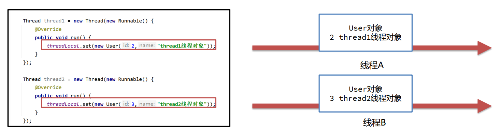

ThreadLocal中是这样去保存对象的：

1、在每个线程中，存放了一个ThreadLocalMap对象，本质上就是一个数组实现的哈希表，里边存放多个Entry对象。 

2、每个Entry对象继承自弱引用，内部存放ThreadLocal对象。同时用强引用，引用保存的ThreadLocal对应的value值。

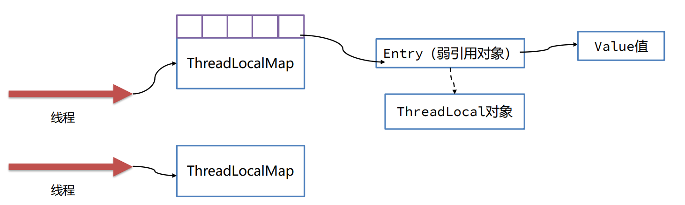

ThreadLocal中为什么要使用弱引用？ 

当threadlocal对象不再使用时，使用弱引用可以让对象被回收；因为仅有弱引用没 有强引用的情况下，对象是可以被回收的。 

弱引用并没有完全解决掉对象回收的问题，Entry对象和value值无法被回收，所以合 理的做法是手动调用remove方法进行回收，然后再将threadlocal对象的强引用解除

## 14.有哪些常见的垃圾回收算法？

### 14.1标记清除算法

标记清除算法的核心思想分为两个阶段： 

1.标记阶段，将所有存活的对象进行标记。Java中使用可达性分析算法，从GC Root开始通过引用链遍历出 所有存活对象。 

2.清除阶段，从内存中删除没有被标记也就是非存活对象。

优点：实现简单，只需要在第一阶段给每个对象维护标志位，第二阶段删除对象即可。 

缺点：

1.碎片化问题 由于内存是连续的，所以在对象被删除之后，内存中会出现很多细小的可用内存单元。如果我们需要的是一 个比较大的空间，很有可能这些内存单元的大小过小无法进行分配。

2.分配速度慢。由于内存碎片的存在，需要维护一个空闲链表，极有可能发生每次需要遍历到链表的最后才 能获得合适的内存空间。

### 14.2复制算法

复制算法的核心思想是： 

1.准备两块空间From空间和To空间，每次在对象分配阶段，只能使用其中一块空间（From空间）。 

2.在垃圾回收GC阶段，将From中存活对象复制到To空间。 

3.将两块空间的From和To名字互换。

优点：

1.吞吐量高

复制算法只需要遍历一次存活对象 复制到To空间即可，比标记-整理 算法少了一次遍历的过程，因而性 能较好，但是不如标记-清除算法， 因为标记清除算法不需要进行对象 的移动

2.不会发生碎片化

复制算法在复制之后就会将对象按顺序放入To空间中，所以对象以外的区域都是可用空间，不存在碎片化内存空间。

缺点：

内存使用效率低：每次只能让一半的内存空间来为创建对象使用

### 14.3标记整理算法

标记整理算法也叫标记压缩算法，是对标记清理算法中容易产生内存碎片问题的一种解决方案。 核心思想分为两个阶段： 

1.标记阶段，将所有存活的对象进行标记。Java中使用可达性分析算法，从GC Root开始通过引用链遍历出 所有存活对象。 

2.整理阶段，将存活对象移动到堆的一端。清理掉存活对象的内存空间。

优点：

1.内存使用效率高

整个堆内存都可以使用，不会像复 制算法只能使用半个堆内存

2.不会发生碎片化

在整理阶段可以将对象往内存的一侧进行 移动，剩下的空间都是可以分配对象的有效空间

缺点：

整理阶段的效率不高：整理算法有很多种，比如Lisp2整 理算法需要对整个堆中的对象搜索3 次，整体性能不佳。可以通过TwoFinger、表格算法、ImmixGC等高 效的整理算法优化此阶段的性能

### 14.4分代垃圾回收算法

现代优秀的垃圾回收算法，会将上述描述的垃圾回收算法组合进行使用，其中应用最广的就是分代垃圾回收 算法(Generational GC)。

分代垃圾回收将整个内存区域划分为年轻代和老年代：

分代回收时，创建出来的对象，首先会被放入Eden伊甸园区。

随着对象在Eden区越来越多，如果Eden区满，新创建的对象已经无法放入，就会触发年轻代的GC，称为 Minor GC或者Young GC。 

Minor GC会把需要eden中和From需要回收的对象回收，把没有回收的对象放入To区。

接下来，S0会变成To区，S1变成From区。当eden区满时再往里放入对象，依然会发生Minor GC。 此时会回收eden区和S1(from)中的对象，并把eden和from区中剩余的对象放入S0。 

注意：每次Minor GC中都会为对象记录他的年龄，初始值为0，每次GC完加1。

如果Minor GC后对象的年龄达到阈值（最大15，默认值和垃圾回收器有关），对象就会被晋升至老年代。 

当老年代中空间不足，无法放入新的对象时，先尝试minor gc如果还是不足，就会触发Full GC，Full GC会对整个 堆进行垃圾回收。 

如果Full GC依然无法回收掉老年代的对象，那么当对象继续放入老年代时，就会抛出Out Of Memory异常。

**分代垃圾回收算法优点**

程序中大部分对象都是朝生夕死，在年轻代创建并且回收，只有少量对象会长期存活进入老年代。分代垃圾 回收的优点有： 

1、可以通过调整年轻代和老年代的比例来适应不同类型的应用程序，提高内存的利用率和性能。

2、新生代和老年代使用不同的垃圾回收算法，新生代一般选择复制算法效率高、不会产生内存碎片，老年 代可以选择标记-清除和标记-整理算法，由程序员来选择灵活度较高。

3、分代的设计中允许只回收新生代（minor gc），如果能满足对象分配的要求就不需要对整个堆进行回收 (full gc),STW（Stop The World）由垃圾回收引起的停顿时间就会减少。

## 15.有哪些常用的垃圾回收器

垃圾回收器是垃圾回收算法的具体实现。 

由于垃圾回收器分为年轻代和老年代，除了G1之外其他垃圾回收器必须成对组合进行使用。 

具体的关系图如下：

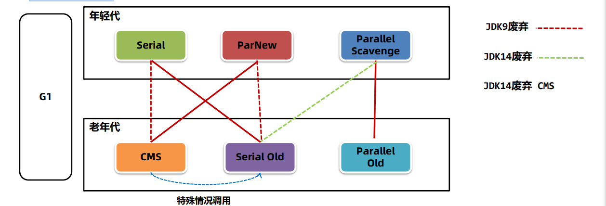

### 15.1 Serial + SerialOld

Serial是是一种单线程串行回收年轻 代的垃圾回收器。

-XX:+UseSerialGC 新生代、老 年代都使用串行回收器。

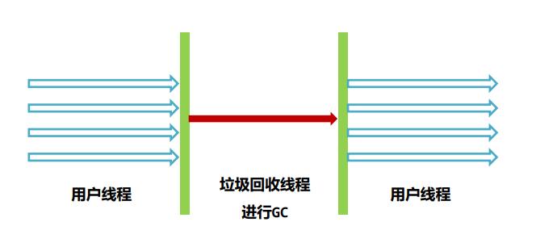

### 15.2Parallel Scavenge垃圾回收器 + Parallel Old垃圾回收器

PS+PO是JDK8默认的垃圾回收器，多线程并行回收， 关注的是系统的吞吐量。具备自动调整堆内存大小的 特点。

| 回收年代和算法                     | 优点                                                         | 缺点                   | 适用场景                                                     |
| ---------------------------------- | ------------------------------------------------------------ | ---------------------- | ------------------------------------------------------------ |
| 年轻代复制算法,老年代标记-整理算法 | 吞吐量高，而且手动可控。 为了提高吞吐量，虚拟机会 动态调整堆的参数 | 不能保证单次的停顿时间 | 后台任务，不需要与用户交互，并 且容易产生大量的对象 比如：大数据的处理，大文件导出 |

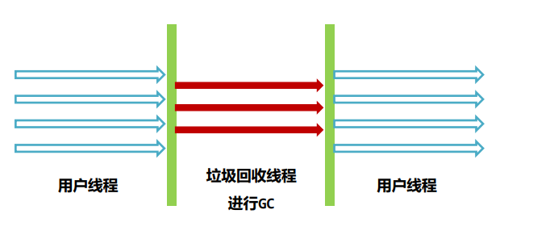

### 15.3年轻代-ParNew垃圾回收器

ParNew垃圾回收器本质上是对Serial在多 CPU下的优化，使用多线程进行垃圾回收 

-XX:+UseParNewGC 新生代使用ParNew 回收器，老年代使用串行回收器

| 回收年代和算法   | 优点                       | 缺点                                              | 适用场景                                           |
| ---------------- | -------------------------- | ------------------------------------------------- | -------------------------------------------------- |
| 年轻代，复制算法 | 多CPU处理器下停顿时间 较短 | 吞吐量和停顿时间不如G1， 所以在JDK9之后不建议使用 | JDK8及之前的版本中，与CMS 老年代垃圾回收器搭配使用 |

### 15.4老年代- CMS(Concurrent Mark Sweep)垃圾回收器

CMS垃圾回收器关注的是系统的暂停时间， 允许用户线程和垃圾回收线程在某些步骤中 同时执行，减少了用户线程的等待时间。

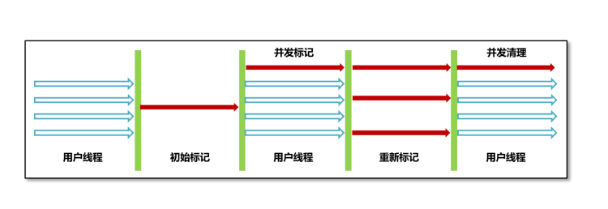

参数：-XX:+UseConcMarkSweepGC

| 回收年代和算法      | 优点                                            | 缺点                                        | 适用场景                                                     |
| ------------------- | ----------------------------------------------- | ------------------------------------------- | ------------------------------------------------------------ |
| 老年代,标记清除算法 | 系统由于垃圾回收出现的停 顿时间较短，用户体验好 | 1、内存碎片问题 2、退化问题 3、浮动垃圾问题 | 大型的互联网系统中用户请求数 据量大、频率高的场景 比如订单接口、商品接口等 |

CMS垃圾回收器存在的问题

缺点： 

1、CMS使用了标记-清除算法，在垃圾收集结束之后会出现大量的内存碎片，CMS会在Full GC时进行碎片的整理。 这样会导致用户线程暂停，可以使用-XX:CMSFullGCsBeforeCompaction=N 参数（默认0）调整N次Full GC之 后再整理。 

2.、无法处理在并发清理过程中产生的“浮动垃圾”，不能做到完全的垃圾回收。 

3、如果老年代内存不足无法分配对象，CMS就会退化成Serial Old单线程回收老年代。 

4、并发阶段会影响用户线程执行的性能

### 15.5 G1 – Garbage First 垃圾回收器

参数1： -XX:+UseG1GC 打开G1的开关， JDK9之后默认不需要打开

参数2：-XX:MaxGCPauseMillis=毫秒值  最大暂停的时间

| 回收年代和算法         | 优点                                                         | 缺点               | 适用场景                            |
| ---------------------- | ------------------------------------------------------------ | ------------------ | ----------------------------------- |
| 年轻代+老年代,复制算法 | 对比较大的堆如超过6G的堆回收时，延迟可控。 不会产生内存碎片。 并发标记的SATB算法效率高 | JDK8之前还不够成熟 | JDK8最新版本、JDK9之后建 议默认使用 |

### 15.6总结

垃圾回收器的组合关系虽然很多，但是针对几个特定的版本，比较好的组合选 择如下：

 JDK8及之前：

 ParNew + CMS（关注暂停时间）、Parallel Scavenge + Parallel Old (关注 吞吐量)、 G1（JDK8之前不建议，较大堆并且关注暂停时间）

JDK9之后:

G1（默认）

从JDK9之后，由于G1日趋成熟，JDK默认的垃圾回收器已经修改为G1，所以 强烈建议在生产环境上使用G1。

如果对低延迟有较高的要求，可以使用Shenandoah或者ZGC。

## 16.如何解决内存泄漏问题

- 内存泄漏（memory leak）：在Java中如果不再使用一个对象，但是该对象依然在GC ROOT的引用链上，这 个对象就不会被垃圾回收器回收，这种情况就称之为内存泄漏。
- 少量的内存泄漏可以容忍，但是如果发生持续的内存泄漏，就像滚雪球雪球越滚越大，不管有多大的内存迟 早会被消耗完，最终导致的结果就是内存溢出。

解决内存泄漏问题总共分为四个步骤，其中前两个步骤是最核心的：

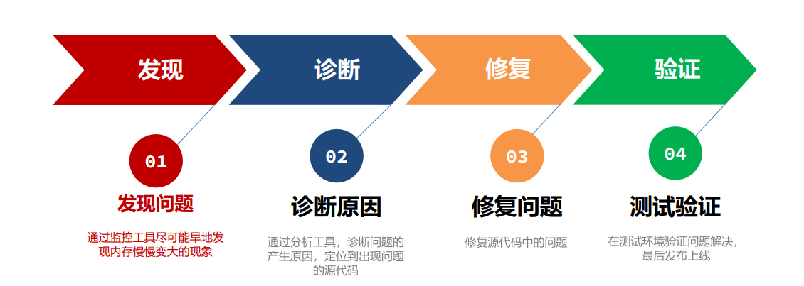

### 16.1 发现问题 – 堆内存状况的对比

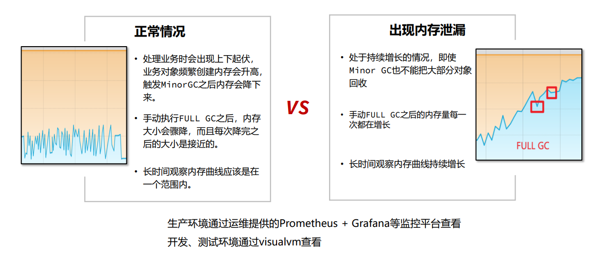

### 16.2 诊断 – 生成内存快照

- 当堆内存溢出时，需要在堆内存溢出时将整个堆内存保存下来，生成内存快照(Heap Profile )文件。 生成方式有两种

  1、内存溢出时自动生成，添加生成内存快照的Java虚拟机参数：

  -XX:+HeapDumpOnOutOfMemoryError：发生OutOfMemoryError错误时，自动生成hprof内存快照文件。

  -XX:HeapDumpPath=：指定hprof文件的输出路径。

  2、导出运行中系统的内存快照，比较简单的方式有两种，注意只需要导出标记为存活的对象：

  通过JDK自带的jmap命令导出，格式为：jmap -dump:live,format=b,file=文件路径和文件名 进程ID

  通过arthas的heapdump命令导出，格式为：heapdump --live 文件路径和文件名

  

- 使用MAT打开hprof文件，并选择内存泄漏检测功能，MAT会自行根据内存快照中保存的数据分析内存泄漏 的根源。

### 16.3修复问题

修复内存溢出问题的要具体问题具体分析，问题总共可以分成三类：

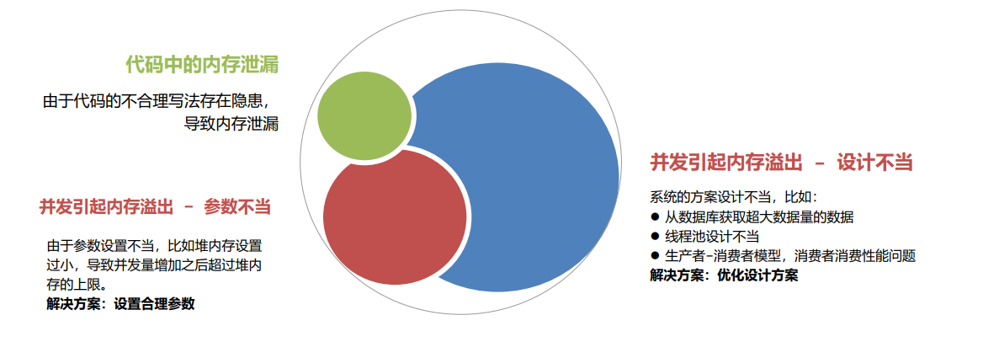

### 16.4常用的JVM工具

JDK自带的命令行工具：

- jps 查看java进程，打印main方法所在类名和进程id 

- jmap 

  1、生成堆内存快照

  2、打印类的直方图

第三方工具： 

VisualVM 监控

Arthas 综合性工具

MAT 堆内存分析工具

监控工具：

Prometheus + grafana

## 17.常见的JVM参数

- 参数1 ： -Xmx 和 –Xms

  -Xmx参数设置的是最大堆内存，但是由于程序是运行在服务器或者容器上，计算可用内存时，要将元空间、操作系统、 其它软件占用的内存排除掉。 

  案例： 服务器内存4G，操作系统+元空间最大值+其它软件占用1.5G，-Xmx可以设置为2g。

  最合理的设置方式应该是根据最大并发量估算服务器的配置，然后再根据服务器配置计算最大堆内存的值。 

  建议将-Xms设置的和-Xmx一样大,运行过程中不再产生扩容的开销。

- 参数2 ： -XX:MaxMetaspaceSize 和 -Xss

  -XX:MaxMetaspaceSize=值 参数指的是最大元空间大小，默认值比较大，如果出现元空间内存泄漏会让操作系 统可用内存不可控，建议根据测试情况设置最大值，一般设置为256m。

  -Xss256k 栈内存大小，如果我们不指定栈的大小，JVM 将创建一个具有默认大小的栈。大小取决于操作系统和计 算机的体系结构。比如Linux x86 64位 ： 1MB，如果不需要用到这么大的栈内存，完全可以将此值调小节省内存 空间，合理值为256k – 1m之间。

- 参数3： -Xmn

  -Xmn 年轻代的大小，默认值为整个堆的1/3，可以根据峰值流量计算最大的年轻代大小，尽量让对象只存放在年 轻代，不进入老年代。但是实际的场景中，接口的响应时间、创建对象的大小、程序内部还会有一些定时任务等不 确定因素都会导致这个值的大小并不能仅凭计算得出，如果设置该值要进行大量的测试。G1垃圾回收器尽量不要设 置该值，G1会动态调整年轻代的大小。

- 打印GC日志

  JDK8及之前 ： -XX:+PrintGCDetails -XX:+PrintGCDateStamps -Xloggc:文件路径

  JDK9及之后 ： -Xlog:gc*:file=文件路径

- -XX:+DisableExplicitGC

  禁止在代码中使用System.gc()， System.gc()可能会引起FULLGC，在代码中尽量不要使用。使用 DisableExplicitGC参数可以禁止使用System.gc()方法调用。

- -XX:+HeapDumpOnOutOfMemoryError：发生OutOfMemoryError错误时，自动生成hprof内存快照文件。 -XX:HeapDumpPath=：指定hprof文件的输出路径。

JVM参数模板：

| -Xms1g                                       | 初始堆内存1g                    |
| -------------------------------------------- | ------------------------------- |
| -Xmx1g                                       | 最大堆内存1g                    |
| -Xss256k                                     | 每个线程的栈内存最大256k        |
| -XX:MaxMetaspaceSize=512m                    | 最大元空间大小512m              |
| -XX:+DisableExplicitGC                       | 代码中System.gc()无效           |
| -XX:+HeapDumpOnOutOfMemoryError              | OutOfMemory错误时生成堆内存快照 |
| -XX:HeapDumpPath=/opt/dumps/my-service.hprof | 堆内存快照生成位置              |
| -XX:+PrintGCDetails                          | 打印详细垃圾回收日志            |
| -XX:+PrintGCDateStamps                       | 打印垃圾回收时间                |
| -Xloggc:文件路径                             | 日志文件输出位置                |

注意： JDK9及之后gc日志输出修改为 -Xlog:gc*:file=文件名 

堆内存大小和栈内存大小根据实际情况灵活调整。
