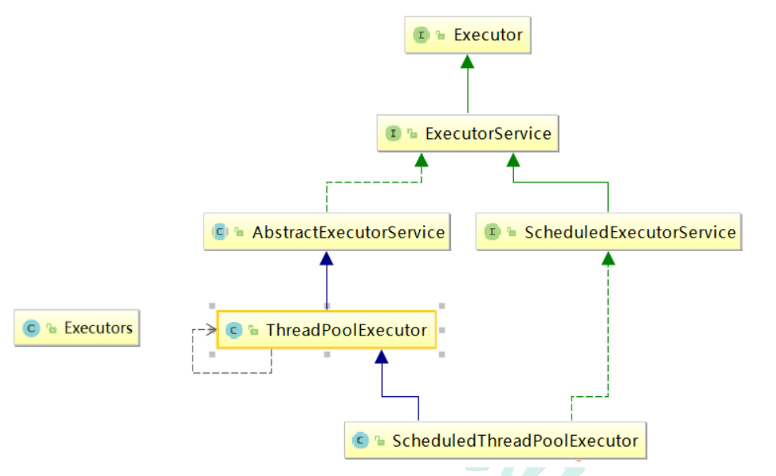
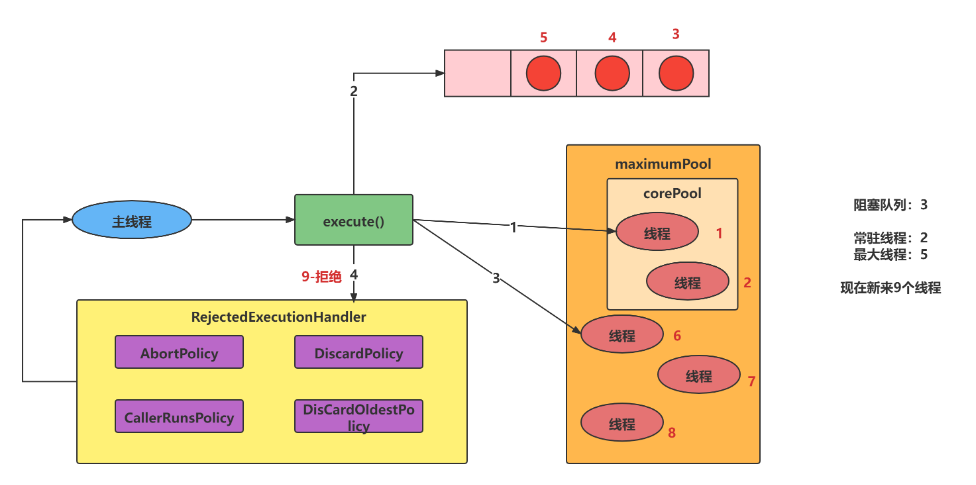
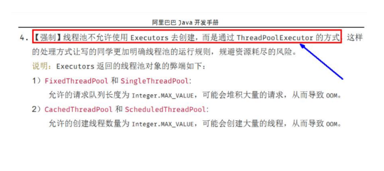

---

title: 线程池
icon: article
date: 2022-10-18
category: Java基础
tag:
  - 线程池
---

## 线程池简介

线程池（英语：thread pool）一种线程使用模式。线程过多会带来调度开销，进而影响缓存局部性和整体性能。而线程池维护着多个线程，等待着监督管理者分配可并发执行的任务。这避免了在处理短时间任务时创建与销毁线程的代价。线程池不仅能够保证内核的充分利用，还能防止过分调度

线程池的优势： 线程池做的工作只要是控制运行的线程数量，处理过程中将任务放入队列，然后在线程创建后启动这些任务，如果线程数量超过了最大数量，超过数量的线程排队等候，等其他线程执行完毕，再从队列中取出任务来执行。

线程池的特点：

1. 降低资源消耗: 通过重复利用已创建的线程降低线程创建和销毁造成的销耗。
2. 提高响应速度: 当任务到达时，任务可以不需要等待线程创建就能立即执行。
3. 提高线程的可管理性: 线程是稀缺资源，如果无限制的创建，不仅会销耗系统资源，还会降低系统的稳定性，使用线程池可以进行统一的分配，调优和监控。

## 线程池架构

Java 中的线程池是通过 Executor 框架实现的，该框架中用到了 Executor，Executors，ExecutorService，ThreadPoolExecutor 这几个类



## 线程池使用方式

**Executors.newFixedThreadPool(int)**：一池N线程

**特征：**

1. 线程池中的线程处于一定的量，可以很好的控制线程的并发量 
2. 线程可以重复被使用，在显示关闭之前，都将一直存在 
3. 超出一定量的线程被提交时候需在队列中等待 

```java
ExecutorService threadPool1 = Executors.newFixedThreadPool(5); //5个窗口
```

**Executors.newSingleThreadExecutor()**：一池一线程

特征： 线程池中最多执行 1 个线程，之后提交的线程活动将会排在队列中以此 执行

```java
ExecutorService threadPool2 = Executors.newSingleThreadExecutor(); //一个窗口
```

**Executors.newCachedThreadPool()**：一池可扩容根据需求创建线程

作用：创建一个可缓存线程池，如果线程池长度超过处理需要，可灵活回收空 闲线程，若无可回收，则新建线程.

特点：

1. 线程池中数量没有固定，可达到最大值（Interger. MAX_VALUE） 
2. 线程池中的线程可进行缓存重复利用和回收（回收默认时间为 1 分钟） 
3. 当线程池中，没有可用线程，会重新创建一个线程

```java
ExecutorService threadPool3 = Executors.newCachedThreadPool();
```

**执行线程**：execute()
**关闭线程**：shutdown()

void execute(Runnable command);参数为Runnable接口类，可以通过设置lambda

**具体案例代码案例**

```java
public class ThreadPoolDemo1 {
    public static void main(String[] args) {
        //一池N线程
        ExecutorService threadPool1 = Executors.newFixedThreadPool(5);
        //一池-线程
        ExecutorService threadPool2 = Executors.newSingleThreadExecutor();
        //一池可扩容线程
        ExecutorService threadPool3 = Executors.newCachedThreadPool();

        //五个窗口处理10个顾客请求
        try{
            for (int i = 1; i <= 10; i++) {
                threadPool3.execute(()->{
                    System.out.println(Thread.currentThread().getName() + " 正在办理业务");
                });
            }
        }catch (Exception ex){

        }finally {
            threadPool3.shutdown();
        }

    }
}
```

一池N线程输出结果为：

> pool-1-thread-2 正在办理业务
>
> pool-1-thread-2 正在办理业务
>
> pool-1-thread-2 正在办理业务
>
> pool-1-thread-2 正在办理业务
>
> pool-1-thread-2 正在办理业务
>
> pool-1-thread-2 正在办理业务
>
> pool-1-thread-3 正在办理业务
>
> pool-1-thread-4 正在办理业务
>
> pool-1-thread-1 正在办理业务
>
> pool-1-thread-5 正在办理业务

一池一线程输出结果：

> pool-2-thread-1 正在办理业务
>
> pool-2-thread-1 正在办理业务
>
> pool-2-thread-1 正在办理业务
>
> pool-2-thread-1 正在办理业务
>
> pool-2-thread-1 正在办理业务
>
> pool-2-thread-1 正在办理业务
>
> pool-2-thread-1 正在办理业务
>
> pool-2-thread-1 正在办理业务
>
> pool-2-thread-1 正在办理业务
>
> pool-2-thread-1 正在办理业务

一池可扩容根据需求创建线程输出结果为：

> pool-3-thread-2 正在办理业务
>
> pool-3-thread-5 正在办理业务
>
> pool-3-thread-3 正在办理业务
>
> pool-3-thread-1 正在办理业务
>
> pool-3-thread-4 正在办理业务
>
> pool-3-thread-7 正在办理业务
>
> pool-3-thread-6 正在办理业务
>
> pool-3-thread-8 正在办理业务
>
> pool-3-thread-9 正在办理业务
>
> pool-3-thread-10 正在办理业务

## 线程池底层原则

通过查看上面三种方式创建对象的类源代码
都有 new ThreadPoolExecutor 具体查看该类的源代码，涉及七个参数

```java
public ThreadPoolExecutor(int corePoolSize,
                          int maximumPoolSize,
                          long keepAliveTime,
                          TimeUnit unit,
                          BlockingQueue<Runnable> workQueue,
                          ThreadFactory threadFactory,
                          RejectedExecutionHandler handler) {
    if (corePoolSize < 0 ||
        maximumPoolSize <= 0 ||
        maximumPoolSize < corePoolSize ||
        keepAliveTime < 0)
        throw new IllegalArgumentException();
    if (workQueue == null || threadFactory == null || handler == null)
        throw new NullPointerException();
    this.acc = System.getSecurityManager() == null ?
        null :
    AccessController.getContext();
    // 常驻线程数量（核心线程数量）
    this.corePoolSize = corePoolSize;
    // 最大线程数量
    this.maximumPoolSize = maximumPoolSize;
    // 阻塞队列（排队的线程放入）
    this.workQueue = workQueue;
    // 线程存活时间
    this.keepAliveTime = unit.toNanos(keepAliveTime);
    // 线程工厂，用于创建线程 线程工厂，用于创建线程
    this.threadFactory = threadFactory;
    // 拒绝测试（线程满了)
    this.handler = handler;
}
```

## 线程池的七个参数

> int corePoolSize，常驻线程数量（核心）
>
> int maximumPoolSize，最大线程数量
>
> long keepAliveTime,TimeUnit unit，线程存活时间
>
> BlockingQueue workQueue，阻塞队列（排队的线程放入）
>
> ThreadFactory threadFactory，线程工厂，用于创建线程
>
> RejectedExecutionHandler handler，拒绝测试（线程满了）

具体工作流程是：

1. 在执行创建对象的时候不会创建线程，创建线程的时候execute(）才会创建
2. 先到常驻线程，满了之后再到阻塞队列进行等待，阻塞队列满了之后，再往外扩容线程，扩容线程不能大于最大线程数。大于最大线程数和阻塞队列之和后，会执行拒绝策略。

## 线程池底层工作流程



对流程图的解释

现在假设来了9个线程，在执行execute()方法才创建线程。

第1-2个线程进入线程池创建

第3-5个线程进入阻塞队列

第6-8个线程会为他们创建新线程执行（直接运行线程6而非线程3）

第9个线程会被拒绝

总结来说：先到常驻线程，满了之后再到阻塞队列进行等待，阻塞队列满了之后，在往外扩容线程，扩容线程不能大于最大线程数。大于最大线程数和阻塞队列之和后，会执行拒绝策略。


**具体的拒绝策略有：**

1. 抛异常-AbortPolicy(默认)：直接抛出RejectedExecutionException异常阻止系统正常运行
2. 谁调用找谁-CallerRunsPolicy：“调用者运行”一种调节机制，该策略既不会抛弃任务，也不会抛出异常，而是将某些任务回退到调用者，从而降低新任务的流量
3. 抛弃最久执行当前-DiscardOldestPolicy：抛弃队列中等待最久的任务，然后把当前任务加入队列中，尝试再次提交当前任务
4. 不理不问-Policydiscard：该策略默默地丢弃无法处理的任务，不予任何处理也不抱出异常。如果允许任务丢失，这是最好的一种策略

## 自定义线程池

实际在开发中不允许使用Executors创建，而是通过ThreadPoolExecutor的方式，规避资源耗尽风险



```java
//自定义线程池创建
public class ThreadPoolDemo2 {
    public static void main(String[] args) {
        ExecutorService threadPool = new ThreadPoolExecutor(
                2,
                5,
                2L,
                TimeUnit.SECONDS,
                new ArrayBlockingQueue<>(3),
                Executors.defaultThreadFactory(),
                new ThreadPoolExecutor.AbortPolicy());

        try{
            for (int i = 1; i <= 10; i++) {
                threadPool.execute(()->{
                    System.out.println(Thread.currentThread().getName() + " 正在办理业务");
                });
            }
        }catch (Exception ex){
            ex.printStackTrace();

        }finally {
            threadPool.shutdown();
        }
    }
}
```

输出结果：

> pool-1-thread-2 正在办理业务
>
> pool-1-thread-5 正在办理业务
>
> pool-1-thread-5 正在办理业务
>
> pool-1-thread-5 正在办理业务
>
> pool-1-thread-3 正在办理业务
>
> pool-1-thread-1 正在办理业务
>
> pool-1-thread-2 正在办理业务
>
> pool-1-thread-4 正在办理业务
>
> java.util.concurrent.RejectedExecutionException: Task com.atguigu.pool.ThreadPoolDemo2$$Lambda$1/1324119927@448139f0 rejected from java.util.concurrent.ThreadPoolExecutor@7cca494b[Running, pool size = 5, active threads = 4, queued tasks = 0, completed tasks = 4]
>
> ​	at java.util.concurrent.ThreadPoolExecutor$AbortPolicy.rejectedExecution(ThreadPoolExecutor.java:2047)
>
> ​	at java.util.concurrent.ThreadPoolExecutor.reject(ThreadPoolExecutor.java:823)
>
> ​	at java.util.concurrent.ThreadPoolExecutor.execute(ThreadPoolExecutor.java:1369)
>
> ​	at com.atguigu.pool.ThreadPoolDemo2.main(ThreadPoolDemo2.java:25)
>
> 
>
> Process finished with exit code 0

如果线程数大于  (最 大 线 程 数 量 + 阻 塞 队 列 容 量 ) 则抛出异常
