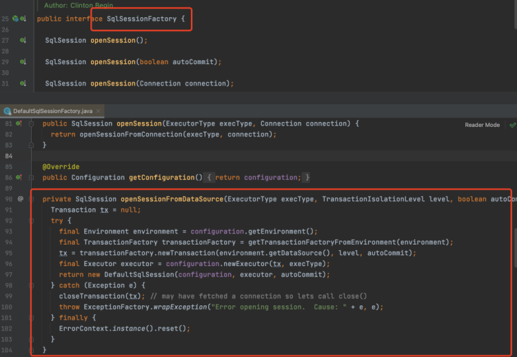

---

title: 工厂模式
icon: article
date: 2022-11-02
category: 设计模式
tag:
  - 设计模式
  - 创建者模式
---


- 简单工厂模式
- 工厂方法模式
- 抽象工厂模式

## 简单工厂模式

简单工厂模式，就跟名字一样，的确很简单。比如说，现在有个动物接口Animal，具体的实现有猫Cat、狗Dog等等，而每个具体的动物对象创建过程很复杂，有各种各样地步骤，此时就可以使用简单工厂来封装对象的创建过程，调用者不需要关心对象是如何具体创建的

```java
public class SimpleAnimalFactory {

    public Animal createAnimal(String animalType) {
        if ("cat".equals(animalType)) {
            Cat cat = new Cat();
            //一系列复杂操作
            return cat;
        } else if ("dog".equals(animalType)) {
            Dog dog = new Dog();
            //一系列复杂操作
            return dog;
        } else {
            throw new RuntimeException("animalType=" + animalType + "无法创建对应对象");
        }
    }

}
```

当需要使用这些对象，调用者就可以直接通过简单工厂创建就行。

```java
SimpleAnimalFactory animalFactory = new SimpleAnimalFactory();
Animal cat = animalFactory.createAnimal("cat");
```

需要注意的是，一般来说如果每个动物对象的创建只需要简单地new一下就行了，那么其实就无需使用工厂模式，工厂模式适合对象创建过程复杂的场景。


## 工厂方法模式

上面说的简单工厂模式看起来没啥问题，但是还是违反了七大设计原则的OCP原则，也就是开闭原则。所谓的开闭原则就是对修改关闭，对扩展开放。

什么叫对修改关闭？就是尽可能不修改的意思。就拿上面的例子来说，如果现在新增了一种动物兔子，那么createAnimal方法就得修改，增加一种类型的判断，那么就此时就出现了修改代码的行为，也就违反了对修改关闭的原则。

所以解决简单工厂模式违反开闭原则的问题，就可以使用工厂方法模式来解决。

```java
/**
 * 工厂接口
 */
public interface AnimalFactory {
    Animal createAnimal();
}

/**
 * 小猫实现
 */
public class CatFactory implements AnimalFactory {
    @Override
    public Animal createAnimal() {
        Cat cat = new Cat();
        //一系列复杂操作
        return cat;
    }
}

/**
 * 小狗实现
 */
public class DogFactory implements AnimalFactory {
    @Override
    public Animal createAnimal() {
        Dog dog = new Dog();
        //一系列复杂操作
        return dog;
    }
}
```


这种方式就是工厂方法模式。他将动物工厂提取成一个接口AnimalFactory，具体每个动物都各自实现这个接口，每种动物都有各自的创建工厂，如果调用者需要创建动物，就可以通过各自的工厂来实现。

```java
AnimalFactory animalFactory = new CatFactory();
Animal cat = animalFactory.createAnimal();
```

此时假设需要新增一个动物兔子，那么只需要实现AnimalFactory接口就行，对于原来的猫和狗的实现，其实代码是不需要修改的，遵守了对修改关闭的原则，同时由于是对扩展开放，实现接口就是扩展的意思，那么也就符合扩展开放的原则。


## 抽象工厂模式

工厂方法模式其实是创建一个产品的工厂，比如上面的例子中，AnimalFactory其实只创建动物这一个产品。而抽象工厂模式特点就是创建一系列产品，比如说，不同的动物吃的东西是不一样的，那么就可以加入食物这个产品，通过抽象工厂模式来实现。

```java
public interface AnimalFactory {

    Animal createAnimal();

    Food createFood();
        
}
```

在动物工厂中，新增了创建食物的接口，小狗小猫的工厂去实现这个接口，创建狗粮和猫粮，这里就不去写了。


## 工厂模式在Mybatis的运用

在Mybatis中，当需要调用Mapper接口执行sql的时候，需要先获取到SqlSession，通过SqlSession再获取到Mapper接口的动态代理对象，而SqlSession的构造过程比较复杂，所以就提供了SqlSessionFactory工厂类来封装SqlSession的创建过程。



## 工厂模式在Spring中的运用

我们知道Spring中的Bean是通过BeanFactory创建的


BeanFactory就是Bean生成的工厂。一个Spring Bean在生成过程中会经历复杂的一个生命周期，而这些生命周期对于使用者来说是无需关心的，所以就可以将Bean创建过程的逻辑给封装起来，提取出一个Bean的工厂。

