---

title: ElasticSearch7.6入门学习笔记
icon: article
date: 2023-11-21
category: ElasticSearch
tag:
  - ElasticSearch
---

在学习ElasticSearch之前，先简单了解一下**Lucene**：

- **Doug Cutting开发**
- 是**apache软件基金会**4 jakarta项目组的一个子项目
- 是一个**开放源代码**的**全文检索引擎工具包**
- **不是一个完整的全文检索引擎，而是一个全文检索引擎的架构**，提供了完整的查询引擎和索引引擎，部分[文本分析](https://baike.baidu.com/item/文本分析/11046544)引擎（英文与德文两种西方语言）
- 当前以及最近几年最受欢迎的**免费Java信息检索程序库**。

**Lucene和ElasticSearch的关系：**

- ElasticSearch是基于Lucene 做了一下封装和增强

# 一、ElasticSearch概述

官网：https://www.elastic.co/cn/downloads/elasticsearch

**Elaticsearch**，简称为es，es是一个开源的**高扩展**的**分布式全文检索引擎**，它可以近乎**实时的存储**、**检索数据;**本身扩展性很好，可以扩展到上百台服务器，处理PB级别(大数据时代）的数据。es也使用java开发并使用Lucene作为其核心来实现所有索引和搜索的功能，但是它的**目的**是<mark>通过简单的**RESTful API**来隐藏Lucene的复杂性，从而让全文搜索变得简单</mark>。

据国际权威的数据库产品评测机构DB Engines的统计，在2016年1月，ElasticSearch已超过Solr等，成为**排名第一的搜索引擎类应用**。

> ### 历史

多年前，一个叫做Shay Banon的刚结婚不久的失业开发者，由于妻子要去伦敦学习厨师，他便跟着也去了。在他找工作的过程中，为了给妻子构建一个食谱的搜索引擎，他开始构建一个早期版本的Lucene。

直接基于Lucene工作会比较困难，所以Shay开始抽象Lucene代码以便lava程序员可以在应用中添加搜索功能。他发布了他的第一个开源项目，叫做“Compass”。

后来Shay找到一份工作，这份工作处在高性能和内存数据网格的分布式环境中，因此高性能的、实时的、分布式的搜索引擎也是理所当然需要的。然后他决定重写Compass库使其成为一个独立的服务叫做Elasticsearch。

第一个公开版本出现在2010年2月，在那之后Elasticsearch已经成为Github上最受欢迎的项目之一，代码贡献者超过300人。一家主营Elasticsearch的公司就此成立，他们一边提供商业支持一边开发新功能，不过Elasticsearch将永远开源且对所有人可用。

Shay的妻子依旧等待着她的食谱搜索…..

**谁在使用：**

1、维基百科,类似百度百科，全文检索,高亮,搜索推荐/2
2、The Guardian (国外新闻网站) ,类似搜狐新闻,用户行为日志(点击,浏览,收藏,评论) +社交网络数据(对某某新闻的相关看法) ,数据分析,给到每篇新闻文章的作者,让他知道他的文章的公众反馈(好,坏,热门，垃圾,鄙视，崇拜)
3、Stack Overflow (国外的程序异常讨论论坛) , IT问题,程序的报错,提交上去,有人会跟你讨论和回答,全文检索,搜索相关问题和答案,程序报错了,就会将报错信息粘贴到里面去,搜索有没有对应的答案
4、GitHub (开源代码管理),搜索 上千亿行代码
5、电商网站,检索商品
6、日志数据分析, logstash采集日志, ES进行复杂的数据分析, **ELK技术, elasticsearch+logstash+kibana**
7、商品价格监控网站,用户设定某商品的价格阈值,当低于该阈值的时候,发送通知消息给用户,比如说订阅牙膏的监控,如果高露洁牙膏的家庭套装低于50块钱,就通知我,我就去买
8、BI系统,商业智能, Business Intelligence。比如说有个大型商场集团，BI ,分析一下某某区域最近3年的用户消费 金额的趋势以及用户群体的组成构成,产出相关的数张报表, **区,最近3年,每年消费金额呈现100%的增长,而且用户群体85%是高级白领，开-个新商场。ES执行数据分析和挖掘, Kibana进行数据可视化
9、国内:站内搜索(电商,招聘,门户,等等),IT系统搜索(OA,CRM,ERP,等等),数据分析(ES热门
的一一个使用场景)

## ES和Solr

### ElasticSearch简介

- Elasticsearch是一个**实时分布式搜索和分析引擎**。 它让你以前所未有的速度处理大数据成为可能。
- 它用于<mark>**全文搜索、结构化搜索、分析**</mark>以及将这三者混合使用:
- `维基百科`使用Elasticsearch提供**全文搜索**并**高亮关键字**,以及输入**实时搜索**(search-asyou-type)和**搜索纠错**(did-you-mean)等搜索建议功能。
- `英国卫报`使用Elasticsearch结合用户日志和社交网络数据提供给他们的编辑以实时的反馈,以便及时了解公众对新发表的文章的回应。
- `StackOverflow`结合全文搜索与地理位置查询,以及more-like-this功能来找到相关的问题和答案。
- `Github`使用Elasticsearch检索1300亿行的代码。
- 但是Elasticsearch不仅用于大型企业，它还让像`DataDog`以及`Klout`这样的创业公司将最初的想法变成可扩展的解决方案。
- Elasticsearch可以在你的笔记本上运行,也可以在数以百计的服务器上处理PB级别的数据。
- Elasticsearch是一个基于Apache Lucene(TM)的开源搜索引擎。无论在开源还是专有领域, Lucene可被认为是迄今为止最先进、性能最好的、功能最全的搜索引擎库。
  - 但是, **Lucene只是一个库**。 想要使用它,你必须使用Java来作为开发语言并将其直接集成到你的应用中,更糟糕的是, Lucene非常复杂,你需要深入了解检索的相关知识来理解它是如何工作的。
- Elasticsearch也使用Java开发并使用Lucene作为其核心来实现所有索引和搜索的功能,但是它的**目的**是<mark>通过简单的**RESTful API**来隐藏Lucene的复杂性,从而让全文搜索变得简单。</mark>

### Solr简介

- Solr是Apache下的一个顶级开源项目,采用Java开发,它是**基于Lucene的全文搜索服务器**。Solr提供了比Lucene更为**丰富的查询语言**,同时实现了**可配置**、**可扩展**，并**对索引、搜索性能进行了优化**
- Solr可以**独立运行**,运行在letty. Tomcat等这些Selrvlet容器中 , Solr 索引的实现方法很简单,<mark>用POST方法向Solr服务器发送一个描述Field及其内容的XML文档, Solr根据xml文档**添加、删除、更新**索引</mark>。Solr 搜索只需要发送HTTP GET请求,然后对Solr返回xml、json等格式的查询结果进行解析,组织页面布局。
- Solr不提供构建UI的功能, **Solr提供了一个管理界面,通过管理界面可以查询Solr的配置和运行情况。**
- Solr是基于lucene开发企业级搜索服务器,实际上就是封装了lucene.
- Solr是一个独立的企业级搜索应用服务器,它**对外提供类似于Web-service的API接口**。用户可以通过http请求,向搜索引擎服务器提交-定格式的文件,生成索引;也可以通过提出查找请求,并得到返回结果。

### ElasticSearch与Solr比较

1. `当单纯的对已有数据进行搜索时，Solr更快`
2. `当实时建立索引时，Solr会产生io阻塞，查询性能较差，ElasticSearch具有明显的优势`
3. `随着数据量的增加，Solr的搜索效率会变得更低，而ElasticSearch却没有明显的变化`

#### 总结

1、**es**基本是**开箱即用**(解压就可以用!) ,非常简单。Solr安装略微复杂一丢丢!
2、**Solr 利用Zookeeper进行分布式管理**,而**Elasticsearch<mark>自身带有分布式协调管理功能</mark>。**
3、Solr 支持更多格式的数据,比如JSON、XML、 CSV ,而**Elasticsearch仅支持json文件格式**。
4、Solr 官方提供的功能更多,而Elasticsearch本身更注重于核心功能，高级功能多有第三方插件提供，例如图形化界面需要kibana友好支撑
<mark>5、</mark>**Solr 查询快,但更新索引时慢(即插入删除慢)** ，用于电商等查询多的应用;

- **ES建立索引快(即查询慢)** ，即**实时性查询快**，用于facebook新浪等搜索。
- Solr是传统搜索应用的有力解决方案，但Elasticsearch更适用于新兴的实时搜索应用。

6、Solr比较成熟，有一个更大，更成熟的用户、开发和贡献者社区，而Elasticsearch相对开发维护者较少,更新太快,学习使用成本较高。


# 二、ElasticSearch安装

```
JDK8，最低要求
```

使用Java开发，必须保证`ElasticSearch`的版本与Java的核心jar包版本对应！（Java环境保证没错）

### Windows下安装

#### 1、安装

下载地址：https://www.elastic.co/cn/downloads/

历史版本下载：https://www.elastic.co/cn/downloads/past-releases/

解压即可（尽量将ElasticSearch相关工具放在统一目录下）

#### 2、熟悉目录


```yaml
bin 启动文件目录
config 配置文件目录
    1og4j2 日志配置文件
    jvm.options java 虚拟机相关的配置(默认启动占1g内存，内容不够需要自己调整)
    elasticsearch.ym1 elasticsearch 的配置文件! 默认9200端口!跨域!
1ib 
    相关jar包
modules 功能模块目录
plugins 插件目录
    ik分词器
```

#### 3、启动

一定要检查自己的java环境是否配置好

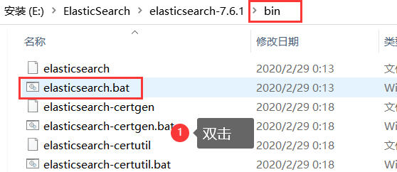


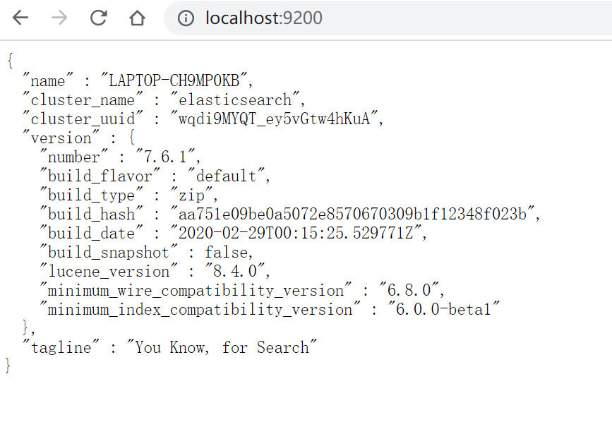

### 安装可视化界面

**elasticsearch-head**

**使用前提**：需要安装nodejs

#### 1、下载地址

https://github.com/mobz/elasticsearch-head

#### 2、安装

解压即可（尽量将ElasticSearch相关工具放在统一目录下）

#### 3、启动

```shell
cd elasticsearch-head
# 安装依赖
npm install
# 启动
npm run start
# 访问
http://localhost:9100/
```

**访问**

```she
存在跨域问题（只有当两个页面同源，才能交互）

同源（端口，主机，协议三者都相同）

https://blog.csdn.net/qq_38128179/article/details/84956552
```

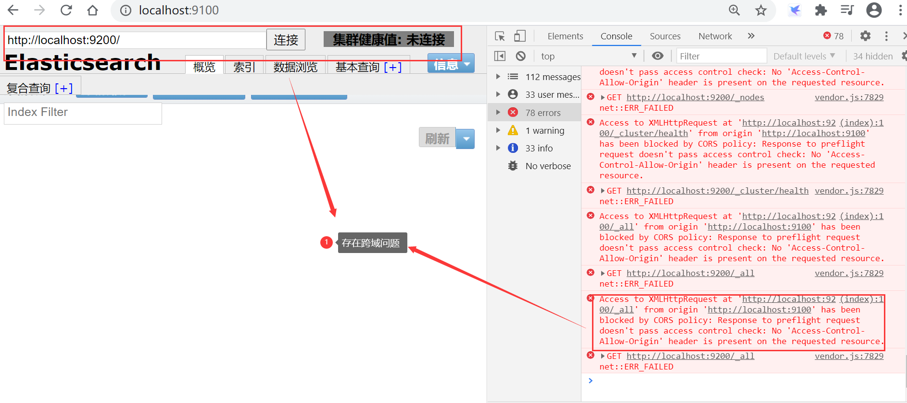

**开启跨域（在elasticsearch解压目录config下elasticsearch.yml中添加）**

```yam
# 开启跨域
http.cors.enabled: true
# 所有人访问
http.cors.allow-origin: "*"
```

重启elasticsearch

**再次连接**


**如何理解上图：**

- 如果你是初学者

  - 索引 可以看做 “数据库”
  - 类型 可以看做 “表”
  - 文档 可以看做 “库中的数据（表中的行）”

- 这个head，我们只是把它

  当做可视化数据展示工具

  ，之后

  所有的查询都在kibana中进行

  - 因为不支持json格式化，不方便

### 安装kibana

#### 1、下载地址:

下载的版本需要与ElasticSearch版本对应

https://www.elastic.co/cn/kibana

历史版本下载：https://www.elastic.co/cn/downloads/past-releases#kibana

#### 2、安装

解压即可（尽量将ElasticSearch相关工具放在统一目录下）

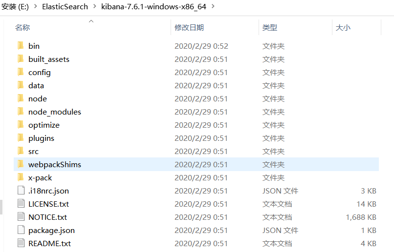

#### 3、启动


**访问**

1. `localhost:5601`

#### 4、开发工具

（Postman、curl、head、谷歌浏览器插件）

可以使用 `Kibana`进行测试

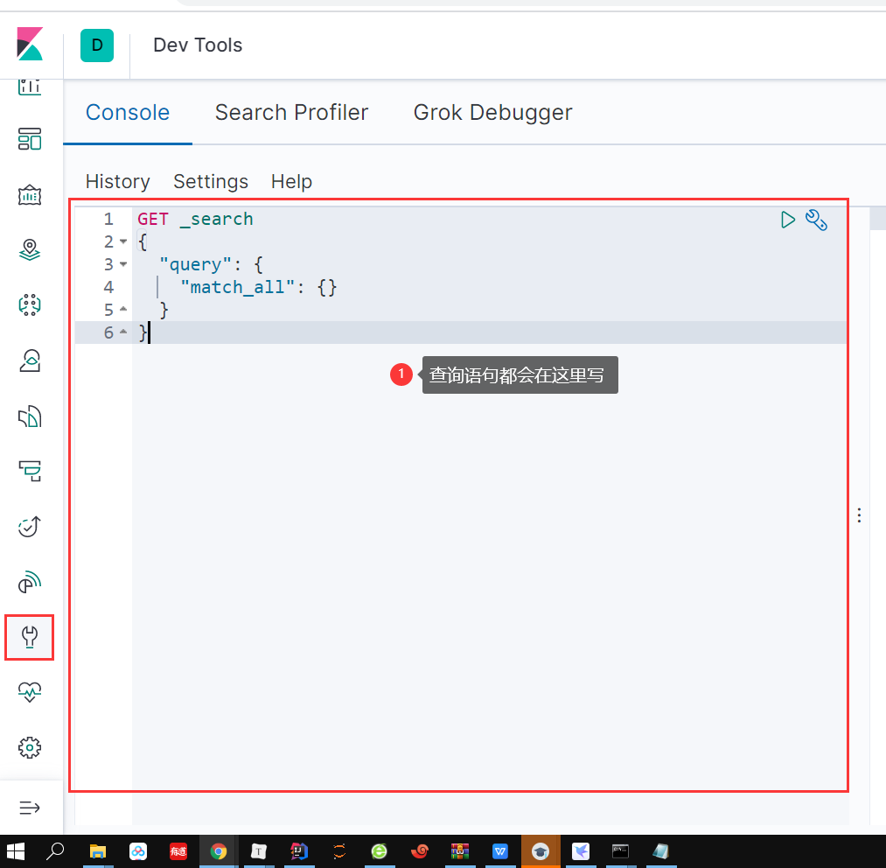

如果说，你在英文方面不太擅长，kibana是支持汉化的

#### 5、kibana汉化

编辑器打开`kibana解压目录/config/kibana.yml`，添加

```yaml
i18n.locale: "zh-CN"
```

重启kibana

# 三、ElasticSearch核心概念

> ## 概述

1、索引（ElasticSearch）

- 包多个分片

2、字段类型（映射）

- 字段类型映射（字段是整型，还是字符型…）

3、文档

4、分片（Lucene索引，倒排索引）

> ElasticSearch是面向文档，关系行数据库和ElasticSearch客观对比！一切都是JSON！

| Relational DB      | ElasticSearch          |
| ------------------ | ---------------------- |
| 数据库（database） | 索引（indices）        |
| 表（tables）       | types \<慢慢会被弃用!> |
| 行（rows）         | documents              |
| 字段（columns）    | fields                 |

**elasticsearch（集群）**中可以包含多个**索引（数据库）** ,每个索引中可以包含多个**类型（表）** ,每个类型下又包含多个**文档（行）** ,每个文档中又包含多个**字段（列）**。

### 物理设计:

elasticsearch在后台把**每个索引划分成多个分片**，每分分片可以在集群中的不同服务器间迁移

一个人就是一个集群! ，即**启动的ElasticSearch服务，默认就是一个集群，且默认集群名为elasticsearch**

### 逻辑设计:

一个索引类型中，包含多个文档，比如说文档1，文档2。当我们索引一篇文档时，可以通过这样的顺序找到它：索引 => 类型 => 文档ID ，通过这个组合我们就能索引到某个具体的文档。 注意：ID不必是整数，实际上它是个字符串。

> #### 文档（”行“）

之前说elasticsearch是面向文档的，那么就意味着**索引和搜索数据的最小单位是文档**，elasticsearch中，文档有几个重要属性:

- 自我包含，一篇文档同时包含字段和对应的值，也就是同时包含key:value !
- 可以是层次型的，一个文档中包含自文档，复杂的逻辑实体就是这么来的! {就是一个json对象 ! fastjson进行自动转换 !}
- 灵活的结构，文档不依赖预先定义的模式，我们知道关系型数据库中，要提前定义字段才能使用，在elasticsearch中，对于字段是非常灵活的，有时候,我们可以忽略该字段，或者动态的添加一个新的字段。

尽管我们可以随意的新增或者忽略某个字段，但是，每个字段的类型非常重要，比如一个年龄字段类型，可以是字符串也可以是整形。因为elasticsearch会保存字段和类型之间的映射及其他的设置。这种映射具体到每个映射的每种类型，这也是为什么在elasticsearch中，类型有时候也称为映射类型。

> #### 类型（“表”）

类型是文档的逻辑容器，就像关系型数据库一样，表格是行的容器。类型中对于字段的定义称为映射，比如name映射为字符串类型。我们说文档是无模式的，它们不需要拥有映射中所定义的所有字段，比如新增一个字段，那么elasticsearch是怎么做的呢?

- elasticsearch会自动的将新字段加入映射，但是这个字段的不确定它是什么类型，elasticsearch就开始猜，如果这个值是18，那么elasticsearch会认为它是整形。但是elasticsearch也可能猜不对，所以最安全的方式就是提前定义好所需要的映射，这点跟关系型数据库殊途同归了，先定义好字段，然后再使用，别整什么幺蛾子。

> #### 索引（“库”）

索引是映射类型的容器， elasticsearch中的索引是一个非常大的文档集合。 索引存储了映射类型的字段和其他设置。然后它们被存储到了各个分片上了。我们来研究下分片是如何工作的。

**倒排索引（Lucene索引底层）**

简单说就是 按（文章关键字，对应的文档\<0个或多个\>）形式建立索引，根据关键字就可直接查询对应的文档（含关键字的），无需查询每一个文档，如下图


# 四、IK分词器(elasticsearch插件)

> **IK分词器：中文分词器**

分词：即把一段中文或者别的划分成一个个的关键字，我们在搜索时候会把自己的信息进行分词，会把数据库中或者索引库中的数据进行分词，然后进行一一个匹配操作，**默认的中文分词是将每个字看成一个词**（<mark>不使用用IK分词器的情况下</mark>），比如“我爱狂神”会被分为”我”，”爱”，”狂”，”神” ，这显然是不符合要求的，所以我们需要安装中文分词器ik来解决这个问题。

**IK提供了两个分词算法**: `ik_smart`和`ik_max_word` ,其中`ik_smart`为**最少切分**, `ik_max_word`为**最细粒度划分**!

### 1、下载

> 版本要与ElasticSearch版本对应

下载地址：https://github.com/medcl/elasticsearch-analysis-ik/releases

### 2、安装

> ik文件夹是自己创建的

加压即可（但是我们需要解压到ElasticSearch的plugins目录ik文件夹下）


### 3、重启ElasticSearch

### 4、使用 `ElasticSearch安装补录/bin/elasticsearch-plugin` 可以查看插件


### 5、使用kibana测试

`ik_smart`：最少切分


`ik_max_word`：最细粒度划分（穷尽词库的可能）


从上面看，感觉分词都比较正常，但是大多数，分词都满足不了我们的想法，如下例


> 那么，我们需要手动将该词添加到分词器的词典当中

### 6、添加自定义的词添加到扩展字典中

elasticsearch目录/plugins/ik/config/IKAnalyzer.cfg.xml

打开 `IKAnalyzer.cfg.xml` 文件，扩展字典


创建字典文件，添加字典内容


重启ElasticSearch，再次使用kibana测试

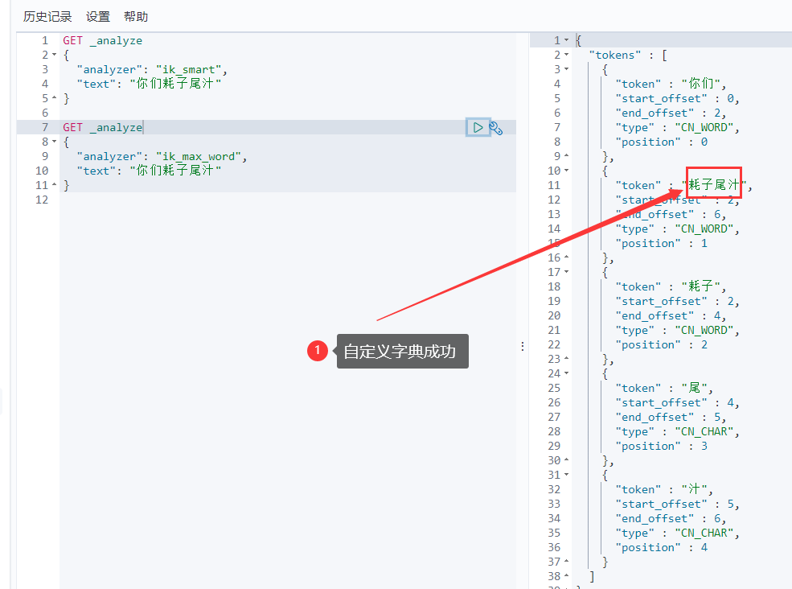

# 五、Rest风格说明

**一种软件架构风格**,而不是标准,只是提供了一组设计原则和约束条件。它主要用于客户端和服务器交互类的软件。基于这个风格设计的软件可以**更简洁**，**更有层次**，**更易于实现缓存**等机制。

### **基本Rest命令说明：**

|      method      |                     url地址                     |          描述          |
| :--------------: | :---------------------------------------------: | :--------------------: |
| PUT（创建,修改） |     localhost:9200/索引名称/类型名称/文档id     | 创建文档（指定文档id） |
|   POST（创建）   |        localhost:9200/索引名称/类型名称         | 创建文档（随机文档id） |
|   POST（修改）   | localhost:9200/索引名称/类型名称/文档id/_update |        修改文档        |
|  DELETE（删除）  |     localhost:9200/索引名称/类型名称/文档id     |        删除文档        |
|   GET（查询）    |     localhost:9200/索引名称/类型名称/文档id     |   查询文档通过文档ID   |
|   POST（查询）   | localhost:9200/索引名称/类型名称/文档id/_search |      查询所有数据      |

### 测试

#### 1、创建一个索引，添加

```json
PUT /test1/type1/1
{  
 "name" : "流柚",
 "age" : 18
}
```

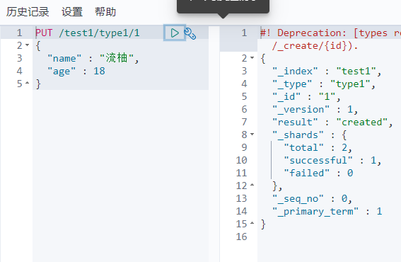


#### 2、字段数据类型

- 字符串类型

  - text、

    keyword

    - text：支持分词，全文检索,支持模糊、精确查询,不支持聚合,排序操作;text类型的最大支持的字符长度无限制,适合大字段存储；
    - keyword：不进行分词，直接索引、支持模糊、支持精确匹配，支持聚合、排序操作。keyword类型的最大支持的长度为——32766个UTF-8类型的字符,可以通过设置ignore_above指定自持字符长度，超过给定长度后的数据将不被索引，无法通过term精确匹配检索返回结果。

- 数值型

  - long、Integer、short、byte、double、float、**half float**、**scaled float**

- 日期类型

  - date

- te布尔类型

  - boolean

- 二进制类型

  - binary

- 等等…

#### 3、指定字段的类型（使用PUT）

> 类似于建库（建立索引和字段对应类型），也可看做规则的建立

```json
PUT /test2
{
  "mappings": {
    "properties": {
      "name": {
        "type": "text"
      },
      "age":{
        "type": "long"
      },
      "birthday":{
        "type": "date"
      }
    }
  }
}
```


#### 4、获取3建立的规则

```json
GET test2
```


#### 5、获取默认信息

> `_doc` 默认类型（default type），type 在未来的版本中会逐渐弃用，因此产生一个默认类型进行代替

```json
PUT /test3/_doc/1
{
  "name": "流柚",
  "age": 18,
  "birth": "1999-10-10"
}
GET test3
```

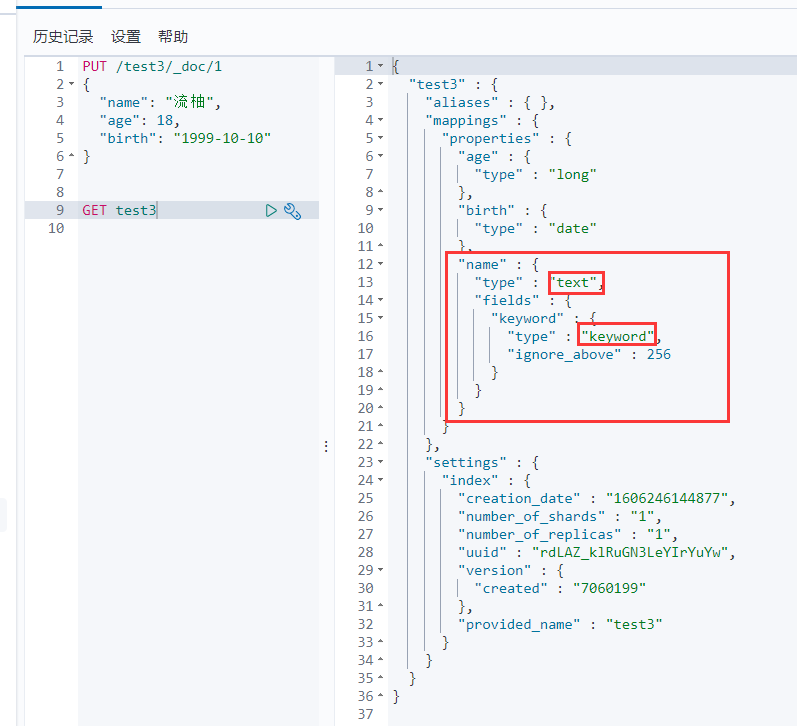

如果自己的文档字段没有被指定，那么ElasticSearch就会给我们默认配置字段类型

扩展：通过`get _cat/` 可以获取ElasticSearch的当前的很多信息！

```te
GET _cat/indices
GET _cat/aliases
GET _cat/allocation
GET _cat/count
GET _cat/fielddata
GET _cat/health
GET _cat/indices
GET _cat/master
GET _cat/nodeattrs
GET _cat/nodes
GET _cat/pending_tasks
GET _cat/plugins
GET _cat/recovery
GET _cat/repositories
GET _cat/segments
GET _cat/shards
GET _cat/snapshots
GET _cat/tasks
GET _cat/templates
GET _cat/thread_pool
```

#### 6、修改

两种方案

①旧的（使用put覆盖原来的值）

- 版本+1（_version）
- 但是如果漏掉某个字段没有写，那么更新是没有写的字段 ，会消失

```json
PUT /test3/_doc/1
{
  "name" : "流柚是我的大哥",
  "age" : 18,
  "birth" : "1999-10-10"
}
GET /test3/_doc/1
// 修改会有字段丢失
PUT /test3/_doc/1
{
  "name" : "流柚"
}
GET /test3/_doc/1
```

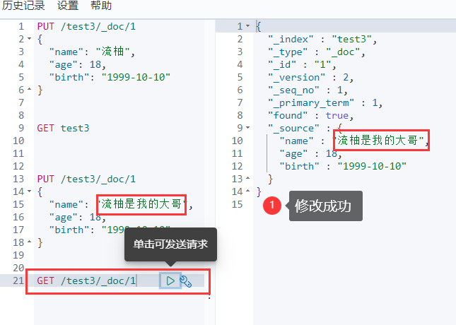


②新的（使用post的update）

- version不会改变
- 需要注意doc
- 不会丢失字段

```json
POST /test3/_doc/1/_update
{
  "doc":{
    "name" : "post修改，version不会加一",
    "age" : 2
  }
}
GET /test3/_doc/1
```

#### 7、删除

```she
GET /test1
DELETE /test1
```

#### 8、查询（简单条件）

```
GET /test3/_doc/_search?q=name:流柚
GET /test3/_doc/1
```

#### 9、复杂查询

test3索引中的内容

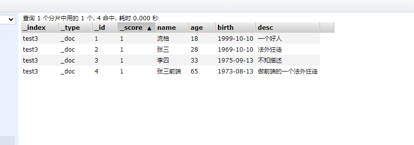

##### ①查询匹配

- `match`：匹配（会使用分词器解析（先分析文档，然后进行查询））
- `_source`：过滤字段(一个索引里面有很多字段，如果不指定，查询会把所有字段都查找出来)
- `sort`：排序
- `form`、`size` 分页

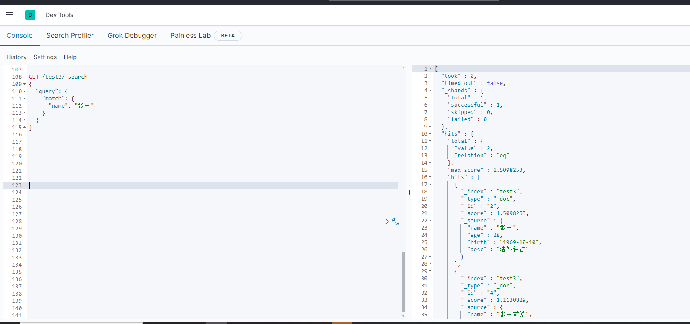

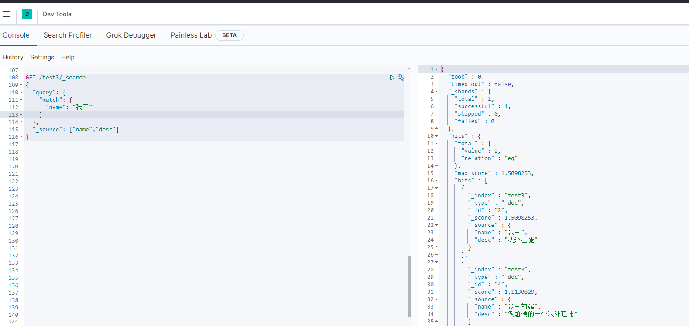

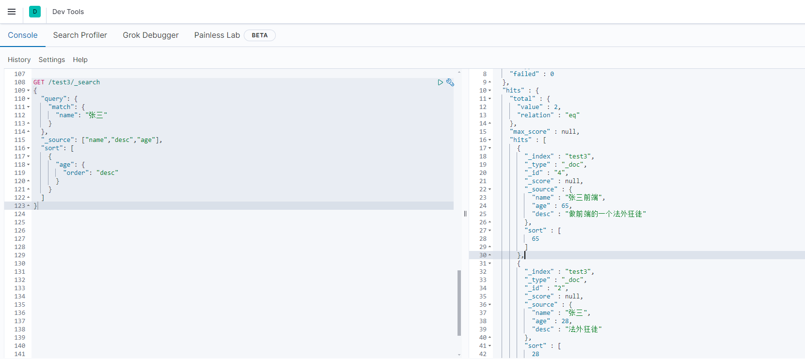


##### ②多条件查询（bool）

- `must` 相当于 `and`
- `should` 相当于 `or`
- `must_not` 相当于 `not (... and ...)`
- `filter` 过滤

```json
/// bool 多条件查询
//// must <==> and
//// should <==> or
//// must_not <==> not (... and ...)
//// filter数据过滤
//// boost
//// minimum_should_match
GET /blog/user/_search
{
  "query":{
    "bool": {
      "must": [
        {
          "match":{
            "age":3
          }
        },
        {
          "match": {
            "name": "流"
          }
        }
      ],
      "filter": {
        "range": {
          "age": {
            "gte": 1,
            "lte": 3
          }
        }
      }
    }
  }
}
```

##### ③匹配数组

- 貌似不能与其它字段一起使用
- 可以多关键字查（空格隔开）— 匹配字段也是符合的
- `match` 会使用分词器解析（先分析文档，然后进行查询）
- 搜词

```json
// 匹配数组 貌似不能与其它字段一起使用
// 可以多关键字查（空格隔开）
// match 会使用分词器解析（先分析文档，然后进行查询）
GET /blog/user/_search
{
  "query":{
    "match":{
      "desc":"年龄 牛 大"
    }
  }
}
```


##### ④精确查询

- `term` 直接通过 倒排索引 指定**词条**查询
- 适合查询 number、date、keyword ，不适合text

```json
// 精确查询（必须全部都有，而且不可分，即按一个完整的词查询）
// term 直接通过 倒排索引 指定的词条 进行精确查找的
GET /blog/user/_search
{
  "query":{
    "term":{
      "desc":"年 "
    }
  }
}
```


##### ⑤text和keyword

- text：

  - **支持分词**，**全文检索**、支持模糊、精确查询,不支持聚合,排序操作;
  - text类型的最大支持的字符长度无限制,适合大字段存储；

- keyword：

  - **不进行分词**，**直接索引**、支持模糊、支持精确匹配，支持聚合、排序操作。
  - keyword类型的最大支持的长度为——32766个UTF-8类型的字符,可以通过设置ignore_above指定自持字符长度，超过给定长度后的数据将不被索引，**无法通过term精确匹配检索返回结果**。

  ```json
  // 测试keyword和text是否支持分词
  // 设置索引类型
  PUT /test
  {
    "mappings": {
      "properties": {
        "text":{
          "type":"text"
        },
        "keyword":{
          "type":"keyword"
        }
      }
    }
  }
  // 设置字段数据
  PUT /test/_doc/1
  {
    "text":"测试keyword和text是否支持分词",
    "keyword":"测试keyword和text是否支持分词"
  }
  // text 支持分词
  // keyword 不支持分词
  GET /test/_doc/_search
  {
    "query":{
     "match":{
        "text":"测试"
     }
    }
  }// 查的到
  GET /test/_doc/_search
  {
    "query":{
     "match":{
        "keyword":"测试"
     }
    }
  }// 查不到，必须是 "测试keyword和text是否支持分词" 才能查到
  GET _analyze
  {
    "analyzer": "keyword",
    "text": ["测试liu"]
  }// 不会分词，即 测试liu
  GET _analyze
  {
    "analyzer": "standard",
    "text": ["测试liu"]
  }// 分为 测 试 liu
  GET _analyze
  {
    "analyzer":"ik_max_word",
    "text": ["测试liu"]
  }// 分为 测试 liu
  ```

  

##### ⑥高亮查询

```json
/// 高亮查询
GET blog/user/_search
{
  "query": {
    "match": {
      "name":"流"
    }
  }
  ,
  "highlight": {
    "fields": {
      "name": {}
    }
  }
}
// 自定义前缀和后缀
GET blog/user/_search
{
  "query": {
    "match": {
      "name":"流"
    }
  }
  ,
  "highlight": {
    "pre_tags": "<p class='key' style='color:red'>",
    "post_tags": "</p>", 
    "fields": {
      "name": {}
    }
  }
}
```


# 六、SpringBoot整合