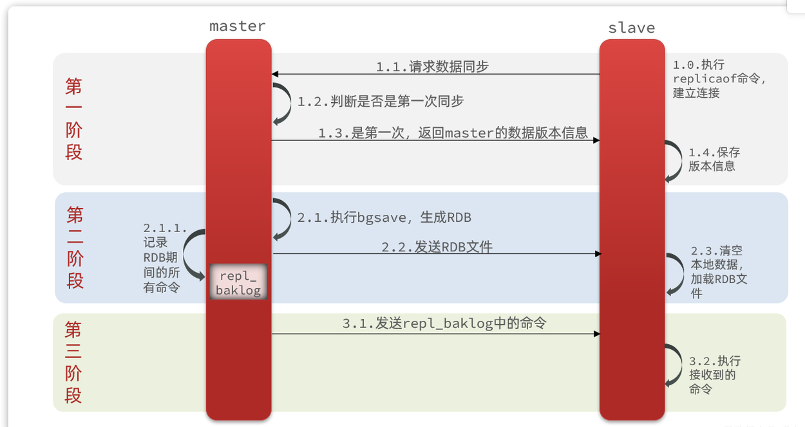
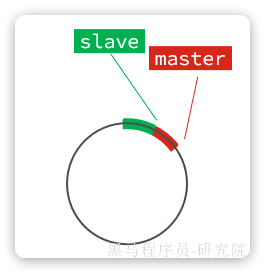
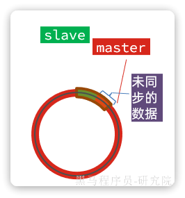
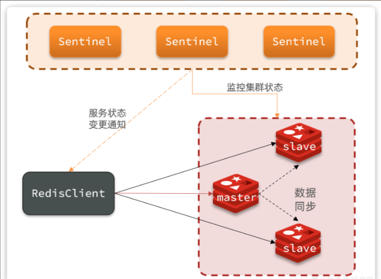
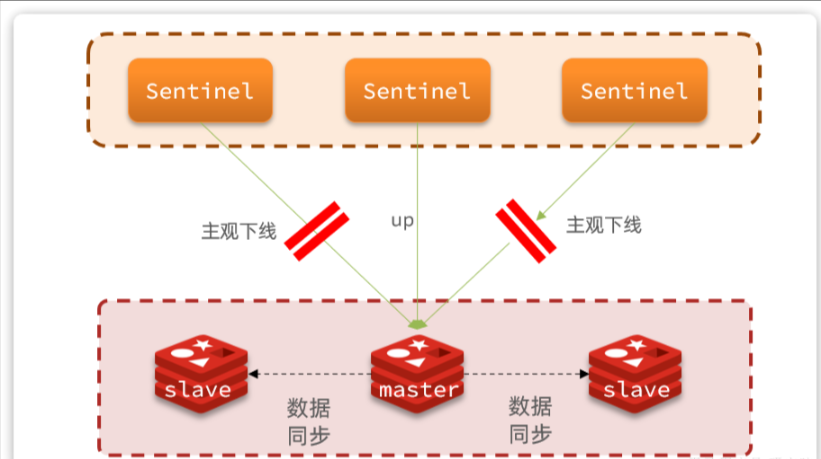
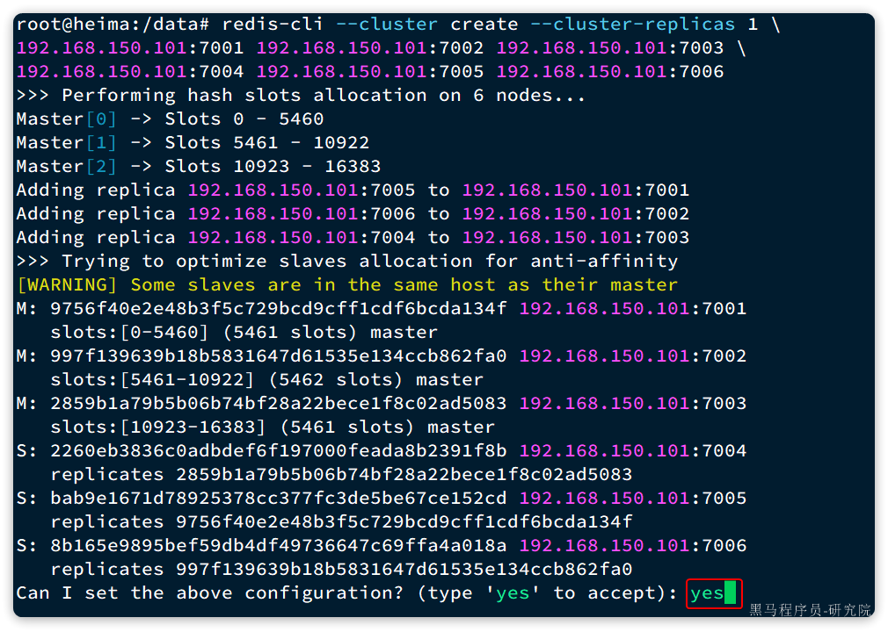
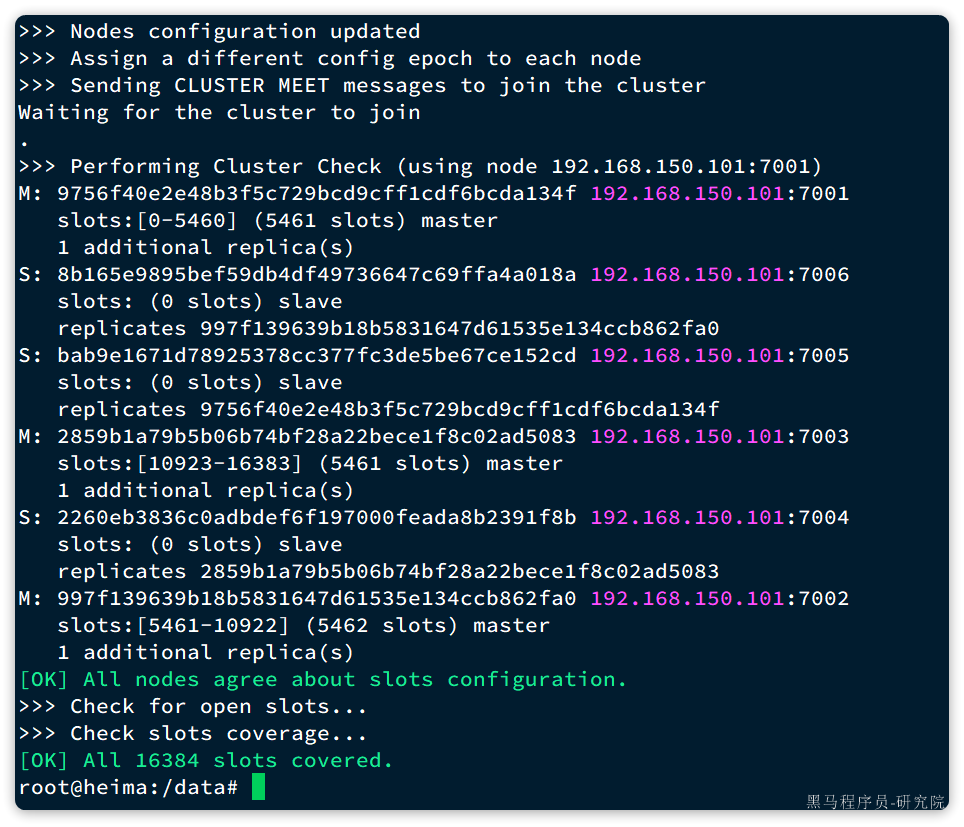
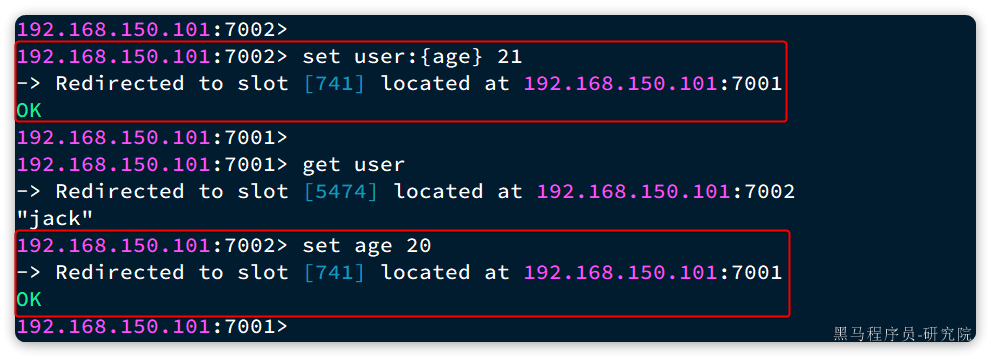

---

title: Redis集群
icon: article
date: 2022-11-21
category: Redis
tag:
  - Redis
---

# 1.Redis主从

单节点Redis的并发能力是有上限的，要进一步提高Redis的并发能力，就需要搭建主从集群，实现读写分离。

## 1.1.主从集群结构

下图就是一个简单的Redis主从集群结构：


如图所示，集群中有一个master节点、两个slave节点（现在叫replica）。当我们通过Redis的Java客户端访问主从集群时，应该做好路由：

- 如果是写操作，应该访问master节点，master会自动将数据同步给两个slave节点
- 如果是读操作，建议访问各个slave节点，从而分担并发压力

## 1.2.搭建主从集群

我们会在同一个虚拟机中利用3个Docker容器来搭建主从集群，容器信息如下：

| **容器名** | **角色** | **IP**          | **映射****端口** |
| :--------- | :------- | :-------------- | :--------------- |
| r1         | master   | 192.168.100.101 | 7001             |
| r2         | slave    | 192.168.100.101 | 7002             |
| r3         | slave    | 192.168.100.101 | 7003             |

### 1.2.1.启动多个Redis实例

我们利用docker-compose文件来构建主从集群：

```yaml
version: "3.2"

services:
  r1:
    image: redis
    container_name: r1
    network_mode: "host"
    entrypoint: ["redis-server", "--port", "7001"]
  r2:
    image: redis
    container_name: r2
    network_mode: "host"
    entrypoint: ["redis-server", "--port", "7002"]
  r3:
    image: redis
    container_name: r3
    network_mode: "host"
    entrypoint: ["redis-server", "--port", "7003"]
```

将其上传至虚拟机的`/root/redis`目录下：

执行命令：

```bash
docker compose up -d
```

查看docker容器，发现都正常启动了：


### 1.2.2.建立集群

虽然我们启动了3个Redis实例，但是它们并没有形成主从关系。我们需要通过命令来配置主从关系：

```bash
# Redis5.0以前
slaveof <masterip> <masterport>
# Redis5.0以后
replicaof <masterip> <masterport>
```

有临时和永久两种模式：

- 永久生效：在redis.conf文件中利用`slaveof`命令指定`master`节点
- 临时生效：直接利用redis-cli控制台输入`slaveof`命令，指定`master`节点

我们测试临时模式，首先连接`r2`，让其以`r1`为master

```bash
# 连接r2
docker exec -it r2 redis-cli -p 7002
# 认r1主，也就是7001
slaveof 192.168.100.101 7001
```

然后连接`r3`，让其以`r1`为master

```bash
# 连接r3
docker exec -it r3 redis-cli -p 7003
# 认r1主，也就是7001
slaveof 192.168.100.101 7001
```

然后连接`r1`，查看集群状态：

```bash
# 连接r1
docker exec -it r1 redis-cli -p 7001
# 查看集群状态
info replication
```

结果如下：

```bash
127.0.0.1:7001> info replication
# Replication
role:master
connected_slaves:2
slave0:ip=192.168.100.101,port=7002,state=online,offset=140,lag=1
slave1:ip=192.168.10.101,port=7003,state=online,offset=140,lag=1
master_failover_state:no-failover
master_replid:16d90568498908b322178ca12078114e6c518b86
master_replid2:0000000000000000000000000000000000000000
master_repl_offset:140
second_repl_offset:-1
repl_backlog_active:1
repl_backlog_size:1048576
repl_backlog_first_byte_offset:1
repl_backlog_histlen:140
```

可以看到，当前节点`r1:7001`的角色是`master`，有两个slave与其连接：

- `slave0`：`port`是`7002`，也就是`r2`节点
- `slave1`：`port`是`7003`，也就是`r3`节点

### 1.2.3.测试

依次在`r1`、`r2`、`r3`节点上执行下面命令：

```Bash
set num 123

get num
```

你会发现，只有在`r1`这个节点上可以执行`set`命令（**写操作**），其它两个节点只能执行`get`命令（**读操作**）。也就是说读写操作已经分离了。

## 1.3.主从同步原理

在刚才的主从测试中，我们发现`r1`上写入Redis的数据，在`r2`和`r3`上也能看到，这说明主从之间确实完成了数据同步。

那么这个同步是如何完成的呢？

### 1.3.1.全量同步

主从第一次建立连接时，会执行**全量同步**，将master节点的所有数据都拷贝给slave节点，流程：



这里有一个问题，`master`如何得知`salve`是否是第一次来同步呢？？

有几个概念，可以作为判断依据：

- **`Replication Id`**：简称`replid`，是数据集的标记，replid一致则是同一数据集。每个`master`都有唯一的`replid`，`slave`则会继承`master`节点的`replid`
- **`offset`**：偏移量，随着记录在`repl_baklog`中的数据增多而逐渐增大。`slave`完成同步时也会记录当前同步的`offset`。如果`slave`的`offset`小于`master`的`offset`，说明`slave`数据落后于`master`，需要更新。

因此`slave`做数据同步，必须向`master`声明自己的`replication id `和`offset`，`master`才可以判断到底需要同步哪些数据。

由于我们在执行`slaveof`命令之前，所有redis节点都是`master`，有自己的`replid`和`offset`。

当我们第一次执行`slaveof`命令，与`master`建立主从关系时，发送的`replid`和`offset`是自己的，与`master`肯定不一致。

`master`判断发现`slave`发送来的`replid`与自己的不一致，说明这是一个全新的slave，就知道要做全量同步了。

`master`会将自己的`replid`和`offset`都发送给这个`slave`，`slave`保存这些信息到本地。自此以后`slave`的`replid`就与`master`一致了。

完整流程描述：

- `slave`节点请求增量同步
- `master`节点判断`replid`，发现不一致，拒绝增量同步
- `master`将完整内存数据生成`RDB`，发送`RDB`到`slave`
- `slave`清空本地数据，加载`master`的`RDB`
- `master`将`RDB`期间的命令记录在`repl_baklog`，并持续将log中的命令发送给`slave`
- `slave`执行接收到的命令，保持与`master`之间的同步

### 1.3.2.增量同步

全量同步需要先做RDB，然后将RDB文件通过网络传输个slave，成本太高了。因此除了第一次做全量同步，其它大多数时候slave与master都是做**增量同步**。

那么master怎么知道slave与自己的数据差异在哪里呢?

### 1.3.3.repl_baklog原理

master怎么知道slave与自己的数据差异在哪里呢?

这就要说到全量同步时的`repl_baklog`文件了。这个文件是一个固定大小的数组，只不过数组是环形，也就是说**角标到达数组末尾后，会再次从0开始读写**，这样数组头部的数据就会被覆盖。

`repl_baklog`中会记录Redis处理过的命令及`offset`，包括master当前的`offset`，和slave已经拷贝到的`offset`：



slave与master的offset之间的差异，就是salve需要增量拷贝的数据了。

随着不断有数据写入，master的offset逐渐变大，slave也不断的拷贝，追赶master的offset：


直到数组被填满：

此时，如果有新的数据写入，就会覆盖数组中的旧数据。不过，旧的数据只要是绿色的，说明是已经被同步到slave的数据，即便被覆盖了也没什么影响。因为未同步的仅仅是红色部分

但是，如果slave出现网络阻塞，导致master的`offset`远远超过了slave的`offset`： 

如果master继续写入新数据，master的`offset`就会覆盖`repl_baklog`中旧的数据，直到将slave现在的`offset`也覆盖：



棕色框中的红色部分，就是尚未同步，但是却已经被覆盖的数据。此时如果slave恢复，需要同步，却发现自己的`offset`都没有了，无法完成增量同步了。只能做**全量同步**。

`repl_baklog`大小有上限，写满后会覆盖最早的数据。如果slave断开时间过久，导致尚未备份的数据被覆盖，则无法基于`repl_baklog`做增量同步，只能再次全量同步。

## 1.4.主从同步优化

主从同步可以保证主从数据的一致性，非常重要。

可以从以下几个方面来优化Redis主从就集群：

- 在master中配置`repl-diskless-sync  yes`启用无磁盘复制，避免全量同步时的磁盘IO。
- Redis单节点上的内存占用不要太大，减少RDB导致的过多磁盘IO
- 适当提高`repl_baklog`的大小，发现slave宕机时尽快实现故障恢复，尽可能避免全量同步
- 限制一个master上的slave节点数量，如果实在是太多slave，则可以采用`主-从-从`链式结构，减少master压力

## 1.5总结

简述全量同步和增量同步区别？

- 全量同步：master将完整内存数据生成RDB，发送RDB到slave。后续命令则记录在repl_baklog，逐个发送给slave。
- 增量同步：slave提交自己的offset到master，master获取repl_baklog中从offset之后的命令给slave

什么时候执行全量同步？

- slave节点第一次连接master节点时
- slave节点断开时间太久，repl_baklog中的offset已经被覆盖时

什么时候执行增量同步？

- slave节点断开又恢复，并且在`repl_baklog`中能找到offset时


# 2.Redis哨兵

主从结构中master节点的作用非常重要，一旦故障就会导致集群不可用。那么有什么办法能保证主从集群的高可用性呢？

## 2.1.哨兵工作原理

Redis提供了`哨兵`（`Sentinel`）机制来监控主从集群监控状态，确保集群的高可用性。

### 2.1.1.哨兵作用

哨兵集群作用原理图：



哨兵的作用如下：

- **状态监控**：`Sentinel` 会不断检查您的`master`和`slave`是否按预期工作
- **故障恢复（failover）**：如果`master`故障，`Sentinel`会将一个`slave`提升为`master`。当故障实例恢复后会成为`slave`
- **状态通知**：`Sentinel`充当`Redis`客户端的服务发现来源，当集群发生`failover`时，会将最新集群信息推送给`Redis`的客户端

那么问题来了，`Sentinel`怎么知道一个Redis节点是否宕机呢？

### 2.1.2.状态监控

`Sentinel`基于心跳机制监测服务状态，每隔1秒向集群的每个节点发送ping命令，并通过实例的响应结果来做出判断：

- **主观下线（sdown）**：如果某sentinel节点发现某Redis节点未在规定时间响应，则认为该节点主观下线。
- **客观下线(odown)**：若超过指定数量（通过`quorum`设置）的sentinel都认为该节点主观下线，则该节点客观下线。quorum值最好超过Sentinel节点数量的一半，Sentinel节点数量至少3台。

如图：



一旦发现master故障，sentinel需要在salve中选择一个作为新的master，选择依据是这样的：

- 首先会判断slave节点与master节点断开时间长短，如果超过`down-after-milliseconds * 10`则会排除该slave节点
- 然后判断slave节点的`slave-priority`值，越小优先级越高，如果是0则永不参与选举（默认都是1）。
- 如果`slave-prority`一样，则判断slave节点的`offset`值，越大说明数据越新，优先级越高
- 最后是判断slave节点的`run_id`大小，越小优先级越高（`通过info server可以查看run_id`）。

对应的官方文档如下：

https://redis.io/docs/management/sentinel/#replica-selection-and-priority

问题来了，当选出一个新的master后，该如何实现身份切换呢？

大概分为两步：

- 在多个`sentinel`中选举一个`leader`
- 由`leader`执行`failover`

### 2.1.3.选举leader

首先，Sentinel集群要选出一个执行`failover`的Sentinel节点，可以成为`leader`。要成为`leader`要满足两个条件：

- 最先获得超过半数的投票
- 获得的投票数不小于`quorum`值

而sentinel投票的原则有两条：

- 优先投票给目前得票最多的
- 如果目前没有任何节点的票，就投给自己

比如有3个sentinel节点，`s1`、`s2`、`s3`，假如`s2`先投票：

- 此时发现没有任何人在投票，那就投给自己。`s2`得1票
- 接着`s1`和`s3`开始投票，发现目前`s2`票最多，于是也投给`s2`，`s2`得3票
- `s2`称为`leader`，开始故障转移

不难看出，**谁先****投票****，谁就会称为****leader**，那什么时候会触发投票呢？

答案是**第一个确认****master****客观下线的人会立刻发起****投票****，一定会成为****leader**。

OK，`sentinel`找到`leader`以后，该如何完成`failover`呢？

### 2.1.4.failover

我们举个例子，有一个集群，初始状态下7001为`master`，7002和7003为`slave`：

假如master发生故障，slave1当选。则故障转移的流程如下：

1）`sentinel`给备选的`slave1`节点发送`slaveof no one`命令，让该节点成为`master`

2）`sentinel`给所有其它`slave`发送`slaveof 192.168.100.101 7002` 命令，让这些节点成为新`master`，也就是`7002`的`slave`节点，开始从新的`master`上同步数据。

3）最后，当故障节点恢复后会接收到哨兵信号，执行`slaveof 192.168.100.101 7002`命令，成为`slave`：

## 2.2.搭建哨兵集群

首先，我们停掉之前的redis集群：

```
docker-compose down
```

然后，编写sentinel.conf文件：

```bash
sentinel announce-ip "192.168.100.101"
sentinel monitor hmaster 192.168.100.101 7003 2
sentinel down-after-milliseconds hmaster 5000
sentinel failover-timeout hmaster 60000
```

说明：

- `sentinel announce-ip "192.168.100.101"`：声明当前sentinel的ip
- `sentinel monitor hmaster 192.168.100.101 7001 2`：指定集群的主节点信息 
  - `hmaster`：主节点名称，自定义，任意写
  - `192.168.100.101 7001`：主节点的ip和端口
  - `2`：认定`master`下线时的`quorum`值
- `sentinel down-after-milliseconds hmaster 5000`：声明master节点超时多久后被标记下线
- `sentinel failover-timeout hmaster 60000`：在第一次故障转移失败后多久再次重试

我们在虚拟机的`/root/redis`目录下新建3个文件夹：`s1`、`s2`、`s3`:

将`sentinel.conf`文件分别拷贝一份到3个文件夹中。

接着修改`docker-compose.yaml`文件，内容如下：

```yaml
version: "3.2"

services:
  r1:
    image: redis
    container_name: r1
    network_mode: "host"
    entrypoint: ["redis-server", "--port", "7001"]
  r2:
    image: redis
    container_name: r2
    network_mode: "host"
    entrypoint: ["redis-server", "--port", "7002", "--slaveof", "192.168.150.101", "7001"]
  r3:
    image: redis
    container_name: r3
    network_mode: "host"
    entrypoint: ["redis-server", "--port", "7003", "--slaveof", "192.168.150.101", "7001"]
  s1:
    image: redis
    container_name: s1
    volumes:
      - /root/redis/s1:/etc/redis
    network_mode: "host"
    entrypoint: ["redis-sentinel", "/etc/redis/sentinel.conf", "--port", "27001"]
  s2:
    image: redis
    container_name: s2
    volumes:
      - /root/redis/s2:/etc/redis
    network_mode: "host"
    entrypoint: ["redis-sentinel", "/etc/redis/sentinel.conf", "--port", "27002"]
  s3:
    image: redis
    container_name: s3
    volumes:
      - /root/redis/s3:/etc/redis
    network_mode: "host"
    entrypoint: ["redis-sentinel", "/etc/redis/sentinel.conf", "--port", "27003"]
```

直接运行命令，启动集群：

```
docker-compose up -d
```

我们以s1节点为例，查看其运行日志：

```bash
# Sentinel ID is 8e91bd24ea8e5eb2aee38f1cf796dcb26bb88acf
# +monitor master hmaster 192.168.100.101 7001 quorum 2
* +slave slave 192.168.100.101:7003 192.168.100.101 7003 @ hmaster 192.168.100.101 7001
* +sentinel sentinel 5bafeb97fc16a82b431c339f67b015a51dad5e4f 192.168.100.101 27002 @ hmaster 192.168.100.101 7001
* +sentinel sentinel 56546568a2f7977da36abd3d2d7324c6c3f06b8d 192.168.100.101 27003 @ hmaster 192.168.100.101 7001
* +slave slave 192.168.100.101:7002 192.168.100.101 7002 @ hmaster 192.168.100.101 7001
```

可以看到`sentinel`已经联系到了`7001`这个节点，并且与其它几个哨兵也建立了链接。哨兵信息如下：

- `27001`：`Sentinel ID`是`8e91bd24ea8e5eb2aee38f1cf796dcb26bb88acf`
- `27002`：`Sentinel ID`是`5bafeb97fc16a82b431c339f67b015a51dad5e4f`
- `27003`：`Sentinel ID`是`56546568a2f7977da36abd3d2d7324c6c3f06b8d`

## 2.3总结

Sentinel的三个作用是什么？

- 集群监控
- 故障恢复
- 状态通知

Sentinel如何判断一个redis实例是否健康？

- 每隔1秒发送一次ping命令，如果超过一定时间没有相向则认为是主观下线（`sdown`）
- 如果大多数sentinel都认为实例主观下线，则判定服务客观下线（`odown`）

故障转移步骤有哪些？

- 首先要在`sentinel`中选出一个`leader`，由leader执行`failover`
- 选定一个`slave`作为新的`master`，执行`slaveof noone`，切换到master模式
- 然后让所有节点都执行`slaveof` 新master
- 修改故障节点配置，添加`slaveof` 新master

sentinel选举leader的依据是什么？

- 票数超过sentinel节点数量1半
- 票数超过quorum数量
- 一般情况下最先发起failover的节点会当选

sentinel从slave中选取master的依据是什么？

- 首先会判断slave节点与master节点断开时间长短，如果超过`down-after-milliseconds * 10`则会排除该slave节点
- 然后判断slave节点的`slave-priority`值，越小优先级越高，如果是0则永不参与选举（默认都是1）。
- 如果`slave-prority`一样，则判断slave节点的`offset`值，越大说明数据越新，优先级越高
- 最后是判断slave节点的`run_id`大小，越小优先级越高（`通过info server可以查看run_id`）。


## 2.4RedisTemplate连接哨兵集群

分为三步：

- 1）引入依赖
- 2）配置哨兵地址
- 3）配置读写分离

### 2.4.1.引入依赖

就是SpringDataRedis的依赖：

```XML
<dependency>
    <groupId>org.springframework.boot</groupId>
    <artifactId>spring-boot-starter-data-redis</artifactId>
</dependency>
```

### 2.4.2.配置哨兵地址

连接哨兵集群与传统单点模式不同，不再需要设置每一个redis的地址，而是直接指定哨兵地址：

```YAML
spring:
  redis:
    sentinel:
      master: hmaster # 集群名
      nodes: # 哨兵地址列表
        - 192.168.100.101:27001
        - 192.168.100.101:27002
        - 192.168.100.101:27003
```

### 2.4.3.配置读写分离

最后，还要配置读写分离，让java客户端将写请求发送到master节点，读请求发送到slave节点。定义一个bean即可：

```Java
@Bean
public LettuceClientConfigurationBuilderCustomizer clientConfigurationBuilderCustomizer(){
    return clientConfigurationBuilder -> clientConfigurationBuilder.readFrom(ReadFrom.REPLICA_PREFERRED);
}
```

这个bean中配置的就是读写策略，包括四种：

- `MASTER`：从主节点读取
- `MASTER_PREFERRED`：优先从`master`节点读取，`master`不可用才读取`slave`
- `REPLICA`：从`slave`节点读取
- `REPLICA_PREFERRED`：优先从`slave`节点读取，所有的`slave`都不可用才读取`master`

# 3.Redis分片集群

主从模式可以解决高可用、高并发读的问题。但依然有两个问题没有解决：

- 海量数据存储
- 高并发写

要解决这两个问题就需要用到分片集群了。分片的意思，就是把数据拆分存储到不同节点，这样整个集群的存储数据量就更大了。

Redis分片集群的结构如图：


分片集群特征：

-  集群中有多个master，每个master保存不同分片数据 ，解决海量数据存储问题
-  每个master都可以有多个slave节点 ，确保高可用
-  master之间通过ping监测彼此健康状态 ，类似哨兵作用
-  客户端请求可以访问集群任意节点，最终都会被转发到数据所在节点 

## 3.1.搭建分片集群

Redis分片集群最少也需要3个master节点，由于我们的机器性能有限，我们只给每个master配置1个slave，形成最小的分片集群：

计划部署的节点信息如下：

| 容器名 | 角色   | IP              | 映射端口 |
| ------ | ------ | --------------- | -------- |
| r1     | master | 192.168.100.101 | 7001     |
| r2     | master | 192.168.100.101 | 7002     |
| r3     | master | 192.168.100.101 | 7003     |
| r4     | slave  | 192.168.100.101 | 7004     |
| r5     | slave  | 192.168.100.101 | 7005     |
| r6     | slave  | 192.168.100.101 | 7006     |

### 3.1.1.集群配置

分片集群中的Redis节点必须开启集群模式，一般在配置文件中添加下面参数：

```Bash
port 7000
cluster-enabled yes
cluster-config-file nodes.conf
cluster-node-timeout 5000
appendonly yes
```

- `cluster-enabled`：是否开启集群模式
- `cluster-config-file`：集群模式的配置文件名称，无需手动创建，由集群自动维护
- `cluster-node-timeout`：集群中节点之间心跳超时时间

一般搭建部署集群肯定是给每个节点都配置上述参数，不过考虑到我们计划用`docker-compose`部署，因此可以直接在启动命令中指定参数，偷个懒。

在虚拟机的`/root`目录下新建一个`redis-cluster`目录，然后在其中新建一个`docker-compose.yaml`文件，内容如下：

```yaml
version: "3.2"

services:
  r1:
    image: redis
    container_name: r1
    network_mode: "host"
    entrypoint: ["redis-server", "--port", "7001", "--cluster-enabled", "yes", "--cluster-config-file", "node.conf"]
  r2:
    image: redis
    container_name: r2
    network_mode: "host"
    entrypoint: ["redis-server", "--port", "7002", "--cluster-enabled", "yes", "--cluster-config-file", "node.conf"]
  r3:
    image: redis
    container_name: r3
    network_mode: "host"
    entrypoint: ["redis-server", "--port", "7003", "--cluster-enabled", "yes", "--cluster-config-file", "node.conf"]
  r4:
    image: redis
    container_name: r4
    network_mode: "host"
    entrypoint: ["redis-server", "--port", "7004", "--cluster-enabled", "yes", "--cluster-config-file", "node.conf"]
  r5:
    image: redis
    container_name: r5
    network_mode: "host"
    entrypoint: ["redis-server", "--port", "7005", "--cluster-enabled", "yes", "--cluster-config-file", "node.conf"]
  r6:
    image: redis
    container_name: r6
    network_mode: "host"
    entrypoint: ["redis-server", "--port", "7006", "--cluster-enabled", "yes", "--cluster-config-file", "node.conf"]
```

**注意**：使用Docker部署Redis集群，network模式必须采用host

### 3.1.2.启动集群

进入`/root/redis-cluster`目录，使用命令启动redis：

```Bash
docker-compose up -d
```

启动成功，可以通过命令查看启动进程：

```bash
ps -ef | grep redis
# 结果：
root       4822   4743  0 14:29 ?        00:00:02 redis-server *:7002 [cluster]
root       4827   4745  0 14:29 ?        00:00:01 redis-server *:7005 [cluster]
root       4897   4778  0 14:29 ?        00:00:01 redis-server *:7004 [cluster]
root       4903   4759  0 14:29 ?        00:00:01 redis-server *:7006 [cluster]
root       4905   4775  0 14:29 ?        00:00:02 redis-server *:7001 [cluster]
root       4912   4732  0 14:29 ?        00:00:01 redis-server *:7003 [cluster]
```

可以发现每个redis节点都以cluster模式运行。不过节点与节点之间并未建立连接。

接下来，我们使用命令创建集群：

```bash
# 进入任意节点容器
docker exec -it r1 bash
# 然后，执行命令
redis-cli --cluster create --cluster-replicas 1 \
192.168.100.101:7001 192.168.100.101:7002 192.168.100.101:7003 \
192.168.100.101:7004 192.168.100.101:7005 192.168.100.101:7006
```

命令说明：

- `redis-cli --cluster`：代表集群操作命令

- `create`：代表是创建集群

- `--cluster-replicas 1` ：指定集群中每个`master`的副本个数为1

  - 此时`节点总数 ÷ (replicas + 1)` 得到的就是`master`的数量`n`。因此节点列表中的前`n`个节点就是`master`，其它节点都是`slave`节点，随机分配到不同`master`

  输入命令后控制台会弹出下面的信息：

  

这里展示了集群中`master`与`slave`节点分配情况，并询问你是否同意。节点信息如下：

- `7001`是`master`，节点`id`后6位是`da134f`
- `7002`是`master`，节点`id`后6位是`862fa0`
- `7003`是`master`，节点`id`后6位是`ad5083`
- `7004`是`slave`，节点`id`后6位是`391f8b`，认`ad5083`（7003）为`master`
- `7005`是`slave`，节点`id`后6位是`e152cd`，认`da134f`（7001）为`master`
- `7006`是`slave`，节点`id`后6位是`4a018a`，认`862fa0`（7002）为`master`

输入`yes`然后回车。会发现集群开始创建，并输出下列信息：



接着，我们可以通过命令查看集群状态：

```Bash
redis-cli -p 7001 cluster nodes
```

结果：


## 3.2.散列插槽

数据要分片存储到不同的Redis节点，肯定需要有分片的依据，这样下次查询的时候才能知道去哪个节点查询。很多数据分片都会采用一致性hash算法。而Redis则是利用散列插槽（**`hash slot`**）的方式实现数据分片。

详见官方文档：

https://redis.io/docs/management/scaling/#redis-cluster-101

在Redis集群中，共有16384个`hash slots`，集群中的每一个master节点都会分配一定数量的`hash slots`。具体的分配在集群创建时就已经指定了：


如图中所示：

- Master[0]，本例中就是7001节点，分配到的插槽是0~5460
- Master[1]，本例中就是7002节点，分配到的插槽是5461~10922
- Master[2]，本例中就是7003节点，分配到的插槽是10923~16383

当我们读写数据时，Redis基于`CRC16` 算法对`key`做`hash`运算，得到的结果与`16384`取余，就计算出了这个`key`的`slot`值。然后到`slot`所在的Redis节点执行读写操作。

不过`hash slot`的计算也分两种情况：

- 当`key`中包含`{}`时，根据`{}`之间的字符串计算`hash slot`
- 当`key`中不包含`{}`时，则根据整个`key`字符串计算`hash slot`

例如：

- key是`user`，则根据`user`来计算hash slot
- key是`user:{age}`，则根据`age`来计算hash slot

我们来测试一下，先于`7001`建立连接：

```Bash
# 进入容器
docker exec -it r1 bash
# 进入redis-cli
redis-cli -p 7001
# 测试
set user jack
```

会发现报错了：


提示我们`MOVED 5474`，其实就是经过计算，得出`user`这个`key`的`hash slot` 是`5474`，而`5474`是在`7002`节点，不能在`7001`上写入！！

说好的任意节点都可以读写呢？

这是因为我们连接的方式有问题，连接集群时，要加`-c`参数：

```Bash
# 通过7001连接集群
redis-cli -c -p 7001
# 存入数据
set user jack
```

结果如下：


可以看到，客户端自动跳转到了`5474`这个`slot`所在的`7002`节点。


现在，我们添加一个新的key，这次加上`{}`：

```bash
# 试一下key中带{}
set user:{age} 21

# 再试一下key中不带{}
set age 20
```

结果如下：



可以看到`user:{age}`和`age`计算出的`slot`都是`741`。

## 3.3.故障转移

分片集群的节点之间会互相通过ping的方式做心跳检测，超时未回应的节点会被标记为下线状态。当发现master下线时，会将这个master的某个slave提升为master

我们先打开一个控制台窗口，利用命令监测集群状态：

```Bash
watch docker exec -it r1 redis-cli -p 7001 cluster nodes
```

命令前面的watch可以每隔一段时间刷新执行结果，方便我们实时监控集群状态变化。

接着，我们故技重施，利用命令让某个master节点休眠。比如这里我们让`7002`节点休眠，打开一个新的ssh控制台，输入下面命令：

```Bash
docker exec -it r2 redis-cli -p 7002 DEBUG sleep 30
```

可以观察到，集群发现7002宕机，标记为下线：


过了一段时间后，7002原本的小弟7006变成了`master`：


而7002被标记为`slave`，而且其`master`正好是7006，主从地位互换。

## 3.4.总结

Redis分片集群如何判断某个key应该在哪个实例？

- 将16384个插槽分配到不同的实例
- 根据key计算哈希值，对16384取余
- 余数作为插槽，寻找插槽所在实例即可

如何将同一类数据固定的保存在同一个Redis实例？

- Redis计算key的插槽值时会判断key中是否包含`{}`，如果有则基于`{}`内的字符计算插槽
- 数据的key中可以加入`{类型}`，例如key都以`{typeId}`为前缀，这样同类型数据计算的插槽一定相同

## 3.5.Java客户端连接分片集群

RedisTemplate底层同样基于lettuce实现了分片集群的支持，而使用的步骤与哨兵模式基本一致，参考`2.5节`：

1）引入redis的starter依赖

2）配置分片集群地址

3）配置读写分离

与哨兵模式相比，其中只有分片集群的配置方式略有差异，如下：

```YAML
spring:
  redis:
    cluster:
      nodes:
        - 192.168.150.101:7001
        - 192.168.150.101:7002
        - 192.168.150.101:7003
        - 192.168.150.101:8001
        - 192.168.150.101:8002
        - 192.168.150.101:8003
```