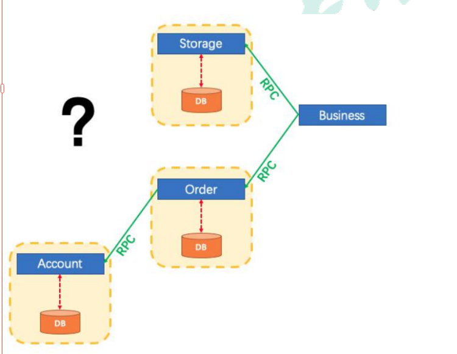
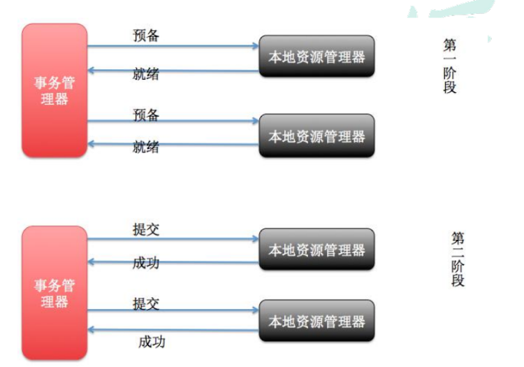
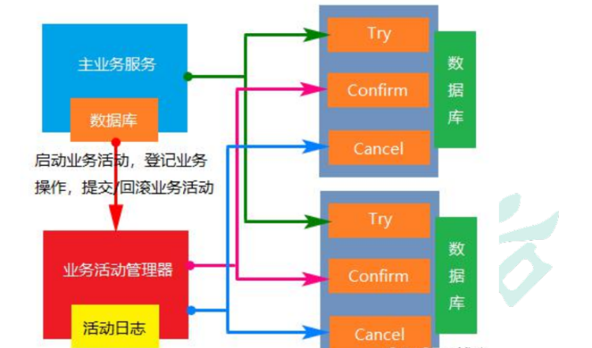
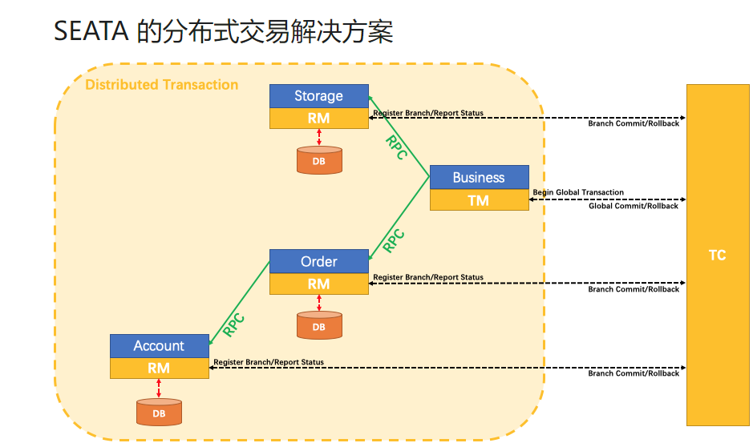

---

title: 分布式事务
icon: article
date: 2023-12-15
category: 分布式
tag:
  - 分布式事务

---


# 一、本地事务

## 1、事务的基本性质


事务的概念：事务是逻辑上一组操作，组成这组操作各个逻辑单元，要么一起成功，要么一起失败。

事务的四个特性（ACID）：

1. 原子性(atomicity)：“原子”的本意是“**不可再分**”，事务的原子性表现为一个事务中涉及到的多个操作在逻辑上缺一不可。事务的原子性要求事务中的所有操作要么都执行，要么都不执行。 
2. 一致性(consistency)：“一致”指的是数据的一致，具体是指：所有数据都处于满足业务规则的一致性状态。一致性原则要求：一个事务中不管涉及到多少个操作，都必须保证**事务执行之前**数据是正确的，**事务执行之后**数据仍然是正确的。如果一个事务在执行的过程中，其中某一个或某几个操作失败了，则必须将其他所有操作撤销，将数据恢复到事务执行之前的状态，这就是回滚。
3. 隔离性(isolation)：在应用程序实际运行过程中，事务往往是并发执行的，所以很有可能有许多事务同时处理相同的数据，因此每个事务都应该与其他事务隔离开来，防止数据损坏。隔离性原则要求多个事务在**并发执行过程中不会互相干扰**。
4. 持久性(durability)：持久性原则要求事务执行完成后，对数据的修改永久的保存下来，不会因各种系统错误或其他意外情况而受到影响。通常情况下，事务对数据的修改应该被写入到**持久化存储器**中。


## 2、事务的隔离级别

事务并发引起一些读的问题：

- 脏读 一个事务可以读取另一个事务未提交的数据
- 不可重复读 一个事务可以读取另一个事务已提交的数据 单条记录前后不匹配
- 虚读（幻读） 一个事务可以读取另一个事务已提交的数据 读取的数据前后多了点或者少了点


并发写：使用mysql默认的锁机制（独占锁）

解决读问题：设置事务隔离级别

- READ UNCOMMITTED（读未提交）(0)

该隔离级别的事务会读到其它未提交事务的数据，此现象也称之为脏读。

- READ COMMITTED（读提交）**(2)**

一个事务可以读取另一个已提交的事务，多次读取会造成不一样的结果，此现象称为不可重 复读问题，Oracle 和 SQL Server 的默认隔离级别。

- REPEATABLE READ（可重复读）**(4)**

该隔离级别是 MySQL 默认的隔离级别，在同一个事务里，select 的结果是事务开始时时间 点的状态，因此，同样的 select 操作读到的结果会是一致的，但是，会有幻读现象。MySQL 的 InnoDB 引擎可以通过 next-key locks 机制（参考下文"行锁的算法"一节）来避免幻读。

- SERIALIZABLE（序列化）(8)

在该隔离级别下事务都是串行顺序执行的，MySQL 数据库的 InnoDB 引擎会给读操作隐式 加一把读共享锁，从而避免了脏读、不可重读复读和幻读问题。


隔离级别越高，性能越低。


## 3、相关命令

查看全局事务隔离级别：SELECT @@global.tx_isolation

设置全局事务隔离级别：set global transaction isolation level read committed;

**查看当前会话事务隔离级别：SELECT @@tx_isolation**

**设置当前会话事务隔离级别：set session transaction isolation level read committed;**

查看mysql默认自动提交状态：select @@autocommit

设置mysql默认自动提交状态：set autocommit = 0;【不自动提交】

**开启一个事务：start transaction;**

**提交事务：commit**

**回滚事务： rollback**

在事务中创建一个保存点：savepoint tx1

回滚到保存点：rollback to tx1


## 4、传播行为

事务的传播行为不是jdbc规范中的定义。传播行为主要针对实际开发中的问题

七种传播行为：

- REQUIRED 如果当前没有事务，就创建一个新事务，如果当前存在事务， 就加入该事务，该设置是最常用的设置。
- SUPPORTS 支持当前事务，如果当前存在事务，就加入该事务，如果当 前不存在事务，就以非事务执行。
- MANDATORY 支持当前事务，如果不存在，抛出异常
- REQUIRES_NEW 创建新事务，无论当前存不存在事务，都创建新事务。
- NOT_SUPPORTED 以非事务方式运行，如果有事务存在，挂起当前事务
- NEVER 以非事务方式运行，如果有事务存在，抛出异常
- NESTED 如果当前存在事务，则在嵌套事务内执行。如果当前没有事务， 则执行与 PROPAGATION_REQUIRED 类似的操作。


这七种事务传播机制最常用的就两种：

REQUIRED：一个事务，要么成功，要么失败

REQUIRES_NEW：两个不同事务，彼此之间没有关系。一个事务失败了不影响另一个事务


传播行为伪代码模拟：有a,b,c,d,e等5个方法，a中调用b,c,d,e方法的传播行为在小括号中标出

```java
a(required){
	b(required);
	c(requires_new);
	d(required);
	e(requires_new);
	// a方法的业务
}
```

问题：

1. a方法的业务出现异常，会怎样？a,b,d回滚 c,e不回滚
2. d方法出现异常，会怎样？a,b,d回滚 c,e不回滚
3. e方法出现异常，会怎样？a,b,d,e回滚 c不回滚，e方法出异常会上抛影响到上级方法
4. b方法出现异常，会怎样？a,b回滚 c,d,e未执行


## 5、SpringBoot 事务关键点


1**、事务的自动配置** 

TransactionAutoConfiguration

2**、事务的坑**

在同一个类里面，编写两个方法，内部调用的时候，会导致事务设置失效。原因是没有用到代理对象的缘故。

解决： 

0）、导入 spring-boot-starter-aop 

1）、@EnableTransactionManagement(proxyTargetClass = true) 

2）、@EnableAspectJAutoProxy(exposeProxy=true) 

3）、AopContext.currentProxy() 调用方法


# 二、分布式事务

1**、为什么有分布式事务**

传统的一个工程内为了保证数据的一致性，使用本地事务。本地事务只能解决同一工程中的事务问题，而现在的场景更加复杂，关系到两个工程模块，怎么保证要么都成功，要么都失败？

​		分布式事务就是一次大的操作由不同的小操作组成，这些小的操作分布在不同的服务器上，且属于不同的应用，分布式事务需要保证这些小操作要么全部成功，要么全部失败。

​		分布式事务场景：不同应用相同数据库，相同应用不同数据库，不同应用不同数据库。

​		分布式事务产生的原因：分布式系统异常除了本地事务那些异常之外，还有：机器宕机、网络异常、消息丢失、消息乱序、数据错误、不可靠的TCP、存储数据丢失...



## 2.1 分布式事务基础

数据库的 ACID 四大特性，已经无法满足我们分布式事务，这个时候又有一些新的大佬提出一些新的理论。

### 2.1.1. CAP

分布式存储系统的CAP原理（分布式系统的三个指标）：

1. **C**onsistency（一致性）：在分布式系统中的所有数据备份，在**同一时刻是否同样的值**。对于数据分布在不同节点上的数据来说，如果在某个节点更新了数据，那么在其他节点如果都能读取到这个最新的数据，那么就称为强一致，如果有某个节点没有读取到，那就是分布式不一致。
2. **A**vailability（可用性）：在集群中一部分节点故障后，集群整体是否还能响应客户端的读写请求。（要求数据需要备份）
3. **P**artition tolerance（分区容忍性）：大多数分布式系统都分布在多个子网络。每个子网络就叫做一个区（partition）。分区容错的意思是，区间通信可能失败。

CAP理论就是说在分布式存储系统中，最多只能实现上面的两点。而由于当前的网络硬件肯定会出现延迟丢包等问题，所以**分区容忍性是我们无法避免的**。所以我们只能在一致性和可用性之间进行权衡，没有系统能同时保证这三点。要么选择CP、要么选择AP。


问题：zookeeper分布式协调组件 是 **CP** 还是 AP

动画：http://thesecretlivesofdata.com/raft/

我们的妥协：BASE


### 2.1.2. BASE

BASE是对CAP中一致性和可用性权衡的结果，其来源于对大规模互联网系统分布式实践的结论，是基于CAP定理逐步演化而来的，其核心思想是即使无法做到强一致性（Strong consistency），但每个应用都可以根据自身的业务特点，采用适当的方式来使系统达到最终一致性（Eventual consistency）。接下来看看BASE中的三要素：

1. Basically Available（**基本可用**）基本可用是指分布式系统在出现故障的时候，允许损失部分可用性，即保证核心可用。 电商大促时，为了应对访问量激增，部分用户可能会被引导到降级页面，服务层也可能只提供降级服务。这就是损失部分可用性的体现。
2. Soft state（软状态）软状态是指允许系统存在中间状态，而该中间状态不会影响系统整体可用性。分布式存储中一般一份数据至少会有三个副本，**允许不同节点间副本同步的延时**就是软状态的体现。mysql replication的异步复制也是一种体现。
3. Eventually consistent（最终一致性）最终一致性是指系统中的所有数据副本经过一定时间后，最终能够达到一致的状态。弱一致性和强一致性相反，最终一致性是弱一致性的一种特殊情况。

BASE模型是传统ACID模型的反面，不同于ACID，BASE强调牺牲高一致性，从而获得可用性，数据**允许在一段时间内的不一致，只要保证最终一致就可以了**。


### 2.1.3 强一致性、弱一致性、最终一致性

从客户端角度，多进程并发访问时，更新过的数据在不同进程如何获取的不同策略，决定了 不同的一致性。对于关系型数据库，要求更新过的数据能被后续的访问都能看到，这是**强一 致性**。如果能容忍后续的部分或者全部访问不到，则是**弱一致性**。如果经过一段时间后要求 能访问到更新后的数据，则是**最终一致性**


## 2.2. 分布式事务解决方案


分布式事务是企业集成中的一个**技术难点**，也是每一个分布式系统架构中都会涉及到的一个东西，特别是在微服务架构中，**几乎可以说是无法避免**。

主流的解决方案如下：

1. 基于XA协议的两阶段提交（2PC）
2. TCC编程模式
3. 消息事务+最终一致性


### 2.2.1. 两阶段提交（2PC）

2PC即两阶段提交协议，是将整个事务流程分为两个阶段，准备阶段（Prepare phase）、提交阶段（commitphase），2是指两个阶段，P是指准备阶段，C是指提交阶段。

MySQL 从 5.5 版本开始支持，SQL Server 2005 开始支持，Oracle 7 开始支持。


其中，XA 是一个两阶段提交协议，该协议分为以下两个阶段：

第一阶段：事务协调器要求每个涉及到事务的数据库预提交(precommit)此操作，并反映是否可以提交.

第二阶段：事务协调器要求每个数据库提交数据。

其中，如果有任何一个数据库否决此次提交，那么所有数据库都会被要求回滚它们在此事务中的那部分信息。



总的来说，XA协议比较简单，而且一旦商业数据库实现了XA协议，使用分布式事务的成本也比较低。但是，XA也有致命的缺点，那就是性能不理想，特别是在交易下单链路，往往并发量很高，XA无法满足高并发场景。

1. 两阶段提交涉及多次节点间的网络通信，通信时间太长！
2. 事务时间相对于变长了，锁定的资源的时间也变长了，造成资源等待时间也增加好多。
3. XA目前在商业数据库支持的比较理想，在mysql数据库中支持的不太理想，mysql的XA实现，没有记录prepare阶段日志，主备切换会导致主库与备库数据不一致。许多nosql也没有支持XA，这让XA的应用场景变得非常狭隘。

### 2.2.2. TCC补偿式事务

是一种编程式分布式事务解决方案。

TCC 其实就是采用的补偿机制，其核心思想是：针对每个操作，都要注册一个与其对应的确认和补偿（撤销）操作。TCC模式要求从服务提供三个接口：Try、Confirm、Cancel。

- Try：主要是对业务系统做检测及资源预留
- Confirm：真正执行业务，不作任何业务检查；只使用Try阶段预留的业务资源；Confirm操作满足幂等性。
- Cancel：释放Try阶段预留的业务资源；Cancel操作满足幂等性。

整个TCC业务分成两个阶段完成：



第一阶段：主业务服务分别调用所有从业务的try操作，并在活动管理器中登记所有从业务服务。当所有从业务服务的try操作都调用成功或者某个从业务服务的try操作失败，进入第二阶段。

第二阶段：活动管理器根据第一阶段的执行结果来执行confirm或cancel操作。如果第一阶段所有try操作都成功，则活动管理器调用所有从业务活动的confirm操作。否则调用所有从业务服务的cancel操作。

举个例子，假如 Bob 要向 Smith 转账100元，思路大概是：

我们有一个本地方法，里面依次调用

1. 首先在 Try 阶段，要先检查Bob的钱是否充足，并把这100元锁住，Smith账户也冻结起来。
2. 在 Confirm 阶段，执行远程调用的转账的操作，转账成功进行解冻。
3. 如果第2步执行成功，那么转账成功，如果第二步执行失败，则调用远程冻结接口对应的解冻方法 (Cancel)。

缺点：

- Canfirm和Cancel的**幂等性**很难保证。
- 这种方式缺点比较多，通常在**复杂场景下是不推荐使用**的，除非是非常简单的场景，非常容易提供回滚Cancel，而且依赖的服务也非常少的情况。
- 这种实现方式会造成**代码量庞大，耦合性高**。而且非常有局限性，因为有很多的业务是无法很简单的实现回滚的，如果串行的服务很多，回滚的成本实在太高。

不少大公司里，其实都是自己研发 TCC 分布式事务框架的，专门在公司内部使用。国内开源出去的：ByteTCC，TCC-transaction，Himly。

### 2.2.3 **柔性事务**-**最大努力通知型方案**

按规律进行通知，**不保证数据一定能通知成功，但会提供可查询操作接口进行核对**。这种 方案主要用在与第三方系统通讯时，比如：调用微信或支付宝支付后的支付结果通知。这种 方案也是结合 MQ 进行实现，例如：通过 MQ 发送 http 请求，设置最大通知次数。达到通 知次数后即不再通知。 


案例：银行通知、商户通知等（各大交易业务平台间的商户通知：多次通知、查询校对、对 账文件），支付宝的支付成功异步回调


### 2.2.4 消息事务+最终一致性

基于消息中间件的两阶段提交往往用在高并发场景下，将一个分布式事务拆成一个消息事务（A系统的本地操作+发消息）+B系统的本地操作，其中B系统的操作由消息驱动，只要消息事务成功，那么A操作一定成功，消息也一定发出来了，这时候B会收到消息去执行本地操作，如果本地操作失败，消息会重投，直到B操作成功，这样就变相地实现了A与B的分布式事务。


# 三、 分布式事务框架-seata

官方：https://github.com/seata/seata

中文wiki：https://seata.io/zh-cn/docs/overview/what-is-seata

Seata 是一款开源的分布式事务解决方案，致力于提供高性能和简单易用的分布式事务服务。Seata 将为用户提供了 AT、TCC、SAGA 和 XA 事务模式，为用户打造一站式的分布式解决方案。


## Seata有3个基本组件：

- Transaction Coordinator(TC)：事务协调器，维护全局事务的运行状态，负责协调并驱动全局事务的提交或回滚。
- Transaction Manager(TM)：事务管理器，控制**全局事务**的边界，负责开启一个全局事务，并最终发起全局提交或全局回滚的决议。
- Resource Manager(RM)：资源管理器，控制**分支事务**，负责分支注册、状态汇报，并接收事务协调器的指令，驱动分支（本地）事务的提交和回滚。



## 快速入门案例的启示

启示玩任何技术，无非就是三个东西：

1. 依赖
2. 配置
3. 注解

接下来以storage-service为例，总结一下seata的玩法。

### 前提：日志表

每个数据库都要有一张undo_log日志表，sql如下：

```sql
SET FOREIGN_KEY_CHECKS=0;

-- ----------------------------
-- Table structure for undo_log
-- ----------------------------
DROP TABLE IF EXISTS `undo_log`;
CREATE TABLE `undo_log` (
  `id` bigint(20) NOT NULL AUTO_INCREMENT,
  `branch_id` bigint(20) NOT NULL,
  `xid` varchar(100) NOT NULL,
  `context` varchar(128) NOT NULL,
  `rollback_info` longblob NOT NULL,
  `log_status` int(11) NOT NULL,
  `log_created` datetime NOT NULL,
  `log_modified` datetime NOT NULL,
  `ext` varchar(100) DEFAULT NULL,
  PRIMARY KEY (`id`),
  UNIQUE KEY `ux_undo_log` (`xid`,`branch_id`)
) ENGINE=InnoDB AUTO_INCREMENT=2 DEFAULT CHARSET=utf8;
```

### 先看依赖

引入了两个和seata有关的依赖

```java
<dependency>
    <groupId>com.alibaba.cloud</groupId>
    <artifactId>spring-cloud-alibaba-seata</artifactId>
    <version>2.0.0.RELEASE</version>
</dependency>
<dependency>
    <groupId>io.seata</groupId>
    <artifactId>seata-all</artifactId>
    <version>0.8.0</version>
</dependency>
```

### 再看配置

application.properties：就是一些常规配置，可略过

还剩下3个配置文件：

1. registry.conf：配置注册中心和配置中心，默认是file。
2. file.conf：seata工作规则信息
3. DataSourceConfig：配置代理数据源实现分支事务，如果没有注入，事务无法成功回滚


#### registry.conf

该文件包含两部分配置：

1. 注册中心
2. 配置中心

注册中心：

```java
registry { # 注册中心配置
  # 可选项：file 、nacos 、eureka、redis、zk
  type = "nacos" # 指定nacos注册中心，默认是file。由于项目整体使用nacos，所以后续选择nacos

  nacos {
    serverAddr = "127.0.0.1:8848"
    namespace = "public"
    cluster = "default"
  }
  eureka {
    serviceUrl = "http://localhost:1001/eureka"
    application = "default"
    weight = "1"
  }
  redis {
    serverAddr = "localhost:6381"
    db = "0"
  }
  zk {
    cluster = "default"
    serverAddr = "127.0.0.1:2181"
    session.timeout = 6000
    connect.timeout = 2000
  }
  file {
    name = "file.conf"
  }
}
```

配置中心

```java
config { # 配置中心
  # 可选项：file、nacos 、apollo、zk
  type = "file" # 指向file配置中心，也可以指向nacos等其他注册中心

  nacos {
    serverAddr = "localhost"
    namespace = "public"
    cluster = "default"
  }
  apollo {
    app.id = "fescar-server"
    apollo.meta = "http://192.168.1.204:8801"
  }
  zk {
    serverAddr = "127.0.0.1:2181"
    session.timeout = 6000
    connect.timeout = 2000
  }
  file {
    name = "file.conf"   # 通过file.conf配置seata参数，指向第二个配置文件
  }
}
```

#### file.conf

该文件的命名取决于registry.conf配置中心的配置

也就是说：file.conf文件名取决于registry的配置中心配置，如果registry配置的配置中心不是file，可以没有改文件。例如：如果配置中心是nacos，这是file.conf文件就不需要了，把file.conf文件内容交给nacos就可

网络传输配置：

```java
transport {
  # tcp udt unix-domain-socket
  type = "TCP"
  #NIO NATIVE
  server = "NIO"
  #enable heartbeat
  heartbeat = true
  #thread factory for netty
  thread-factory {
    boss-thread-prefix = "NettyBoss"
    worker-thread-prefix = "NettyServerNIOWorker"
    server-executor-thread-prefix = "NettyServerBizHandler"
    share-boss-worker = false
    client-selector-thread-prefix = "NettyClientSelector"
    client-selector-thread-size = 1
    client-worker-thread-prefix = "NettyClientWorkerThread"
    # netty boss thread size,will not be used for UDT
    boss-thread-size = 1
    #auto default pin or 8
    worker-thread-size = 8
  }
}
```

事务日志存储配置：该部分配置仅在seata-server中使用，如果选择db请配合seata.sql使用

```java
## transaction log store, only used in seata-server
store {
  ## store mode: file、db
  mode = "file"

  ## file store property
  file {
    ## store location dir
    dir = "sessionStore"
  }

  ## database store property
  db {
    ## the implement of javax.sql.DataSource, such as DruidDataSource(druid)/BasicDataSource(dbcp) etc.
    datasource = "dbcp"
    ## mysql/oracle/h2/oceanbase etc.
    db-type = "mysql"
    driver-class-name = "com.mysql.jdbc.Driver"
    url = "jdbc:mysql://127.0.0.1:3306/seata"
    user = "mysql"
    password = "mysql"
  }
}
```

当前微服务在seata服务器中注册的信息配置：

```java
service {
  # 事务分组，默认：${spring.applicaiton.name}-fescar-service-group，可以随便写
  vgroup_mapping.${spring.application.name}-fescar-service-group = "default"
  # 仅支持单节点，不要配置多地址，这里的default要和事务分组的值一致
  default.grouplist = "127.0.0.1:8091" #seata-server服务器地址，默认是8091
  # 降级，当前不支持
  enableDegrade = false
  # 禁用全局事务
  disableGlobalTransaction = false
}
```

客户端相关工作的机制

```java
client {
  rm {
    async.commit.buffer.limit = 10000
    lock {
      retry.internal = 10
      retry.times = 30
      retry.policy.branch-rollback-on-conflict = true
    }
    report.retry.count = 5
    table.meta.check.enable = false
    report.success.enable = true
  }
  tm {
    commit.retry.count = 5
    rollback.retry.count = 5
  }
  undo {
    data.validation = true
    log.serialization = "jackson"
    log.table = "undo_log"
  }
  log {
    exceptionRate = 100
  }
  support {
    # auto proxy the DataSource bean
    spring.datasource.autoproxy = false
  }
}
```


#### DataSourceConfig

每一个微服务原来自己的数据源都必须使用DataSourceProxy代理，这样seata才能掌控所有事务。

```java
@Configuration
public class DataSourceConfig {

    @Bean
    @ConfigurationProperties(prefix = "spring.datasource")
    public DruidDataSource druidDataSource() {
        return new DruidDataSource();
    }

    /**
     * 需要将 DataSourceProxy 设置为主数据源，否则事务无法回滚
     *
     * @param druidDataSource The DruidDataSource
     * @return The default datasource
     */
    @Primary
    @Bean("dataSource")
    public DataSource dataSource(DruidDataSource druidDataSource) {
        return new DataSourceProxy(druidDataSource);
    }
}
```


### 最后注解

主业务方法添加全局事务：@GlobalTransactional

分支业务方法添加本地事务注解：@Transactional


### seata-server

一旦我们使用注册中心，进行服务的发现，seata服务器也得配置放在注册中心。

修改registry.conf配置文件，把seata-server事务协调管理器也注册到nacos注册中心


seata at模式适合没有大并发的情况，比如后台管理系统


大并发适合用  可靠消息+最终一致性方案
