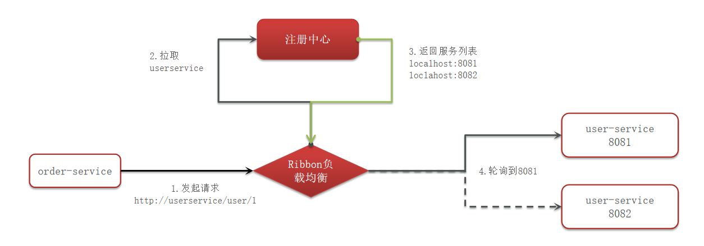
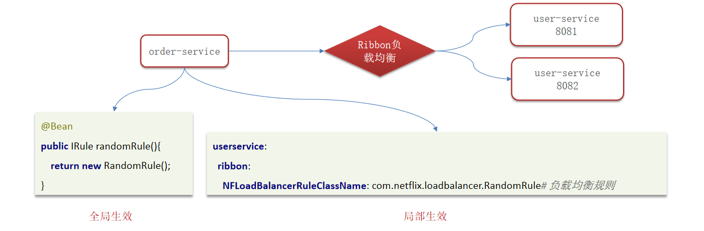

---

title: Ribbon负载均衡策略
icon: article
date: 2023-03-04
category: SpringCloud
tag:
  - Ribbon
---

## Ribbon负载均衡流程

## Ribbon 支持的 7 种负载均衡策略：

- RoundRobinRule（默认）：简单轮询服务列表来选择服务器
- RandomRule：随机选择一个可用的服务器
- WeightedResponseTimeRule：按照权重来选择服务器，响应时间越长，权重越小
- BestAvailableRule：最小连接数策略，忽略那些短路的服务器，并选择并发数较低的服务器
- RetryRule：重试策略（按照轮询策略来获取服务，如果获取的服务实例为 null 或已经失效，则在指定的时间之内不断地进行重试来获取服务，如果超过指定时间依然没获取到服务实例则返回 null）
- AvailabilityFilteringRule：可用性敏感策略，先过滤非健康的，再选择连接数较小的实例
- ZoneAvoidanceRule：以区域可用的服务器为基础进行服务器的选择。使用Zone对服务器进行分类，这个Zone可以理解为一个机房、一个机架等。而后再对Zone内的多个服务做轮询

## 自定义负载均衡策略如何实现 ?

1. 创建类实现IRule接口，可以指定负载均衡策略，这个是全局的，对所有的远程调用都起作用

2. 在客户端的配置文件中，可以配置某一个服务调用的负载均衡策略，只是对配置的这个服务生效远程调用

