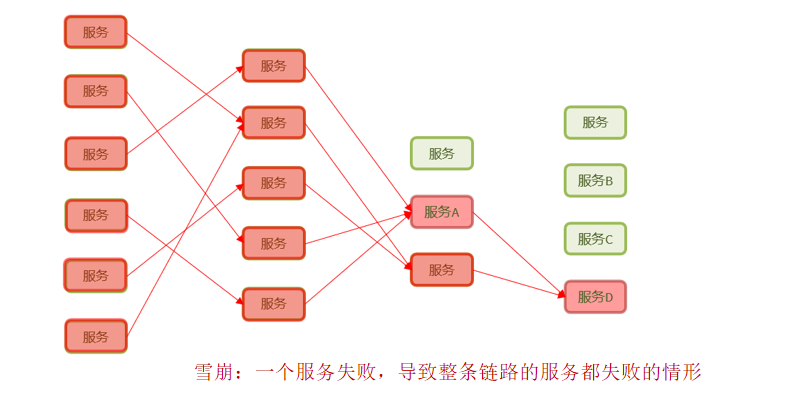
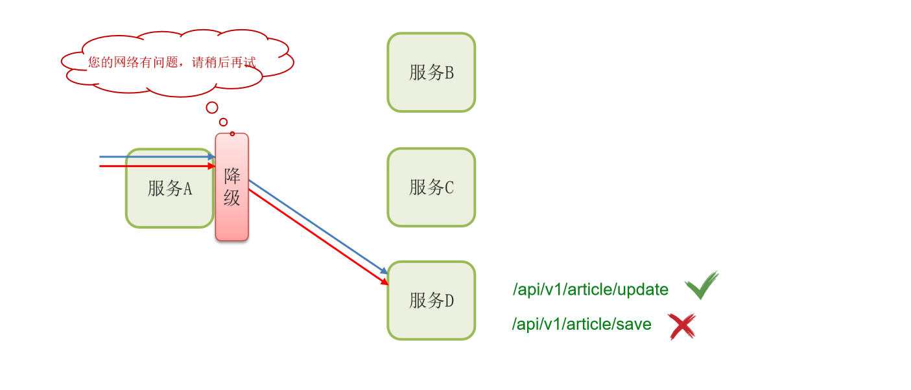
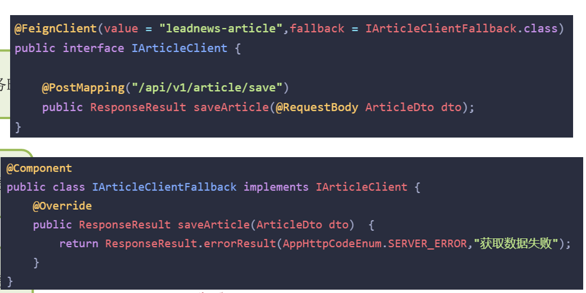

---

title: 服务雪崩，降级熔断
icon: article
date: 2023-03-04
category: SpringCloud
tag:
  - 降级熔断
---

## 服务雪崩

服务雪崩是指一个服务失败，导致整条链路的服务都失败的情形，一般我们在项目解决的话就是两种方案，第一个是服务降级，第二个是服务熔断，如果流量太大的话，可以考虑限流

## 服务降级

服务降级是服务自我保护的一种方式，或者保护下游服务的一种方式，用于确保服务不会受请求突增影响变得不可用，确保服务不会崩溃

如果降级太多，则会触发熔断机制

## 服务熔断

Hystrix 熔断机制，用于监控微服务调用情况， 默认是关闭的，如果需要开启需要在引导类上添加注解：@EnableCircuitBreaker如果检测到 10 秒内请求的失败率超过 50%，就触发熔断机制。之后每隔 5 秒重新尝试请求微服务，如果微服务不能响应，继续走熔断机制。如果微服务可达，则关闭熔断机制，恢复正常请求
