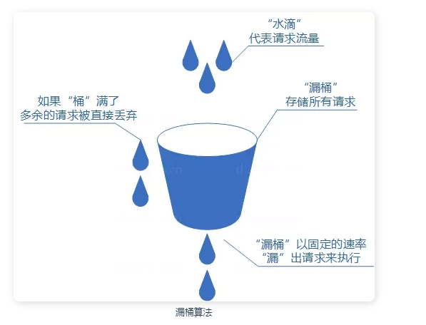
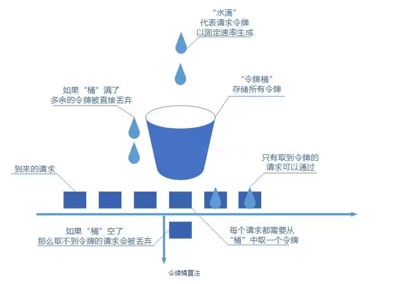

---

title: 服务限流
icon: article
date: 2023-03-05
category: SpringCloud
tag:
  - 限流
---

## 为什么要限流？

1. 并发的确大（突发流量）

2. 防止用户恶意刷接口

限流的实现方式：

- Tomcat：可以设置最大连接数
- Nginx，漏桶算法
- 网关，令牌桶算法
- 自定义拦截器

## Nginx限流

漏桶算法

我们可以把发请求的动作比作成注水到桶中，我们处理请求的过程可以比喻为漏桶漏水。我们往桶中以任意速率流入水，以一定速率流出水。当水超过桶流量则丢弃，因为桶容量是不变的，保证了整体的速率。

如果想要实现这个算法的话也很简单，准备一个队列用来保存请求，然后我们定期从队列中拿请求来执行就好了（和消息队列削峰/限流的思想是一样的）。

漏桶算法可以控制限流速率，避免网络拥塞和系统过载。不过，漏桶算法无法应对突然激增的流量，因为只能以固定的速率处理请求，对系统资源利用不够友好。

## 网关限流

令牌桶算法

和漏桶算法算法一样，我们的主角还是桶，不过现在桶里装的是令牌了，请求在被处理之前需要拿到一个令牌，请求处理完毕之后将这个令牌丢弃（删除）。我们根据限流大小，按照一定的速率往桶里添加令牌。如果桶装满了，就不能继续往里面继续添加令牌了。

令牌桶算法可以限制平均速率和应对突然激增的流量，还可以动态调整生成令牌的速率。不过，如果令牌产生速率和桶的容量设置不合理，可能会出现问题比如大量的请求被丢弃、系统过载。

## 总结

**你们项目中有没有做过限流 ? 怎么做的 ?**

1，先来介绍业务，什么情况下去做限流，需要说明QPS具体多少

我们当时有一个活动，到了假期就会抢购优惠券，QPS最高可以达到2000，平时10-50之间，为了应对突发流量，需要做限流

常规限流，为了防止恶意攻击，保护系统正常运行，我们当时系统能够承受最大的QPS是多少（压测结果）

2，nginx限流

- 控制速率（突发流量），使用的漏桶算法来实现过滤，让请求以固定的速率处理请求，可以应对突发流量
- 控制并发数，限制单个ip的链接数和并发链接的总数

3，网关限流

- 在spring cloud gateway中支持局部过滤器RequestRateLimiter来做限流，使用的是令牌桶算法
- 可以根据ip或路径进行限流，可以设置每秒填充平均速率，和令牌桶总容量

**限流常见的算法有哪些呢？**

比较常见的限流算法有漏桶算法和令牌桶算法

漏桶算法是把请求存入到桶中，以固定速率从桶中流出，可以让我们的服务做到绝对的平均，起到很好的限流效果

令牌桶算法在桶中存储的是令牌，按照一定的速率生成令牌，每个请求都要先申请令牌，申请到令牌以后才能正常请求，也可以起到很好的限流作用

它们的区别是，漏桶和令牌桶都可以处理突发流量，其中漏桶可以做到绝对的平滑，令牌桶有可能会产生突发大量请求的情况，一般nginx限流采用的漏桶，spring cloud gateway中可以支持令牌桶算法
