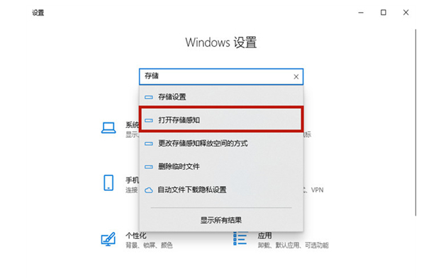
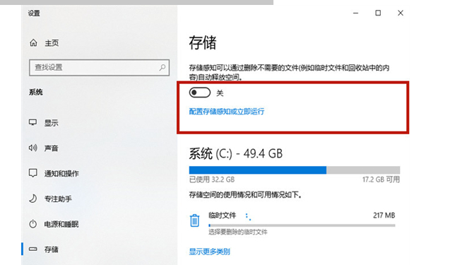
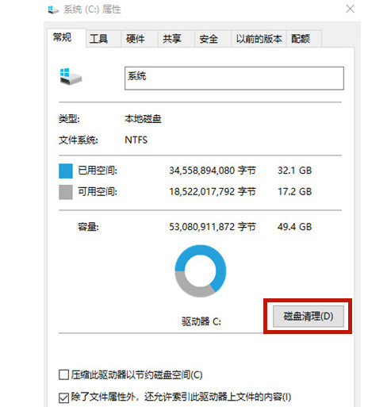
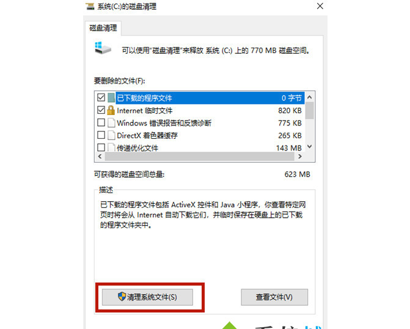

---

title: C盘空间清理
icon: article
date: 2022-03-10
category: 杂记
tag:
  - C盘空间清理
---

## 方法一

1.点击【开始】菜单的【设置】功能;

2.在设置功能页面输入【存储】，选择【打开存储感知】;

3.将存储开关打开，然后点击进入【配置存储感知或立即运行】;

4.点击【立即清理】，系统就会自动清理电脑c盘中无用的文件了。

## 方法二

1.鼠标右键点击【c盘】，选择【属性】;

2.在c盘的属性当中点击【磁盘清理】;

3.进入磁盘清理页面以后选择【清理系统文件】，会跳转到新页面;

4.在新页面当中勾选【windows更新清理】或【以前的windows安装】，之后点击【确定】就可以了。

## 方法三

1.使用【win+r】打开电脑的运行功能，输入【cmd】，并点击【确定】;

2.在cmd命令窗口内输入【powercfg hibernate size 40】就可以清除系统的休眠文件了