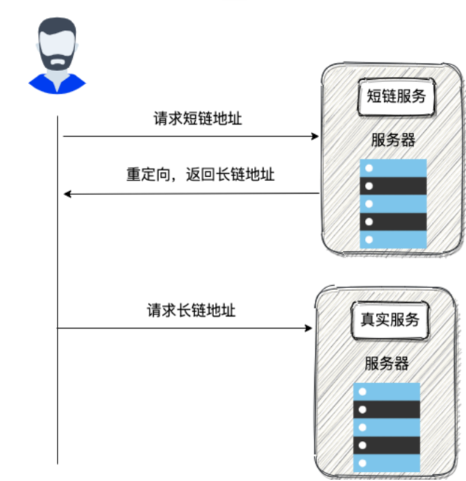
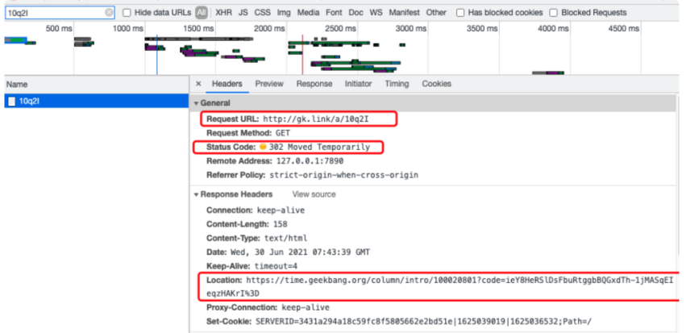

---

title: 如何设计⼀个短链系统？
icon: article
date: 2023-12-18
category: 杂记
tag:
  - 短链
---

我平时经常看极客时间上的专栏，上⾯的每⼀个专栏 URL 地址都有⼀个短链与之对应。
⽐如你使⽤下⾯两个链接打开的都是 《MySQL 实战 45 讲》这⻔课程。

> 原始链接：https://time.geekbang.org/column/intro/100020801
> 短链 ：http://gk.link/a/10q2I

有了⻓链，为什么还要再弄⼀个短链呢?
1. 短链更简洁，更⽅便传播：过⻓的链接不利于在互联⽹传播；
2. ⽅便对链接的点击情况做后续追踪：⽐如查看短链最近⼀周的访问量、访客数、访问
  来源......；
3. 对于短信等限制字数的场景来说更加友好：很多社交平台发表动态是有字数限制的，
  如果你直接使⽤⻓链的话，那留给你⾃⼰想表达的其他内容的⽂字就少了很多；
4. ......

## 短链原理

短链的具体原理其实⽐较简单，说⽩了就是： 通过短链找到⻓链（原始链接），然后再重定向到⻓链地址即可！

⼀个简单的示意图：

举个例⼦：我们来访问 “http://gk.link/a/10q2I” 这个链接，从 HTTP 请求信息可以看到请求被重定向了，返回的状态码为 “302”。

另外还有⼀个⽐较常⽤的重定向状态 “301” ， 我们应该⽤“301” 还是“302”作为状态码更好呢？
答案是：“302” ，绝⼤部分短链系统也都是使⽤的 “302” 作为状态码。
这是因为 “301” 状态码代表永久重定向，只要浏览器拿到⻓链之后就会对其缓存，下次再请求短链就直接从缓存中拿对应的⻓链地址。这样的话，我们就没办法对短链进⾏相关分析了。
⽽“302” 状态码代表资源被临时重定向了，不会存在上⾯说的这种问题。

## 唯⼀短链⽣成

原始链接必定是唯⼀的，我们也要确保⽣成的短链唯⼀。

如何⽣成唯⼀的短链呢？换⾔之就是我们如何通过唯⼀的字符串来表示⻓链。

⽐较常⻅的⼀种⽅法就是: 通过哈希算法对⻓链去哈希。

⼀般建议使⽤⽤⾮加密型哈希算法⽐如 MurmurHash 。因为，相⽐于 MD5 ， SHA 等加密型哈希算法，⾮加密型哈希算法往往效率更⾼！

既然使⽤了哈希算法，那不可避免会出现哈希冲突（不同的⻓链⽣成的短链是⼀样的），虽然概率⽐较⼩，但是我们也还是要解决。

### 如何判断是否发⽣了哈希冲突呢？

判断是否发⽣哈希冲突也就是看我们⽣成的短链是否是唯⼀的。

如果我们使⽤的是 MySQL，PostgreSQL 这类关系型数据库的话，我们可以给存放短链的字段 sort_url 添加唯⼀索引。

不过，为了提⾼性能以及应对⾼并发，还是建议利⽤布隆过滤器解决这个问题。

### 如何解决哈希冲突呢？

解决办法其实也很简单。如果发⽣哈希冲突，我们就在⻓链后拼接⼀个随机字符串。如果拼接了随机字符串还是发⽣哈希冲突那就再拼接⼀个随机字符串。

并且，我们要将拼接之后得到的字符串和拼接的字符串都存储起来，通过这两者可以获取⻓链（原始链接）。

### ⼀个长链对应⼀个短链还是多个短链呢？

这个还是要看具体的业务需求。个⼈建议是⼀个⻓链可以在不同的条件（⽐如⽣成短链的⽤户不同）下对应上不同的短链。这样的话，我们可以更好地对短链进⾏相关分析。

## 短链存储

我们可以使⽤ MySQL，PostgreSQL 这类关系型数据库存储，也可以使⽤ Redis 这类 K-V 内存数据库来做，这样性能也会更好！并且，存放在 Redis 中存放的本就是键值对的数据，刚好满⾜我们的需求。

当我们存放⼀个长链的时候，我们⾸先判断⼀下这个⻓链是否已经被转换过短链。

如果需要对⻓链就⾏区分的话（⽐如不同的⽤户使⽤同⼀个⻓链⽣成的短链不同），我们在判断的时候加上对应的条件即可（⽐如这个长链对应的⽤户）。

这⾥不能直接根据长链哈希之后得到的短链来判断⻓链是否已经被转换过短链，因为不同的⻓链⽣成的短链可能是⼀样的（哈希冲突，不过，概率很低）。

建议不论是否使⽤ Redis 数据库，都要将最近⽐较活跃的短连接存放在缓存中。为了避免缓存过⼤，我们可以为这些放在缓存中的短连接设置⼀个过期时间。